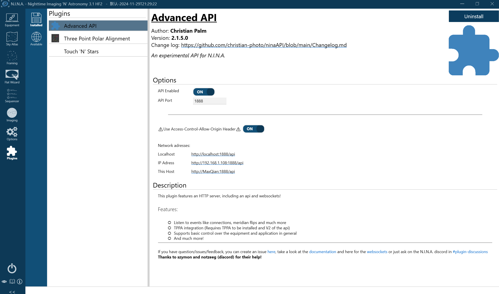
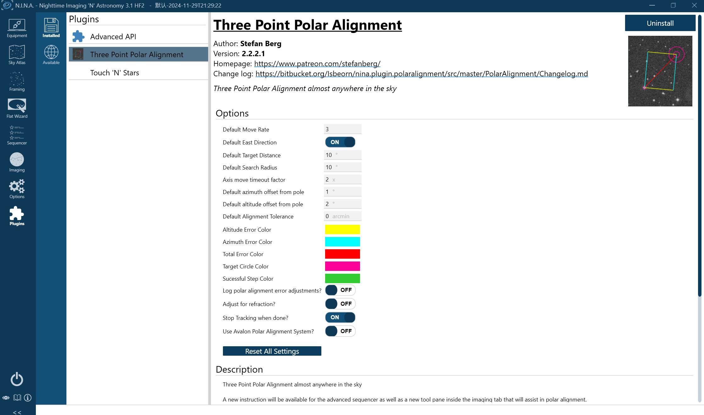
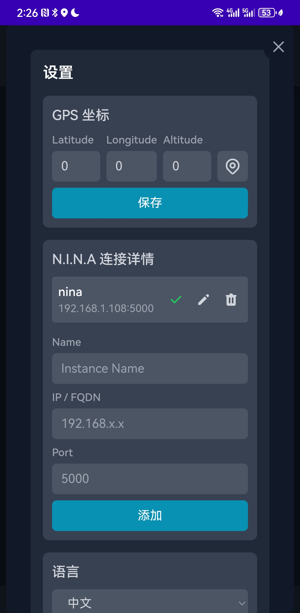
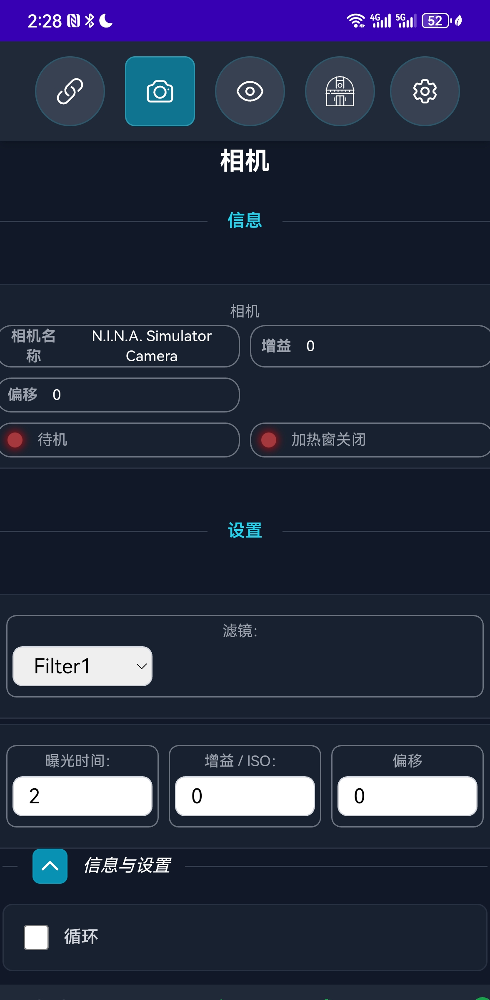
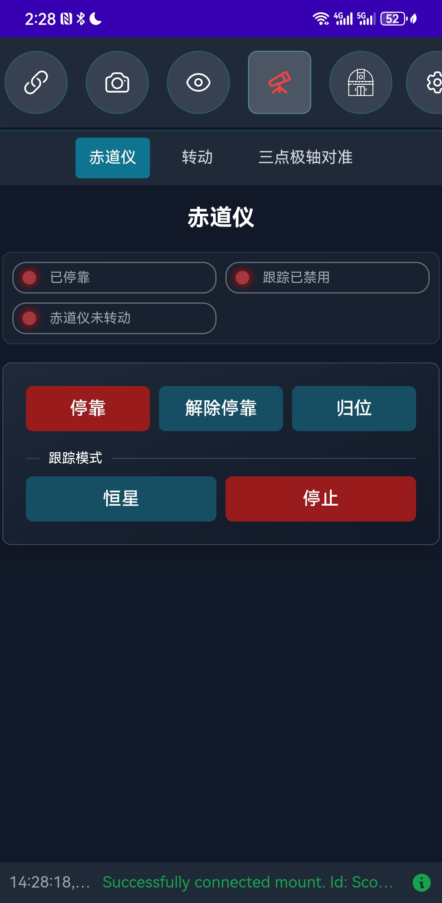
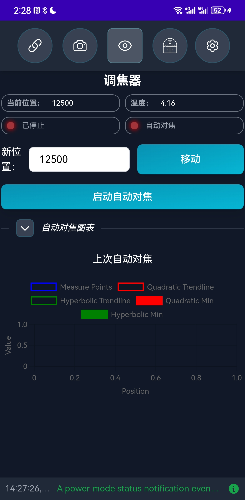

# Touch'N'Stars：移动控制NINA的完美伴侣

## 推荐理由

如果你是一位天文摄影爱好者，并且正在使用**NINA**（Nighttime Imaging 'N' Astronomy）这款强大的天文摄影软件，那么一定会被手机或者其他设备远程桌面糟糕的交互体验所烦恼，并且抱怨为何没有移动端的适配。这时**Touch'N'Stars**绝对是你不可错过的工具。这款WebApp专为移动设备设计，旨在让你通过智能手机或平板电脑轻松控制NINA，极大地提升了设备设置的便捷性和灵活性。

### 为什么选择Touch'N'Stars？

1. **移动操作，解放双手**  
   无需再依赖电脑，只需通过手机或平板即可完成设备设置和拍摄启动，特别适合户外拍摄场景。

2. **简洁直观的界面**  
   专为移动设备优化的用户界面，操作简单，即使是新手也能快速上手。

3. **高效实用**  
   专注于核心功能，支持快速调整配置文件、启动拍摄流程，以及三点极轴校准等关键操作。

4. **免费开源**  
   作为一款开源工具，Touch'N'Stars不仅免费使用，还支持社区共同改进和优化。

---

## 教程：如何使用Touch'N'Stars

### 准备工作

+ 安装Advanced API插件
  + 下载并安装[Advanced API插件](https://github.com/Touch-N-Stars/N.I.N.A-Plugin-for-Touch-N-Stars)。
  + 在NINA中启用插件，并将API端口设置为**1888**，同时确保V2版本已激活。
  + 勾选“Use Access-Control-Allow-Origin Header”选项。

+ 安装Touch'N'Stars**
  

+ 安装三星极轴校准插件（高版本必备）

+ 配置防火墙
   如果无法访问Touch'N'Stars，请检查Windows防火墙设置，确保允许相关端口（5000）的通信。

---

### 安装Touch'N'Stars

1. **访问WebApp**  
   在浏览器中输入以下地址：  
   `http://"你的NINA电脑IP":5000`  
   例如：`http://192.168.1.100:5000`

2. **安装Android应用（可选）**  
   如果你是安卓用户，可以直接下载并安装[APK文件](https://github.com/Touch-N-Stars/Touch-N-Stars/releases)，享受更流畅的移动体验。

---

### 使用教程

+ **连接设备**  
  + 打开Touch'N'Stars，确保你的手机或平板与运行NINA的电脑处于同一局域网。
  + 输入NINA电脑的IP地址，点击连接。
  +

+ **控制设备**  
  + **配置文件管理**：选择已配置的配置文件，快速启动设备。
  + **三点极轴校准**：如果你的NINA版本为2.2.2.0或更新，可以直接通过Touch'N'Stars完成极轴校准。
  + **启动拍摄**：一键启动拍摄流程，实时监控拍摄状态。

+ **调整设置**  
  + 通过简洁的界面调整设备参数，如曝光时间、滤镜轮设置等。
  + 支持快速切换配置文件，适应不同的拍摄需求。

---

### 注意事项

+ **兼容性**：确保NINA和Advanced API插件均为最新版本。
+ **网络稳定性**：建议在稳定的局域网环境下使用，避免连接中断。
+ **免责声明**：Touch'N'Stars仍处于测试阶段，请谨慎使用，开发者不承担因使用该工具导致的任何损失。

---

## 结语

Touch'N'Stars为天文摄影爱好者提供了一种全新的设备控制方式，让繁琐的设备设置变得简单高效。无论是初学者还是资深玩家，这款工具都能为你带来极大的便利。赶快尝试一下吧，让你的天文摄影之旅更加轻松愉快！

如果你喜欢这款工具，别忘了给开发者点个⭐️支持哦！  
[GitHub项目地址](https://github.com/Touch-N-Stars/Touch-N-Stars)

汉化和教程作者：Max Qian[（GitHub）](https://github.com/AstroAir)
