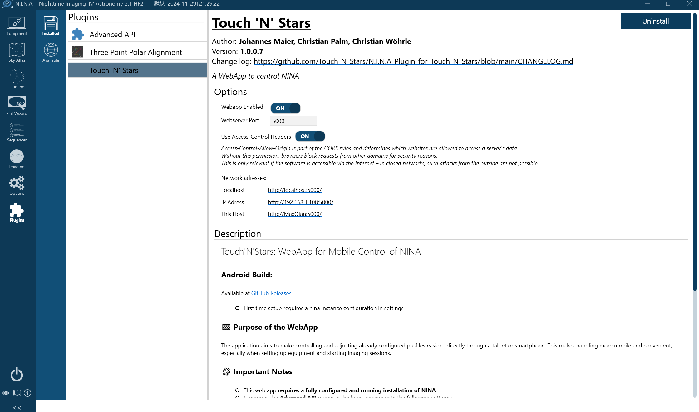
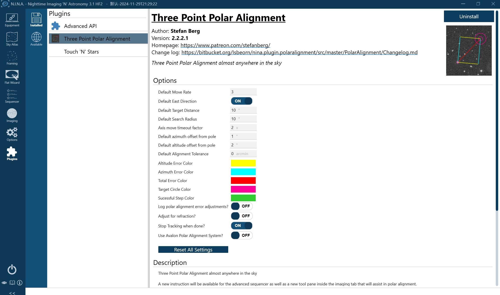
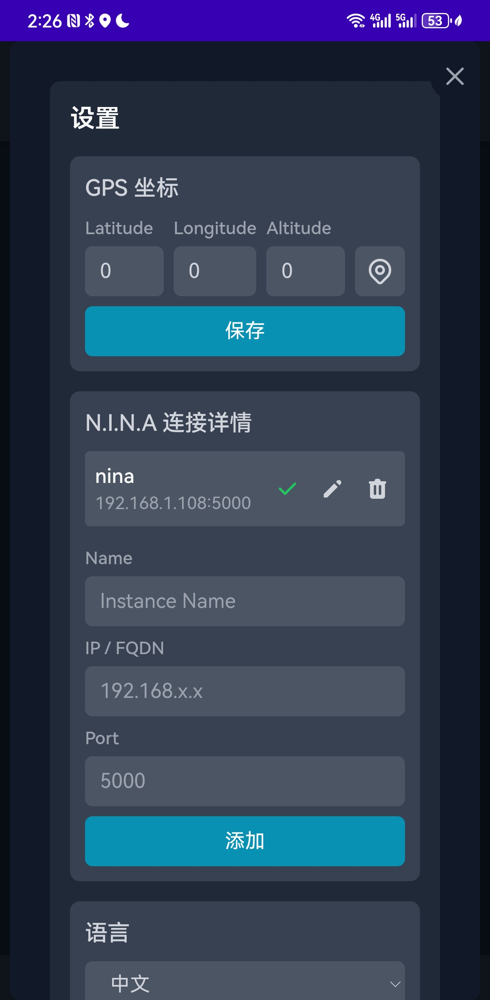
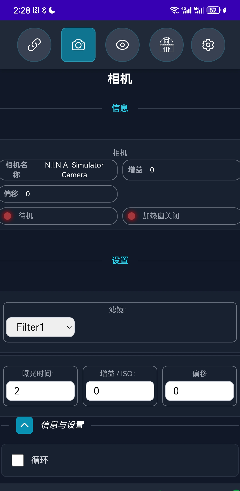
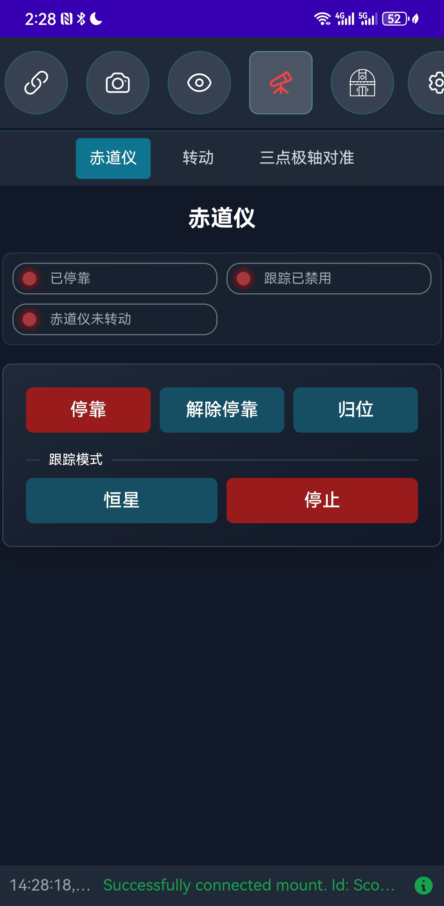

# Touch'N'Stars: The Perfect Mobile Companion for NINA

**Touch'N'Stars** is a revolutionary mobile web application that transforms how astrophotographers interact with NINA (Nighttime Imaging 'N' Astronomy). This comprehensive guide covers everything from basic setup to advanced usage scenarios.

## 🌟 Why Touch'N'Stars is Essential for Astrophotographers

If you're an astrophotography enthusiast using **NINA**, you've likely experienced the frustration of poor remote desktop experiences on mobile devices and wondered why there's no native mobile adaptation. Touch'N'Stars solves this problem by providing a mobile-first interface designed specifically for smartphones and tablets.

### 🎯 Key Advantages

#### 1. **Mobile-First Design**
- **Optimized Touch Interface**: Designed specifically for touch interactions
- **Responsive Layout**: Adapts perfectly to different screen sizes
- **Intuitive Navigation**: Easy-to-use interface even in dark field conditions
- **Offline Capability**: Core functions work even with intermittent connectivity

#### 2. **Enhanced Field Experience**
- **Hands-Free Operation**: Control your entire imaging setup from your mobile device
- **Red Light Mode**: Preserves night vision during field operations
- **Quick Access**: Essential controls are just a tap away
- **Weather Integration**: Real-time weather information for imaging decisions

#### 3. **Professional Features**
- **Profile Management**: Switch between different equipment configurations instantly
- **Polar Alignment**: Three-point polar alignment assistance with visual guides
- **Sequence Control**: Start, stop, and monitor imaging sequences remotely
- **Equipment Status**: Real-time monitoring of all connected devices

#### 4. **Open Source Benefits**
- **Free to Use**: No licensing fees or subscription costs
- **Community Driven**: Continuous improvements from the astrophotography community
- **Customizable**: Source code available for modifications and enhancements
- **Transparent Development**: Open development process with regular updates

### 🔧 Technical Specifications

#### System Requirements
- **NINA Version**: 2.2.2.0 or later (recommended: latest stable)
- **Operating System**: Windows 10/11 (for NINA host)
- **Mobile Devices**: iOS 12+, Android 8+, or any modern web browser
- **Network**: Local WiFi network (2.4GHz or 5GHz)
- **Memory**: Minimal impact on NINA performance

#### Supported Features
- ✅ **Equipment Control**: Mount, camera, filter wheel, focuser
- ✅ **Sequence Management**: Start/stop/pause imaging sequences
- ✅ **Profile Switching**: Quick configuration changes
- ✅ **Polar Alignment**: Three-point alignment assistance
- ✅ **Weather Monitoring**: Real-time conditions
- ✅ **Target Selection**: Object database and planning
- ✅ **Status Monitoring**: Equipment health and progress tracking

#### Performance Characteristics
- **Response Time**: < 200ms for most operations
- **Battery Usage**: Optimized for extended field sessions
- **Data Usage**: Minimal bandwidth requirements
- **Reliability**: Automatic reconnection on network interruptions

### 🌍 Use Cases and Scenarios

#### **Remote Observatory Control**
Perfect for permanent installations where you need to monitor and control equipment from a distance:
- Monitor imaging progress from indoors
- Respond to weather changes quickly
- Troubleshoot equipment issues remotely
- Review and adjust sequences without visiting the observatory

#### **Portable Setup Management**
Ideal for portable astrophotography setups:
- Quick equipment setup and alignment
- Easy profile switching for different targets
- Hands-free operation during cold nights
- Reduced computer dependency in the field

#### **Group Imaging Sessions**
Excellent for astronomy clubs and group events:
- Multiple people can monitor progress
- Easy demonstration of astrophotography workflow
- Collaborative target selection and planning
- Educational tool for teaching astrophotography

#### **Backup Control Interface**
Provides redundancy for critical imaging sessions:
- Alternative control method if primary interface fails
- Emergency stop capabilities
- Quick status checks without disturbing main workflow
- Simplified interface for less experienced operators

---

## 教程：如何使用Touch'N'Stars

### 准备工作

+ 安装Advanced API插件
  + 下载并安装[Advanced API插件](https://github.com/Touch-N-Stars/N.I.N.A-Plugin-for-Touch-N-Stars)。
  + 在NINA中启用插件，并将API端口设置为**1888**，同时确保V2版本已激活。
  + 勾选“Use Access-Control-Allow-Origin Header”选项。

+ 安装Touch'N'Stars**
  

+ 安装三星极轴校准插件（高版本必备）

+ 配置防火墙
   如果无法访问Touch'N'Stars，请检查Windows防火墙设置，确保允许相关端口（5000）的通信。

---

### 安装Touch'N'Stars

1. **访问WebApp**  
   在浏览器中输入以下地址：  
   `http://"你的NINA电脑IP":5000`  
   例如：`http://192.168.1.100:5000`

2. **安装Android应用（可选）**  
   如果你是安卓用户，可以直接下载并安装[APK文件](https://github.com/Touch-N-Stars/Touch-N-Stars/releases)，享受更流畅的移动体验。

---

### 使用教程

+ **连接设备**  
  + 打开Touch'N'Stars，确保你的手机或平板与运行NINA的电脑处于同一局域网。
  + 输入NINA电脑的IP地址，点击连接。
  +

+ **控制设备**  
  + **配置文件管理**：选择已配置的配置文件，快速启动设备。
  + **三点极轴校准**：如果你的NINA版本为2.2.2.0或更新，可以直接通过Touch'N'Stars完成极轴校准。
  + **启动拍摄**：一键启动拍摄流程，实时监控拍摄状态。

+ **调整设置**  
  + 通过简洁的界面调整设备参数，如曝光时间、滤镜轮设置等。
  + 支持快速切换配置文件，适应不同的拍摄需求。

---

### 注意事项

+ **兼容性**：确保NINA和Advanced API插件均为最新版本。
+ **网络稳定性**：建议在稳定的局域网环境下使用，避免连接中断。
+ **免责声明**：Touch'N'Stars仍处于测试阶段，请谨慎使用，开发者不承担因使用该工具导致的任何损失。

---

## 结语

Touch'N'Stars为天文摄影爱好者提供了一种全新的设备控制方式，让繁琐的设备设置变得简单高效。无论是初学者还是资深玩家，这款工具都能为你带来极大的便利。赶快尝试一下吧，让你的天文摄影之旅更加轻松愉快！

如果你喜欢这款工具，别忘了给开发者点个⭐️支持哦！  
[GitHub项目地址](https://github.com/Touch-N-Stars/Touch-N-Stars)

汉化和教程作者：Max Qian[（GitHub）](https://github.com/AstroAir)
