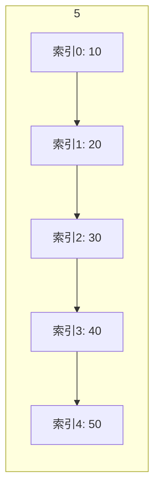

# C 语言中的数组与字符串：构建数据处理的基石

在C语言中，数组和字符串是程序处理数据的两大核心工具。无论是存储一组学生成绩，还是处理用户输入的文本信息，掌握它们的使用方法是每位C语言学习者的必经之路。本章将系统讲解数组与字符串的基本概念、操作技巧及常见陷阱，帮助你打下坚实的数据处理基础。

## 数组：批量数据的高效管理

### 什么是数组？

想象你需要记录一个班级30名学生的考试成绩。如果为每个学生单独声明变量（如`score1`, `score2`, ...），不仅繁琐还容易出错。数组正是为解决这类问题而生——它将**多个相同类型的数据**存储在**连续的内存空间**中，并通过**单一变量名**和**索引**进行访问。

技术定义：数组是相同数据类型元素的集合，这些元素在内存中连续存放。通过数组，程序员可以高效地管理批量数据。



> 💡 **学习提示**：数组索引从0开始是C语言的固定规则，这与日常计数习惯不同，务必牢记！

### 数组声明与初始化

#### 基础声明方式

```c
// 显式指定大小
int numbers[5];        // 可存储5个整数的数组
float scores[10];      // 10个浮点数的数组
char letters[26];      // 26个字符的数组（如字母表）

// 声明并初始化
int ages[3] = {25, 30, 35};  // 显式初始化
float prices[] = {10.5, 20.0, 15.75};  // 编译器自动推断大小为3
char vowels[5] = {'a', 'e', 'i', 'o', 'u'};
```

> ⚠️ **重要说明**：数组大小必须是**编译时常量**（如`5`），不能是变量（C99标准后支持变长数组，但初学者建议避免使用）。

#### 零初始化技巧

```c
int zeros[100] = {0};     // 所有元素初始化为0
int partial[5] = {1, 2};  // 前两个元素：1, 2；其余自动设为0
```

> 💡 **最佳实践**：显式初始化数组可避免"垃圾值"问题，特别是当数组用于计算时。

### 访问与操作数组元素

#### 基础访问示例

```c
#include <stdio.h>

int main() {
    int numbers[5] = {10, 20, 30, 40, 50};
    
    // 正确访问方式（索引从0开始）
    printf("第一个元素: %d\n", numbers[0]);   // 输出10
    printf("第三个元素: %d\n", numbers[2]);   // 输出30
    printf("最后一个元素: %d\n", numbers[4]); // 输出50
    
    // 修改元素
    numbers[1] = 25;
    printf("修改后的第二个元素: %d\n", numbers[1]);  // 输出25
    
    return 0;
}
```

> ⚠️ **关键警告**：C语言**不会自动检查数组边界**！访问`numbers[5]`（当数组大小为5时）会导致**缓冲区溢出**，可能引发程序崩溃或安全漏洞。

#### 数组大小计算

```c
#include <stdio.h>

int main() {
    int arr[] = {1, 2, 3, 4, 5};
    // 计算元素数量 = 总字节数 / 单个元素字节数
    int size = sizeof(arr) / sizeof(arr[0]);
    
    printf("数组包含 %d 个元素\n", size);  // 输出5
    
    return 0;
}
```

> 💡 **技术要点**：`sizeof(arr)`返回整个数组占用的字节数，除以单个元素大小即可得到元素数量。

#### 遍历数组的正确姿势

```c
#include <stdio.h>

int main() {
    int numbers[5] = {10, 20, 30, 40, 50};
    int size = sizeof(numbers) / sizeof(numbers[0]);
    
    printf("数组元素: ");
    for (int i = 0; i < size; i++) {
        printf("%d ", numbers[i]);
    }
    // 输出: 10 20 30 40 50
    
    return 0;
}
```

> ✅ **黄金法则**：循环条件中**始终使用`i < size`**，避免硬编码数组大小。

### 数组函数设计

```c
#include <stdio.h>

// 查找最大值函数
int findMax(int arr[], int size) {
    int max = arr[0];
    for (int i = 1; i < size; i++) {
        if (arr[i] > max) {
            max = arr[i];
        }
    }
    return max;
}

// 计算总和函数
int calculateSum(int arr[], int size) {
    int sum = 0;
    for (int i = 0; i < size; i++) {
        sum += arr[i];
    }
    return sum;
}

int main() {
    int numbers[] = {15, 8, 23, 4, 16};
    int size = sizeof(numbers) / sizeof(numbers[0]);
    
    printf("最大值: %d\n", findMax(numbers, size));  // 23
    printf("总和: %d\n", calculateSum(numbers, size)); // 66
    
    return 0;
}
```

> 💡 **设计建议**：对不修改数组的函数参数添加`const`限定符，如`int findMax(const int arr[], int size)`，可防止意外修改数据。

## 多维数组：表格数据的表示

### 二维数组实战

```c
#include <stdio.h>

int main() {
    // 声明3行4列的矩阵
    int matrix[3][4] = {
        {1, 2, 3, 4},
        {5, 6, 7, 8},
        {9, 10, 11, 12}
    };
    
    // 访问特定元素
    printf("第2行第3列的元素: %d\n", matrix[1][2]);  // 输出7（索引从0开始）
    
    // 遍历输出矩阵
    printf("矩阵内容:\n");
    for (int i = 0; i < 3; i++) {
        for (int j = 0; j < 4; j++) {
            printf("%3d ", matrix[i][j]);
        }
        printf("\n");
    }
    /* 输出:
       1   2   3   4 
       5   6   7   8 
       9  10  11  12 
    */
    
    return 0;
}
```

```mermaid
flowchart TB
    subgraph 二维数组 matrix[3][4]
    row0["第0行: 1, 2, 3, 4"] 
    row1["第1行: 5, 6, 7, 8"]
    row2["第2行: 9,10,11,12"]
    end
    row0 --> row1 --> row2
```

> 💡 **内存布局**：C语言中二维数组按**行优先**顺序存储。`matrix[1][2]`在内存中的位置 = 起始地址 + (1*4 + 2)*sizeof(int)

## 字符串：C语言中的文本处理

### 字符串的本质

在C语言中，**字符串是以空字符（`\0`）结尾的字符数组**。这个看似简单的规则至关重要——标准库函数（如`printf`）正是通过`\0`判断字符串结束位置。

```mermaid
flowchart LR
    H[H] --> e[e]
    e --> l1[l]
    l1 --> l2[l]
    l2 --> o[o]
    o --> nul[\0]
```

> ⚠️ **致命陷阱**：若遗漏`\0`，程序可能会读取到内存中的随机数据，导致不可预知的错误甚至安全漏洞。

### 字符串声明与初始化

```c
#include <stdio.h>

int main() {
    // 三种等效声明方式
    char str1[6] = "Hello";  // 显式指定大小（含\0）
    char str2[] = "World";   // 编译器自动计算大小（6字节）
    char str3[10] = {'H','i','\0'}; // 手动添加终止符
    
    printf("str1: %s\n", str1);  // Hello
    printf("str2: %s\n", str2);  // World
    printf("str3: %s\n", str3);  // Hi
    
    return 0;
}
```

> 💡 **关键区别**：`"Hello"`实际占用6字节（5字符 + `\0`），而`{'H','e','l','l','o'}`不包含终止符，**不是合法字符串**！

### 安全的字符串输入输出

```c
#include <stdio.h>

int main() {
    char name[50];
    char message[100];
    
    // 读取单个单词（遇到空格停止）
    printf("请输入姓名: ");
    scanf("%49s", name);  // 限制输入长度防止溢出
    
    // 读取整行文本（包含空格）
    printf("请输入消息: ");
    getchar();  // 消耗前次输入的换行符
    fgets(message, sizeof(message), stdin);  // 安全读取
    
    printf("你好, %s!\n", name);
    printf("你的消息: %s", message);
    
    return 0;
}
```

> ✅ **安全准则**：
>
> 1. `scanf`中指定最大宽度（如`%49s`）
> 2. 用`fgets`替代`gets`（后者已被淘汰）
> 3. 始终检查输入长度

### 字符串处理函数库

```c
#include <stdio.h>
#include <string.h>

int main() {
    char str1[50] = "Hello";
    char str2[50] = "World";
    char str3[100];
    
    // 获取长度（不包含\0）
    printf("str1长度: %zu\n", strlen(str1));  // 5
    
    // 安全复制（推荐strncpy）
    strncpy(str3, str1, sizeof(str3)-1);
    str3[sizeof(str3)-1] = '\0';  // 确保终止
    printf("复制结果: %s\n", str3);  // Hello
    
    // 安全连接
    strncat(str1, " ", sizeof(str1)-strlen(str1)-1);
    strncat(str1, str2, sizeof(str1)-strlen(str1)-1);
    printf("连接结果: %s\n", str1);  // Hello World
    
    // 安全比较
    if (strncmp(str2, "World", 5) == 0) {
        printf("字符串匹配\n");
    }
    
    return 0;
}
```

> 💡 **函数选择指南**：
>
> | 操作       | 不安全函数 | 安全函数       | 推荐度 |
> |------------|------------|----------------|--------|
> | 复制       | strcpy     | strncpy        | ★★★★   |
> | 连接       | strcat     | strncat        | ★★★★   |
> | 格式化输出 | sprintf    | snprintf       | ★★★★★  |

### 字符串操作实战

```c
#include <stdio.h>
#include <string.h>
#include <ctype.h>

// 转换为大写
void toUpperCase(char str[]) {
    for (int i = 0; str[i]; i++) {
        str[i] = toupper(str[i]);
    }
}

// 反转字符串
void reverseString(char str[]) {
    int len = strlen(str);
    for (int i = 0; i < len/2; i++) {
        char temp = str[i];
        str[i] = str[len-1-i];
        str[len-1-i] = temp;
    }
}

int main() {
    char text[] = "Hello World";
    
    printf("原始: %s\n", text);
    
    toUpperCase(text);
    printf("大写: %s\n", text);  // HELLO WORLD
    
    reverseString(text);
    printf("反转: %s\n", text);  // DLROW OLLEH
    
    return 0;
}
```

> 💡 **技巧**：`for (int i = 0; str[i]; i++)`中`str[i]`作为条件，等价于`str[i] != '\0'`，是C语言中处理字符串的惯用写法。

## 避坑指南：常见错误与最佳实践

### 三大致命陷阱

1. **数组越界访问**

   ```c
   int arr[5] = {1,2,3,4,5};
   arr[5] = 10;  // 错误！有效索引为0-4
   ```

2. **字符串缓冲区溢出**

   ```c
   char buf[10];
   strcpy(buf, "This is too long");  // 危险！
   ```

3. **遗漏字符串终止符**

   ```c
   char str[5] = {'H','e','l','l','o'}; 
   printf("%s", str);  // 可能输出乱码（缺少\0）
   ```

### 黄金开发准则

✅ **边界检查**  
始终使用`sizeof`计算数组大小，循环条件写为`i < size`

✅ **安全函数优先**  

- 用`strncpy`替代`strcpy`
- 用`snprintf`替代`sprintf`
- 用`fgets`替代`gets`

✅ **显式终止符**  
手动操作字符数组时，务必在末尾添加`\0`：

```c
char buf[20];
strncpy(buf, "Safe", sizeof(buf)-1);
buf[sizeof(buf)-1] = '\0';  // 关键！
```

✅ **const保护**  
对不修改的数组参数添加`const`：

```c
void printArray(const int arr[], size_t size) {
    // 此处无法修改arr，增强代码安全性
}
```

✅ **size_t类型**  
数组索引和大小应使用`size_t`（无符号整型）：

```c
size_t size = sizeof(arr)/sizeof(arr[0]);
for (size_t i = 0; i < size; i++) { ... }
```

> 🌟 **终极建议**：现代C编译器（如GCC）提供`-D_FORTIFY_SOURCE=2`选项，可在编译时检测部分缓冲区溢出问题，建议在开发阶段启用。

## 总结

数组和字符串构成了C语言数据操作的基石。通过本章学习，你应该掌握：

- 数组的声明、初始化与安全访问技巧
- 字符串的本质（带终止符的字符数组）及处理方法
- 关键库函数的正确使用方式
- 识别并避免常见内存安全问题

记住：**安全编码习惯比技巧更重要**。在编写涉及数组和字符串的代码时，始终思考"这个操作会越界吗？"、"这个字符串有终止符吗？"。当你能自然地遵循这些准则时，你就真正掌握了C语言的核心精髓。
