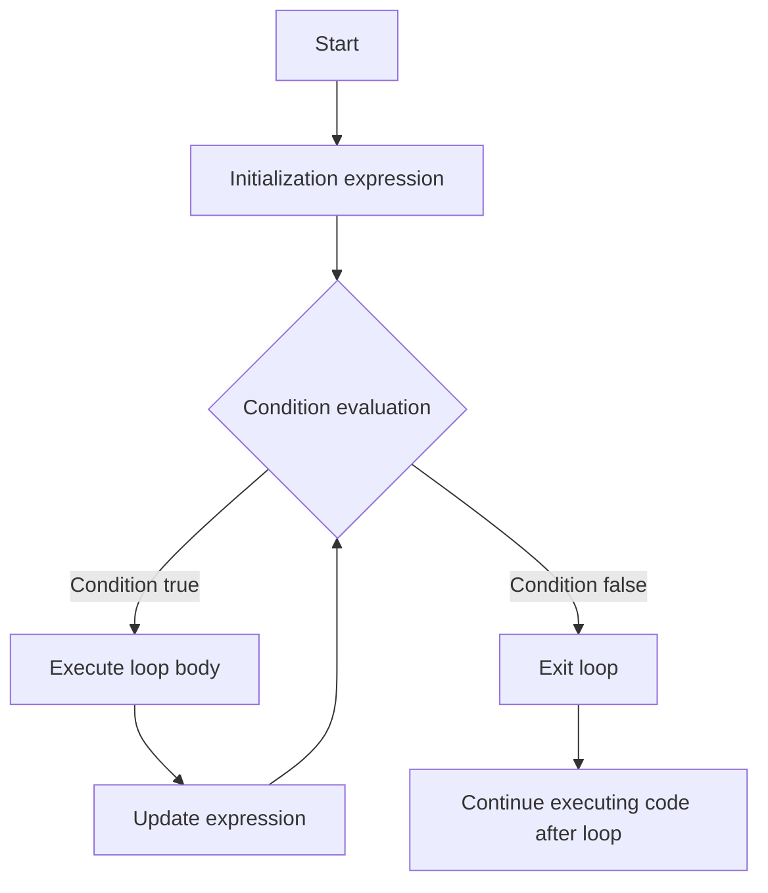
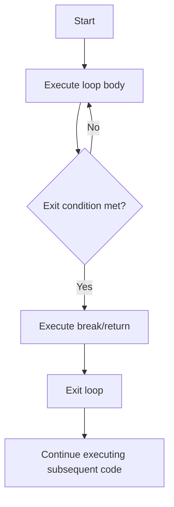
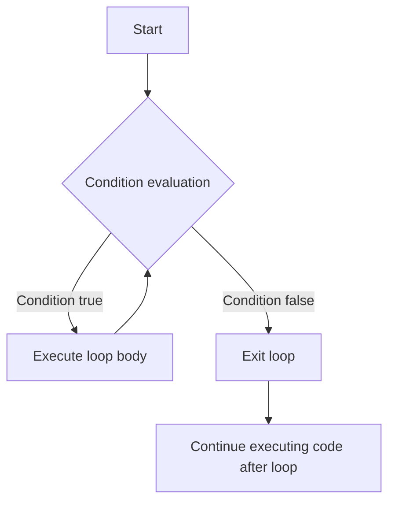
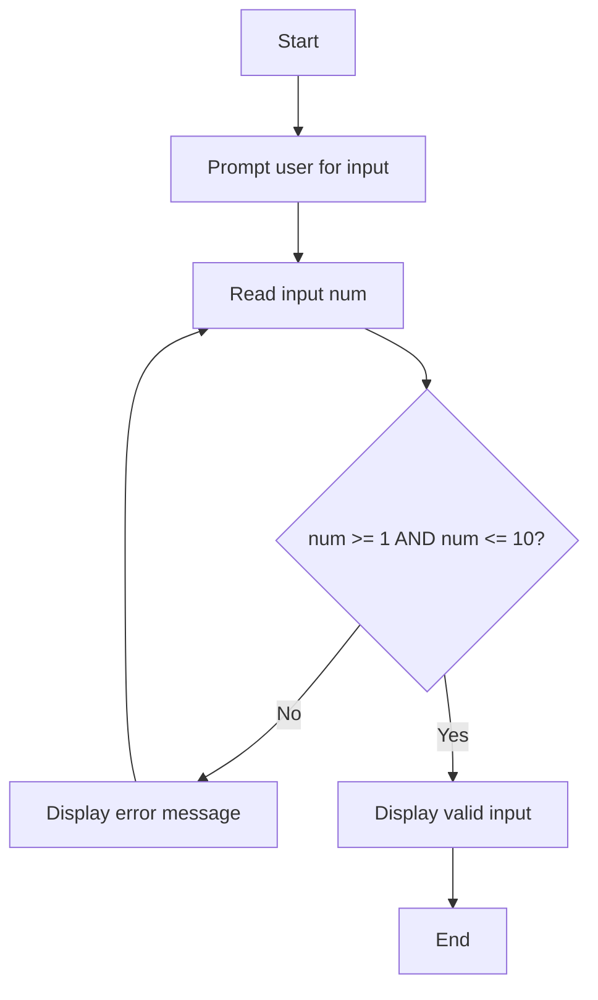
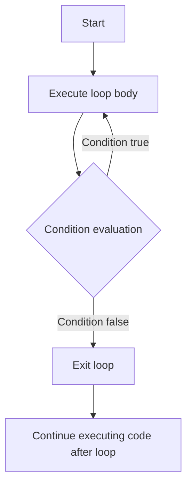
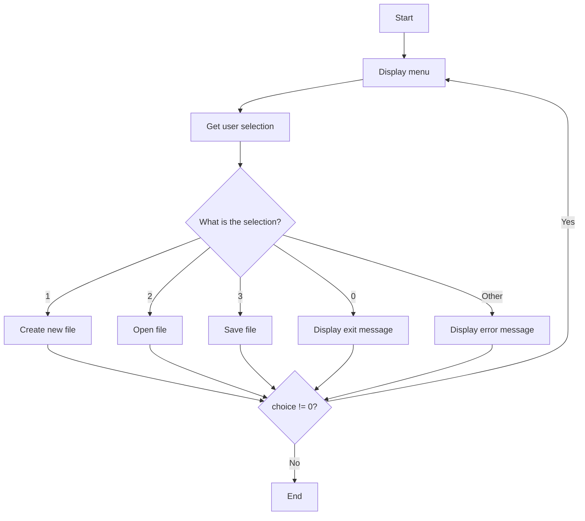
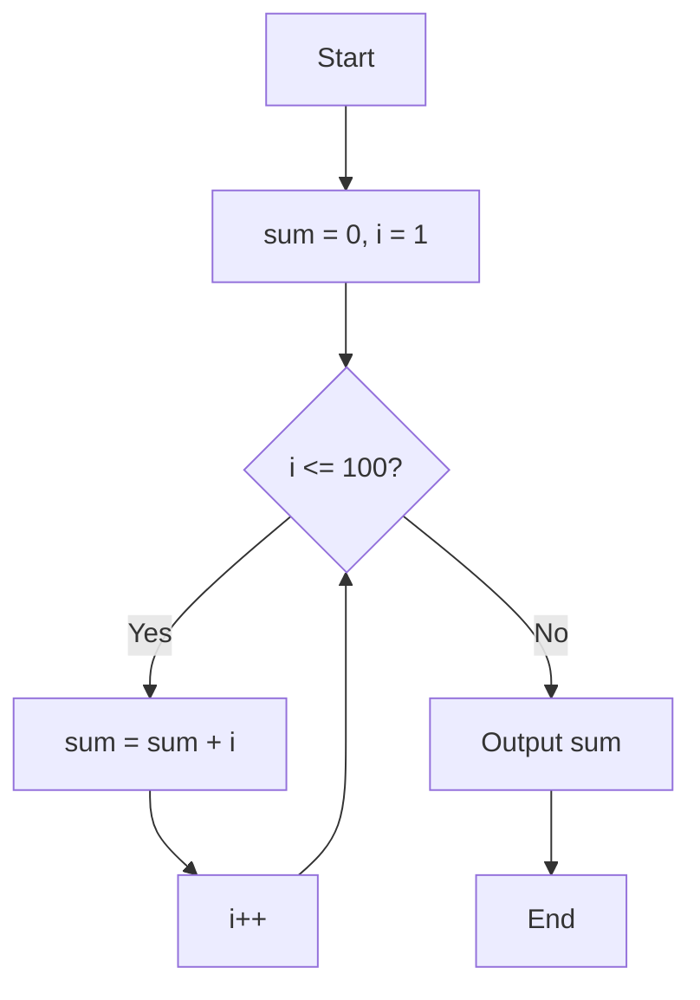
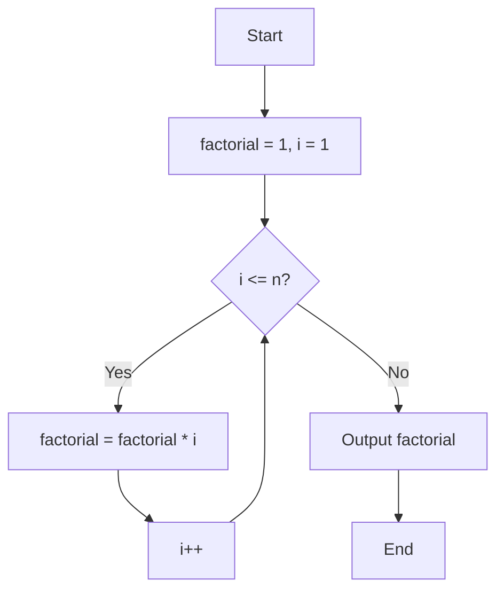
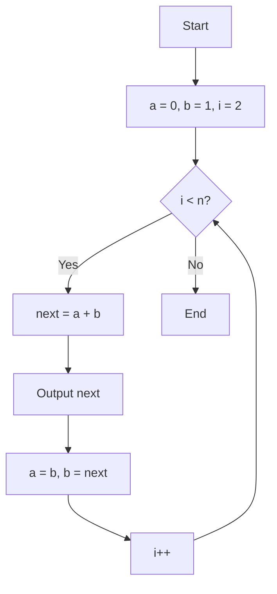

# Getting Started with C Language: Day 3 - Loop Structures: Efficiently Handling Repetitive Tasks

This chapter systematically and thoroughly introduces loop statements, a core programming concept. Loop structures enable us to handle repetitive tasks concisely and efficiently, forming the cornerstone of dynamic program logic. Through this chapter, you will master the working principles, execution flow, and applicable scenarios of three basic loop structures, laying a solid foundation for writing more complex programs.

## `for` Loop: Precise Control of Repetition Count

The `for` loop is the most commonly used loop structure, especially suitable for scenarios where the number of repetitions is known. Its standard syntax structure is as follows:

```c
for (initialization expression; condition expression; update expression) {
    // Loop body
}
```

### Execution Flow Details

The execution flow of a `for` loop can be clearly illustrated using the following Mermaid flowchart:



1. **Initialization expression**: Executed once before the loop begins, typically used to define and initialize loop variables
2. **Condition expression evaluation**: Checked before each loop iteration; if true (non-zero value), the loop body executes; otherwise, the loop exits
3. **Execute loop body**: Code block executed when the condition is true
4. **Update expression**: Executed after each loop body execution, performing update operations
5. **Repeat steps 2-4**: Until the condition evaluates to false

### Example: Counting Output

```c
#include <stdio.h>

int main() {
    for (int i = 0; i < 5; i++) {
        printf("Current count: %d\n", i);
    }
    return 0;
}
```

**Detailed execution process**:

1. Initialization: `i = 0` (executed once)
2. First iteration:
   - Condition check: `0 < 5` is true
   - Execute loop body: Output "Current count: 0"
   - Update operation: `i++` → `i = 1`
3. Second iteration:
   - Condition check: `1 < 5` is true
   - Execute loop body: Output "Current count: 1"
   - Update operation: `i++` → `i = 2`
4. ... (and so on)
5. Fifth iteration:
   - Condition check: `4 < 5` is true
   - Execute loop body: Output "Current count: 4"
   - Update operation: `i++` → `i = 5`
6. Sixth check:
   - Condition check: `5 < 5` is false → Exit loop

**Output**:

```
Current count: 0
Current count: 1
Current count: 2
Current count: 3
Current count: 4
```

### Flexible Usage Techniques

- **Omitting expressions**: All three expressions can be omitted, but semicolons must remain

  ```c
  int i = 0;
  for (; i < 10; ) {  // Valid but requires updating i within the loop body
      printf("%d ", i++);
  }
  ```
  
- **Multiple initialization**: Use comma operator to initialize multiple variables

  ```c
  for (int i = 0, j = 10; i < j; i++, j--) {
      printf("i=%d, j=%d\n", i, j);
  }
  ```

- **Nested loops**: Include another loop within the loop body

  ```c
  for (int i = 1; i <= 3; i++) {
      for (int j = 1; j <= 3; j++) {
          printf("(%d,%d) ", i, j);
      }
      printf("\n");
  }
  ```

  **Output**:

  ```
  (1,1) (1,2) (1,3) 
  (2,1) (2,2) (2,3) 
  (3,1) (3,2) (3,3) 
  ```

### Infinite Loop: `for(;;)`

When all expressions are omitted, `for(;;)` forms an infinite loop, commonly used in scenarios requiring continuous execution until a specific condition is met:

```c
#include <stdio.h>

int main() {
    int count = 0;
    
    for (;;) {  // Infinite loop structure
        printf("Count: %d\n", count);
        if (++count >= 5) break;  // Exit using break when condition is met
    }
    
    return 0;
}
```

**Technical points**:

- C language specification states that omitting the condition expression defaults to true, causing continuous loop execution
- Must explicitly exit through `break` statement, `return`, or external intervention (such as program termination)
- Infinite loop flowchart:



## `while` Loop: Condition-Driven Repetitive Execution

The `while` loop continuously executes while the condition is true, suitable for scenarios with unknown repetition counts:

```c
while (condition expression) {
    // Loop body
}
```

### Execution Flow Details

The execution flow of a `while` loop can be clearly illustrated using the following Mermaid flowchart:



1. **Condition expression evaluation**: First checks the condition expression
2. **Execute loop body**: Executes when condition is true
3. **Repeat steps 1-2**: Until condition becomes false

### Example: User Input Validation

```c
#include <stdio.h>

int main() {
    int num;
    
    printf("Please enter a number between 1-10: ");
    scanf("%d", &num);
    
    while (num < 1 || num > 10) {
        printf("Invalid input! Please re-enter: ");
        scanf("%d", &num);
    }
    
    printf("Valid input: %d\n", num);
    return 0;
}
```

**Execution flowchart**:



**Execution process**:

1. Program prompts user to enter a number between 1-10
2. User inputs a value, stored in variable `num`
3. Check if `num` is within 1-10 range
   - If not in range, display error message and request re-entry
   - If in range, display valid input and exit loop

### Important Notes

- **Avoid infinite loops**: Ensure the loop body contains statements that modify the condition
- **Condition initialization**: Ensure condition variables have reasonable initial values before the loop
- **Typical applications**: File reading, user input validation, event listening, and other scenarios with uncertain repetition counts
- **Common mistakes**: Forgetting to update condition variables leading to infinite loops

## `do-while` Loop: Loop That Executes at Least Once

The `do-while` loop executes the loop body first and then checks the condition, ensuring the loop body executes at least once:

```c
do {
    // Loop body
} while (condition expression);
```

### Execution Flow Details

The execution flow of a `do-while` loop can be clearly illustrated using the following Mermaid flowchart:



1. **Execute loop body**: Unconditionally executed once
2. **Condition expression evaluation**: Checks the condition expression
3. **Repeat steps 1-2**: Continues execution when condition is true

### Example: Menu System

```c
#include <stdio.h>

int main() {
    int choice;
    
    do {
        printf("\n1. Create new file\n2. Open file\n3. Save file\n0. Exit\n");
        printf("Please select operation: ");
        scanf("%d", &choice);
        
        switch(choice) {
            case 1: printf("Creating new file...\n"); break;
            case 2: printf("Opening file...\n"); break;
            case 3: printf("Saving file...\n"); break;
            case 0: printf("Exiting program\n"); break;
            default: printf("Invalid selection, please try again\n");
        }
    } while (choice != 0);
    
    return 0;
}
```

**Execution flowchart**:



### Applicable Scenarios

- Operations that need to execute at least once (such as menu systems)
- Scenarios where loop conditions depend on calculations within the loop body
- Interactive programs ensuring at least one prompt display
- Comparison with `while` loop: `do-while` loop body executes at least once, while `while` may not execute at all

## Classic Application Examples

### 1. Cumulative Sum (1 to 100)

```c
#include <stdio.h>

int main() {
    int sum = 0;
    
    for (int i = 1; i <= 100; i++) {
        sum += i;  // Equivalent to sum = sum + i
    }
    
    printf("Sum from 1 to 100 = %d\n", sum);
    return 0;
}
```

**Algorithm flowchart**:



**Algorithm explanation**:

- Loop variable `i` increments from 1 to 100
- Each value is accumulated into `sum`
- Final result is the sum from 1 to 100 (5050)
- **Mathematical formula verification**: n(n+1)/2 = 100×101/2 = 5050

### 2. Factorial Calculation

```c
#include <stdio.h>

int main() {
    int n = 5;
    long factorial = 1;  // Using long to avoid overflow with large numbers
    
    for (int i = 1; i <= n; i++) {
        factorial *= i;
    }
    
    printf("%d! = %ld\n", n, factorial);
    return 0;
}
```

**Algorithm flowchart**:



**Execution process**:

- n = 5
- i = 1: factorial = 1 × 1 = 1
- i = 2: factorial = 1 × 2 = 2
- i = 3: factorial = 2 × 3 = 6
- i = 4: factorial = 6 × 4 = 24
- i = 5: factorial = 24 × 5 = 120
- Output: 5! = 120

**Important notes**:

- Factorials grow rapidly: 5! = 120, 10! = 3,628,800
- 20! exceeds `int` range (approximately 2.43×10¹⁸), requiring careful data type selection
- Factorials above 13! require `long long` type

### 3. Fibonacci Sequence

```c
#include <stdio.h>

int main() {
    int n = 10;
    int a = 0, b = 1;
    
    printf("First %d terms of Fibonacci sequence: %d %d", n, a, b);
    
    for (int i = 2; i < n; i++) {
        int next = a + b;
        printf(" %d", next);
        a = b;
        b = next;
    }
    
    printf("\n");
    return 0;
}
```

**Algorithm flowchart**:



**Execution process**:

- Initialization: a = 0, b = 1
- i = 2: next = 0 + 1 = 1, a = 1, b = 1
- i = 3: next = 1 + 1 = 2, a = 1, b = 2
- i = 4: next = 1 + 2 = 3, a = 2, b = 3
- i = 5: next = 2 + 3 = 5, a = 3, b = 5
- ... (and so on)
- Output: 0 1 1 2 3 5 8 13 21 34

**Optimization notes**:

- Compared to the original code, this implementation uses two variables to track the previous two terms, avoiding conditional checks
- More concise and efficient code with O(n) time complexity
- O(1) space complexity, using only a fixed number of variables

## Loop Selection Guide and Best Practices

| Loop Type | Applicable Scenario | Execution Characteristics | Typical Applications | Notes |
|-----------|---------------------|---------------------------|----------------------|-------|
| `for` | Known exact number of repetitions | Check condition before execution | Counting loops, array traversal | Loop variables should be declared as close as possible to their usage |
| `while` | Repetition while condition is met | Check condition before execution | Input validation, file reading | Ensure loop body contains statements that modify the condition |
| `do-while` | At least one execution required | Execute first, then check condition | Menu systems, interactive programs | Note that semicolon cannot be omitted |

### Loop Control Statements

- **`break`**: Immediately exit the current loop

  ```c
  for (int i = 0; i < 10; i++) {
      if (i == 5) break;  // Exit loop when i=5
      printf("%d ", i);
  }
  // Output: 0 1 2 3 4
  ```

- **`continue`**: Skip the remaining part of the current loop iteration and proceed to the next iteration

  ```c
  for (int i = 0; i < 10; i++) {
      if (i % 2 == 0) continue;  // Skip even numbers
      printf("%d ", i);
  }
  // Output: 1 3 5 7 9
  ```

### Common Errors and Solutions

1. **Infinite loops**:
   - **Cause**: Condition expression always true, or no condition-modifying statements in loop body
   - **Solution**: Ensure condition can become false, or include exit mechanisms in loop body

2. **"Loop boundary" errors**:
   - **Cause**: Loop variable exceeds expected range
   - **Solution**: Carefully check boundary conditions, such as `i <= n` vs `i < n`

3. **Floating-point comparison issues**:
   - **Cause**: Precision problems with floating-point numbers causing inaccurate condition checks
   - **Solution**: Avoid direct equality comparisons with floating-point numbers; use range comparisons

4. **Loop variable scope**:
   - **Issue**: In C89 standard, loop variables must be declared before the loop
   - **Solution**: Use C99 or higher standard, or declare variables before the loop

### Performance Considerations

- **Loop unrolling**: Reduce condition check frequency to improve execution efficiency

  ```c
  // Without unrolling
  for (int i = 0; i < 100; i++) {
      array[i] = i * 2;
  }
  
  // Unrolled (processing 4 elements per iteration)
  for (int i = 0; i < 100; i += 4) {
      array[i] = i * 2;
      array[i+1] = (i+1) * 2;
      array[i+2] = (i+2) * 2;
      array[i+3] = (i+3) * 2;
  }
  ```

- **Avoid calling functions in loop conditions**:

  ```c
  // Inefficient
  for (int i = 0; i < strlen(s); i++) {
      // ...
  }
  
  // Efficient
  int len = strlen(s);
  for (int i = 0; i < len; i++) {
      // ...
  }
  ```

Through this chapter, you should be able to select appropriate loop structures based on actual requirements and correctly implement various repetitive task processing logic. In the next chapter, we will explore nested loops and flow control statements to further enhance your program design capabilities.

**Programming wisdom**: Good loop design is key to program efficiency. Avoid unnecessary repeated calculations, ensure loops have clear termination conditions, and make your code both concise and efficient.
