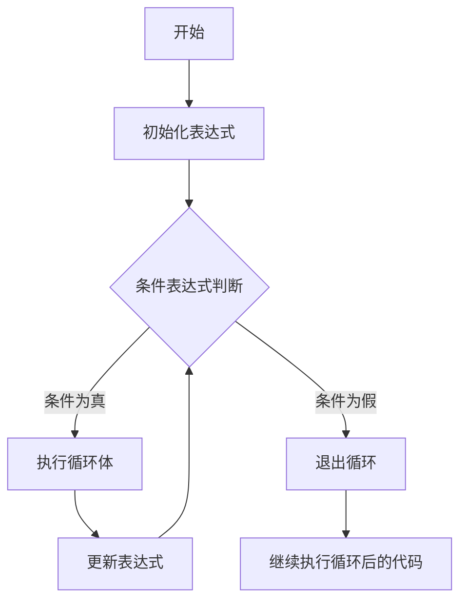
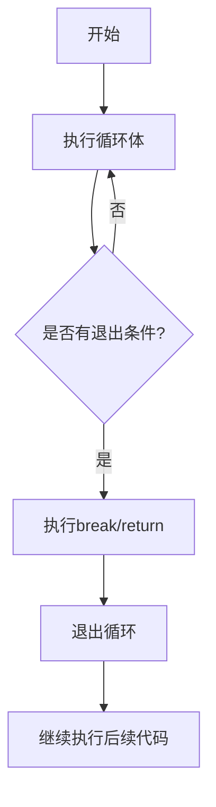
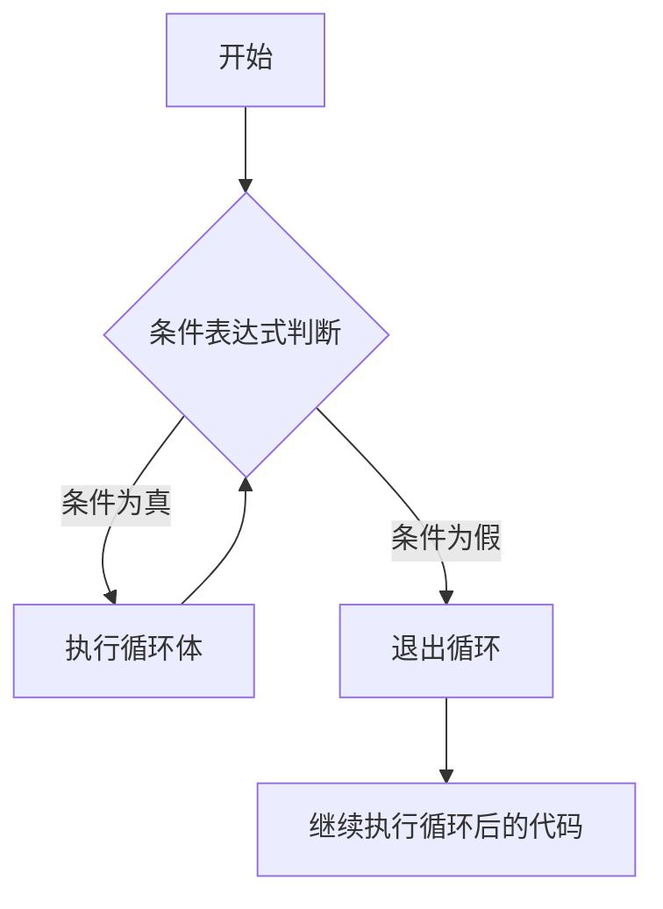
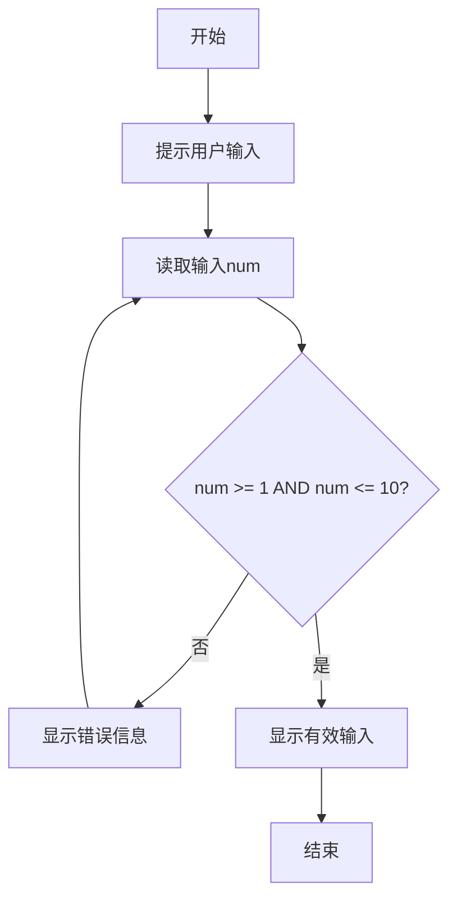
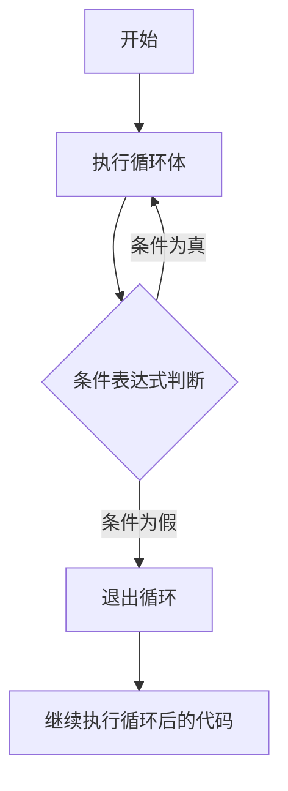
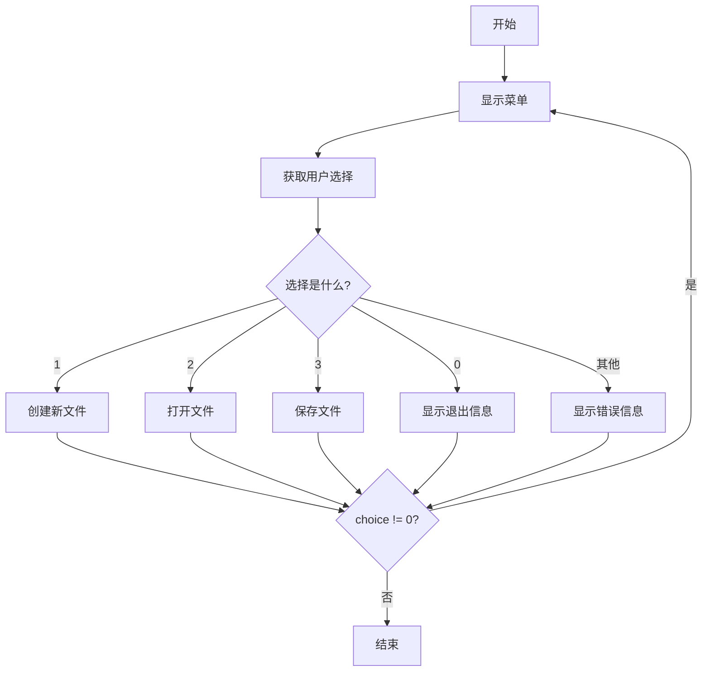
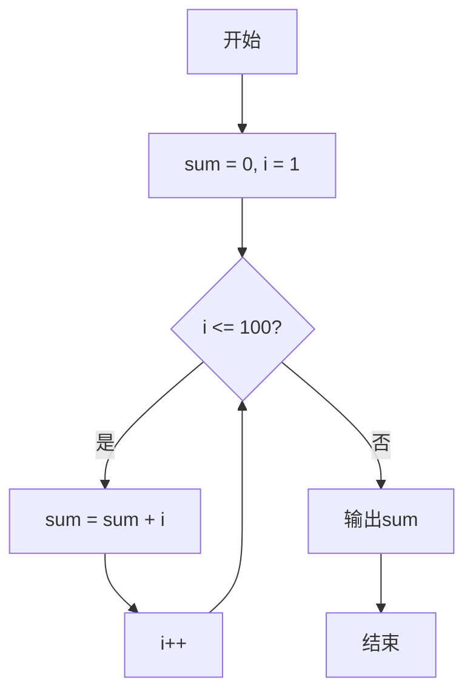
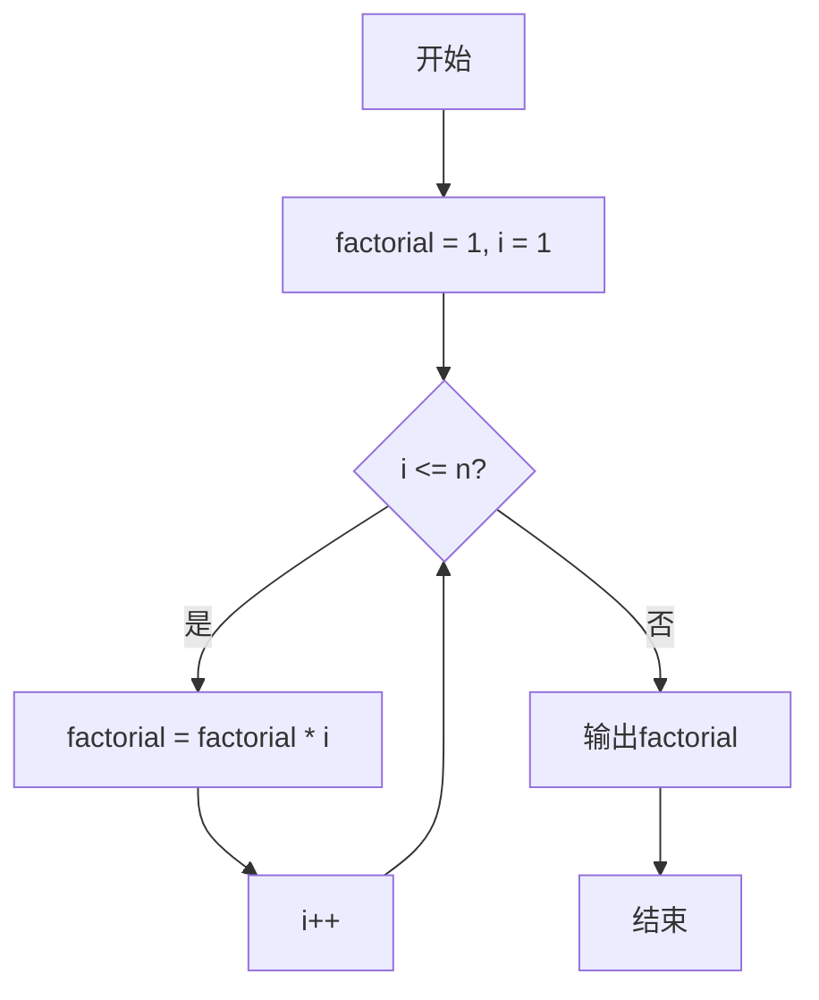
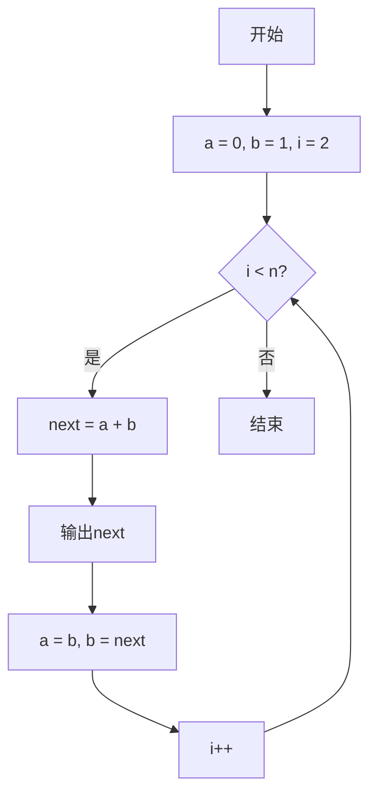

# 从零入门 C 语言：Day3 - 循环结构：高效处理重复任务

本章将系统深入地介绍循环语句这一核心编程概念。循环结构使我们能够简洁高效地处理重复性任务，是构建动态程序逻辑的基石。通过本章学习，你将掌握三种基本循环结构的工作原理、执行流程与适用场景，为编写更复杂的程序打下坚实基础。

## `for` 循环：精确控制重复次数

`for` 循环是最常用的循环结构，特别适合已知重复次数的场景。其标准语法结构如下：

```c
for (初始化表达式; 条件表达式; 更新表达式) {
    // 循环体
}
```

### 执行流程详解

`for` 循环的执行流程可以用以下 Mermaid 流程图清晰展示：



1. **初始化表达式**：循环开始前执行一次，通常用于定义和初始化循环变量
2. **条件表达式判断**：每次循环前检查，若结果为真（非零值）则执行循环体，否则退出循环
3. **执行循环体**：条件为真时执行的代码块
4. **更新表达式**：每次循环体执行完毕后，执行更新操作
5. **重复步骤2-4**：直到条件判断为假

### 示例：计数输出

```c
#include <stdio.h>

int main() {
    for (int i = 0; i < 5; i++) {
        printf("当前计数: %d\n", i);
    }
    return 0;
}
```

**执行过程详细分析**：

1. 初始化：`i = 0`（只执行一次）
2. 第1次循环：
   - 条件判断：`0 < 5` 为真
   - 执行循环体：输出"当前计数: 0"
   - 更新操作：`i++` → `i = 1`
3. 第2次循环：
   - 条件判断：`1 < 5` 为真
   - 执行循环体：输出"当前计数: 1"
   - 更新操作：`i++` → `i = 2`
4. ...（依此类推）
5. 第5次循环：
   - 条件判断：`4 < 5` 为真
   - 执行循环体：输出"当前计数: 4"
   - 更新操作：`i++` → `i = 5`
6. 第6次判断：
   - 条件判断：`5 < 5` 为假 → 退出循环

**输出结果**：

```
当前计数: 0
当前计数: 1
当前计数: 2
当前计数: 3
当前计数: 4
```

### 灵活使用技巧

- **省略部分表达式**：三个表达式均可省略，但分号必须保留

  ```c
  int i = 0;
  for (; i < 10; ) {  // 有效但需在循环体内更新i
      printf("%d ", i++);
  }
  ```
  
- **多重初始化**：使用逗号运算符实现多个变量初始化

  ```c
  for (int i = 0, j = 10; i < j; i++, j--) {
      printf("i=%d, j=%d\n", i, j);
  }
  ```

- **嵌套循环**：在循环体内包含另一个循环

  ```c
  for (int i = 1; i <= 3; i++) {
      for (int j = 1; j <= 3; j++) {
          printf("(%d,%d) ", i, j);
      }
      printf("\n");
  }
  ```

  **输出**：

  ```
  (1,1) (1,2) (1,3) 
  (2,1) (2,2) (2,3) 
  (3,1) (3,2) (3,3) 
  ```

### 无限循环：`for(;;)`

当省略所有表达式时，`for(;;)`构成无限循环，常用于需要持续运行直到特定条件满足的场景：

```c
#include <stdio.h>

int main() {
    int count = 0;
    
    for (;;) {  // 无限循环结构
        printf("计数: %d\n", count);
        if (++count >= 5) break;  // 达到条件后使用break退出
    }
    
    return 0;
}
```

**技术要点**：

- C语言规范规定，省略条件表达式时默认视为真，因此会持续执行循环体
- 必须通过`break`语句、`return`或外部干预（如程序终止）显式退出
- 无限循环流程图：



## `while` 循环：条件驱动的重复执行

`while`循环在条件为真时持续执行，适用于重复次数未知的场景：

```c
while (条件表达式) {
    // 循环体
}
```

### 执行流程详解

`while` 循环的执行流程可以用以下 Mermaid 流程图清晰展示：



1. **条件表达式判断**：先检查条件表达式
2. **执行循环体**：条件为真时执行
3. **重复步骤1-2**：直到条件为假

### 示例：用户输入验证

```c
#include <stdio.h>

int main() {
    int num;
    
    printf("请输入一个1-10之间的数字: ");
    scanf("%d", &num);
    
    while (num < 1 || num > 10) {
        printf("输入无效！请重新输入: ");
        scanf("%d", &num);
    }
    
    printf("有效输入: %d\n", num);
    return 0;
}
```

**执行流程图**：



**执行过程**：

1. 程序提示用户输入一个1-10之间的数字
2. 用户输入一个值，存储在变量`num`中
3. 检查`num`是否在1-10范围内
   - 如果不在范围内，显示错误信息并要求重新输入
   - 如果在范围内，显示有效输入并退出循环

### 注意事项

- **避免死循环**：确保循环体内有修改条件的语句
- **条件初始化**：循环前需确保条件变量有合理初始值
- **典型应用**：文件读取、用户输入验证、事件监听等不确定次数的场景
- **常见错误**：忘记更新条件变量导致无限循环

## `do-while` 循环：至少执行一次的循环

`do-while`循环先执行循环体再判断条件，确保循环体至少执行一次：

```c
do {
    // 循环体
} while (条件表达式);
```

### 执行流程详解

`do-while` 循环的执行流程可以用以下 Mermaid 流程图清晰展示：



1. **执行循环体**：无条件执行一次
2. **条件表达式判断**：检查条件表达式
3. **重复步骤1-2**：条件为真时继续执行

### 示例：菜单系统

```c
#include <stdio.h>

int main() {
    int choice;
    
    do {
        printf("\n1. 新建文件\n2. 打开文件\n3. 保存文件\n0. 退出\n");
        printf("请选择操作: ");
        scanf("%d", &choice);
        
        switch(choice) {
            case 1: printf("正在创建新文件...\n"); break;
            case 2: printf("正在打开文件...\n"); break;
            case 3: printf("正在保存文件...\n"); break;
            case 0: printf("退出程序\n"); break;
            default: printf("无效选择，请重试\n");
        }
    } while (choice != 0);
    
    return 0;
}
```

**执行流程图**：



### 适用场景

- 需要至少执行一次的操作（如菜单系统）
- 循环条件依赖于循环体内部计算结果的情况
- 用户交互式程序中确保至少显示一次提示
- 与`while`循环对比：`do-while`循环体至少执行一次，而`while`可能一次都不执行

## 经典应用案例

### 1. 累加求和（1到100）

```c
#include <stdio.h>

int main() {
    int sum = 0;
    
    for (int i = 1; i <= 100; i++) {
        sum += i;  // 等价于 sum = sum + i
    }
    
    printf("1到100的和 = %d\n", sum);
    return 0;
}
```

**算法流程图**：



**算法解析**：

- 通过循环变量`i`从1递增到100
- 每次将当前值累加到`sum`中
- 最终得到1到100的总和（5050）
- **数学公式验证**：n(n+1)/2 = 100×101/2 = 5050

### 2. 阶乘计算

```c
#include <stdio.h>

int main() {
    int n = 5;
    long factorial = 1;  // 使用long避免大数溢出
    
    for (int i = 1; i <= n; i++) {
        factorial *= i;
    }
    
    printf("%d! = %ld\n", n, factorial);
    return 0;
}
```

**算法流程图**：



**执行过程**：

- n = 5
- i = 1: factorial = 1 × 1 = 1
- i = 2: factorial = 1 × 2 = 2
- i = 3: factorial = 2 × 3 = 6
- i = 4: factorial = 6 × 4 = 24
- i = 5: factorial = 24 × 5 = 120
- 输出：5! = 120

**注意事项**：

- 阶乘增长迅速，5! = 120，10! = 3,628,800
- 20! 已超过`int`表示范围（约2.43×10¹⁸），需注意数据类型选择
- 13! 以上需要使用`long long`类型

### 3. 斐波那契数列

```c
#include <stdio.h>

int main() {
    int n = 10;
    int a = 0, b = 1;
    
    printf("斐波那契数列前%d项: %d %d", n, a, b);
    
    for (int i = 2; i < n; i++) {
        int next = a + b;
        printf(" %d", next);
        a = b;
        b = next;
    }
    
    printf("\n");
    return 0;
}
```

**算法流程图**：



**执行过程**：

- 初始化：a = 0, b = 1
- i = 2: next = 0 + 1 = 1, a = 1, b = 1
- i = 3: next = 1 + 1 = 2, a = 1, b = 2
- i = 4: next = 1 + 2 = 3, a = 2, b = 3
- i = 5: next = 2 + 3 = 5, a = 3, b = 5
- ...（依此类推）
- 输出：0 1 1 2 3 5 8 13 21 34

**优化说明**：

- 相比原始代码，此实现使用两个变量跟踪前两项，避免了条件判断
- 代码更简洁高效，时间复杂度为O(n)
- 空间复杂度为O(1)，只使用了固定数量的变量

## 循环选择指南与最佳实践

| 循环类型 | 适用场景 | 执行特点 | 典型应用 | 注意事项 |
|---------|---------|---------|---------|---------|
| `for` | 已知精确重复次数 | 先判断后执行 | 计数循环、数组遍历 | 循环变量应在最接近使用处声明 |
| `while` | 条件满足时重复 | 先判断后执行 | 输入验证、文件读取 | 确保循环体内有修改条件的语句 |
| `do-while` | 至少执行一次 | 先执行后判断 | 菜单系统、交互式程序 | 注意分号不能省略 |

### 循环控制语句

- **`break`**：立即退出当前循环

  ```c
  for (int i = 0; i < 10; i++) {
      if (i == 5) break;  // 当i=5时退出循环
      printf("%d ", i);
  }
  // 输出: 0 1 2 3 4
  ```

- **`continue`**：跳过当前循环的剩余部分，进入下一次循环

  ```c
  for (int i = 0; i < 10; i++) {
      if (i % 2 == 0) continue;  // 跳过偶数
      printf("%d ", i);
  }
  // 输出: 1 3 5 7 9
  ```

### 常见错误与解决方案

1. **无限循环**：
   - **原因**：条件表达式始终为真，或没有更新条件变量
   - **解决方案**：确保条件能变为假，或在循环体内有退出机制

2. **"循环越界"错误**：
   - **原因**：循环变量超出预期范围
   - **解决方案**：仔细检查边界条件，如`i <= n` vs `i < n`

3. **浮点数比较问题**：
   - **原因**：浮点数精度问题导致条件判断不准确
   - **解决方案**：避免直接比较浮点数相等，使用范围比较

4. **循环变量作用域**：
   - **问题**：C89标准中循环变量必须在循环前声明
   - **解决方案**：使用C99或更高标准，或在循环前声明变量

### 性能考量

- **循环展开**：减少条件判断次数，提高执行效率

  ```c
  // 未展开
  for (int i = 0; i < 100; i++) {
      array[i] = i * 2;
  }
  
  // 展开（每次处理4个元素）
  for (int i = 0; i < 100; i += 4) {
      array[i] = i * 2;
      array[i+1] = (i+1) * 2;
      array[i+2] = (i+2) * 2;
      array[i+3] = (i+3) * 2;
  }
  ```

- **避免在循环条件中调用函数**：

  ```c
  // 低效
  for (int i = 0; i < strlen(s); i++) {
      // ...
  }
  
  // 高效
  int len = strlen(s);
  for (int i = 0; i < len; i++) {
      // ...
  }
  ```

通过本章学习，你应该能够根据实际需求选择合适的循环结构，并正确实现各种重复性任务处理逻辑。下一章我们将探讨循环嵌套与流程控制语句，进一步提升你的程序设计能力。

**编程箴言**：好的循环设计是程序效率的关键。避免不必要的重复计算，确保循环有明确的终止条件，让代码既简洁又高效。
