# Zero to C Language: Day 6 - In-Depth Explanation of Functions

Writing all code within the `main` function leads to disorganized program structure, making it difficult to maintain and read. By dividing code into multiple functions, we can significantly improve code readability, reusability, and maintainability. This chapter systematically explains core concepts and usage techniques of functions in C language, and explores their underlying mechanisms in depth.

## Function Definition and Declaration

### Function Definition

A function definition provides the specific implementation of a function, including its functionality, input parameters, and return value type. The basic syntax for function definition in C is:

```c
return_type function_name(parameter_type parameter_name, ...) {
    // Function body
    return return_value;
}
```

Take a simple addition function as an example:

```c
int add(int a, int b) {
    return a + b;
}
```

Components of this function:

- **Function name**: `add`, used to identify and call the function
- **Return type**: `int`, indicating the function will return an integer value
- **Parameter list**: `int a, int b`, indicating the function requires two integer parameters
- **Function body**: `return a + b;`, implementing the specific functionality of the function

#### Underlying Mechanism of Function Definition

When the compiler encounters a function definition, it performs the following operations:

1. Allocates memory space in the code segment
2. Generates the function entry address (function pointer)
3. Establishes parameter passing and return value conventions
4. Allocates stack space for local variables

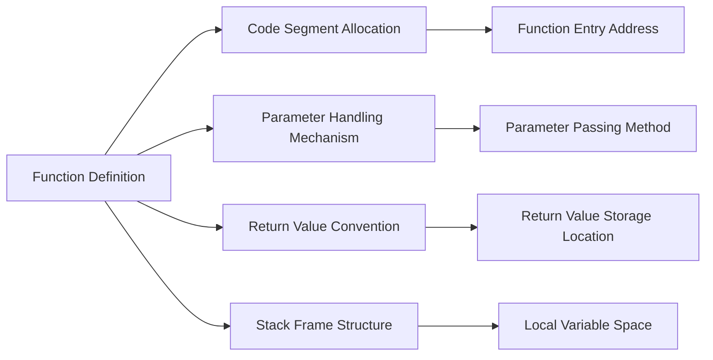

### Function Declaration

A function declaration (also called a function prototype) tells the compiler the function's name, return type, and parameter types, but does not include the implementation. Function declarations are typically placed at the beginning of source files or in header files, allowing the compiler to perform type checking when encountering function calls.

```c
int add(int a, int b);  // Function declaration
```

The main difference between function declaration and definition is that declarations end with a semicolon and lack a function body. Good programming practice involves declaring functions before use to avoid compilation errors and improve code readability.

#### Why Function Declarations Are Needed?

C compilers are single-pass compilers that process code sequentially. Without function declarations, when the compiler encounters a function call, it cannot determine the function's parameter types and return type, potentially causing:

- Parameter type mismatch errors
- Improper return value handling
- Inability to perform type checking

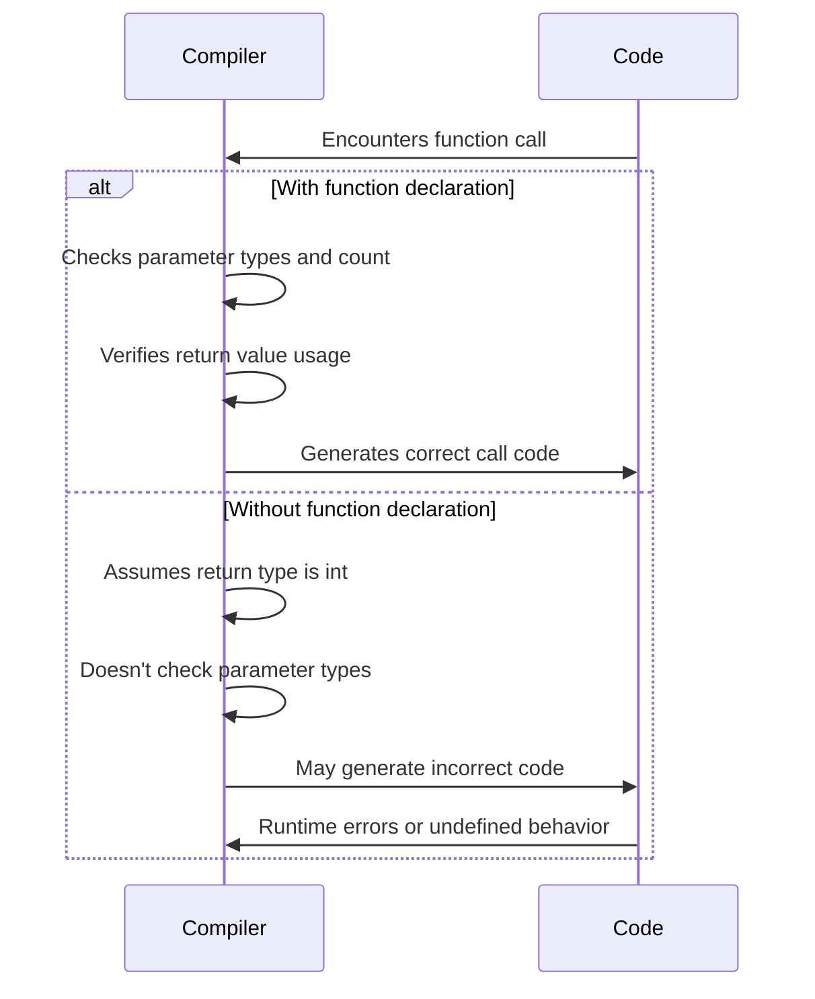

## Function Call Mechanism

### Function Call Process

After defining a function, it must be called to execute its functionality. The basic syntax for function calls is:

```c
return_value_variable = function_name(actual_parameters);
```

- Return value reception is **optional**; if the return value isn't needed, the function can be called directly
- Actual parameters must match the parameter types and count in the function definition

Continuing with the `add` function example:

```c
int result = add(5, 3);  // Calls function, result will be 8
```

#### Underlying Execution Flow of Function Calls

C language function calls follow specific calling conventions, which may vary across platforms, but the basic flow is:

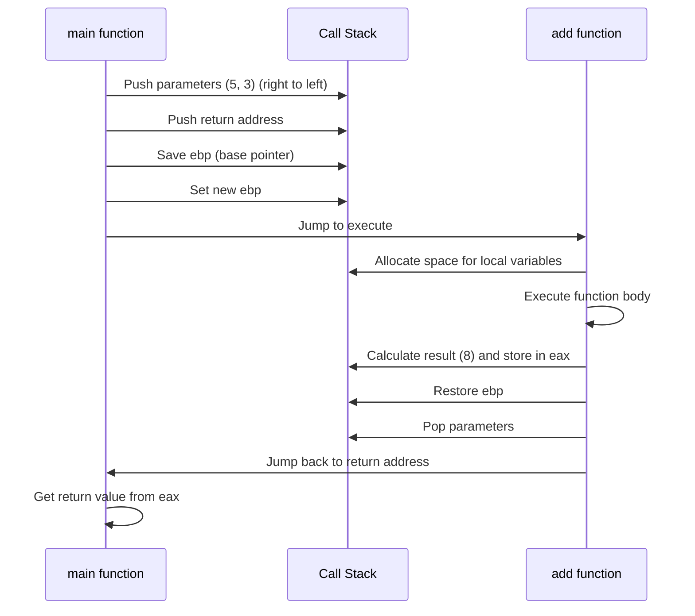

### Stack Frame Structure Explained

When a function is called, a stack frame is created on the stack containing:

```
|-----------------|
| Caller parameters|  <- esp (stack pointer)
|-----------------|
| Return address   |
|-----------------|
| Saved ebp        |  <- ebp (base pointer)
|-----------------|
| Local variables  |
|-----------------|
| Temporary space  |
|-----------------|
```

- **ebp (Base Pointer)**: Points to the base of the current function's stack frame
- **esp (Stack Pointer)**: Points to the top of the stack
- **Return address**: Location to jump back to after function execution completes
- **Local variables**: Storage area for variables defined within the function

## Parameter Passing Mechanism

### Pass by Value

C language uses pass by value by default, meaning the function receives a copy of the actual parameter, and modifications to the formal parameter don't affect the original data:

```c
void changeValue(int x) {
    x = 10;  // Only modifies the copy
}

int main() {
    int a = 5;
    changeValue(a);
    printf("%d", a);  // Still outputs 5
    return 0;
}
```

#### Memory Model of Pass by Value

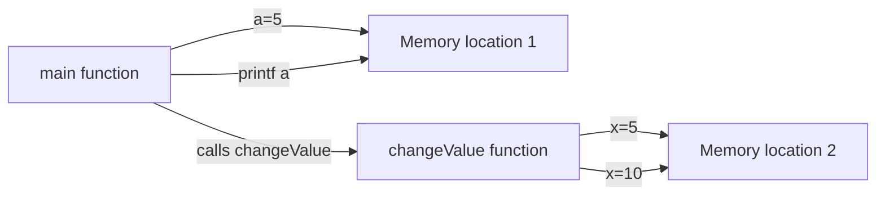

### Pass by Pointer (Simulating Pass by Reference)

By passing the address of a variable (pointer), a function can modify the original data provided by the caller:

```c
void changeValue(int *x) {
    *x = 10;  // Modifies original data through pointer
}

int main() {
    int a = 5;
    changeValue(&a);  // Pass address of a
    printf("%d", a);  // Outputs 10
    return 0;
}
```

#### Memory Model of Pointer Passing

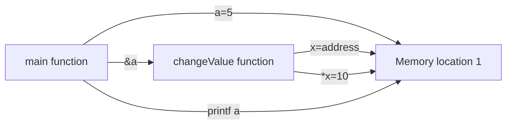

> **Note**: C language doesn't have true "pass by reference"; this is an equivalent mechanism implemented through pointers.

## Return Value Handling

C language functions can return a value, with the return type specified in the function definition:

```c
int max(int x, int y) {
    return (x > y) ? x : y;
}
```

If a function doesn't need to return a value, it should use `void` as the return type:

```c
void printHello() {
    printf("Hello, World!\n");
}
```

#### Implementation Mechanism of Return Values

On most platforms, function return values are passed through registers:

- Integers and pointers: Typically through EAX/RAX register
- Floating-point numbers: Typically through floating-point registers
- Large structures: May be passed through implicit pointer parameters

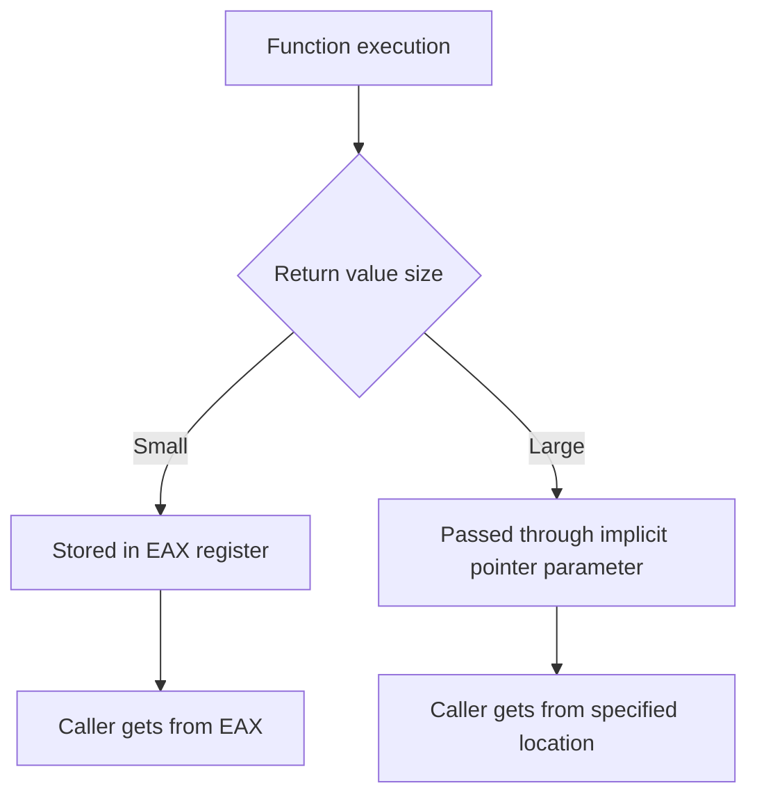

> **Important**: Non-`void` functions must have return values on all execution paths, otherwise it leads to undefined behavior.

## Recursive Functions

Recursion refers to a function directly or indirectly calling itself. Effective recursion must include:

1. **Base case**: A simple situation that can be solved directly
2. **Recursive case**: Breaking the problem into smaller subproblems

```c
int factorial(int n) {
    if (n == 0)  // Base case
        return 1;
    return n * factorial(n - 1);  // Recursive case
}
```

#### Detailed Execution Flow of Recursion

```mermaid
graph TD
    A[factorial(5)] --> B[factorial(4)]
    B --> C[factorial(3)]
    C --> D[factorial(2)]
    D --> E[factorial(1)]
    E --> F[factorial(0)]
    F -->|Returns 1| E
    E -->|Returns 1*1| D
    D -->|Returns 2*1| C
    C -->|Returns 3*2| B
    B -->|Returns 4*6| A
    A -->|Returns 5*24| Result[Result: 120]
    
    classDef base fill:#d4f7e2,stroke:#2e8b57;
    class F base;
```

#### Stack Space Usage in Recursion

Each recursive call creates a new stack frame on the stack until the base case is reached:

```
Stack frame 5: factorial(0) - returns 1
Stack frame 4: factorial(1) - waiting for 1*1
Stack frame 3: factorial(2) - waiting for 2*1
Stack frame 2: factorial(3) - waiting for 3*2
Stack frame 1: factorial(4) - waiting for 4*6
Stack frame 0: factorial(5) - waiting for 5*24
```

> **Warning**: Excessive recursion depth can cause stack overflow; use recursion cautiously.

## Variable Scope and Lifetime

### Scope Hierarchy

Variables in C language have four scope levels:

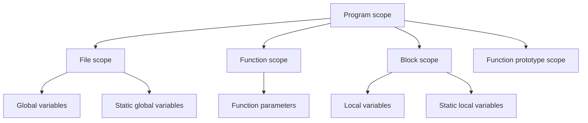

### Local Variables

Variables defined inside a function, accessible only within that function, and automatically destroyed when the function execution ends:

```c
void foo() {
    int x = 10;  // Local variable
    printf("%d\n", x);
}

int main() {
    foo();      // Outputs 10
    // printf("%d", x);  // Error: x is not visible in this scope
}
```

### Global Variables

Variables defined outside all functions, accessible throughout the program:

```c
int globalVar = 10;  // Global variable

void foo() {
    printf("%d\n", globalVar);  // Can access
}

int main() {
    foo();  // Outputs 10
    printf("%d\n", globalVar);  // Outputs 10
}
```

> **Recommendation**: Minimize global variable usage to avoid naming conflicts and difficult-to-debug issues.

### Static Local Variables

Local variables modified with `static` have their lifetime extended to the entire program execution, but their scope remains limited to the function where they're defined:

```c
void counter() {
    static int count = 0;  // Static local variable
    count++;
    printf("Call count: %d\n", count);
}

int main() {
    counter();  // Outputs: Call count: 1
    counter();  // Outputs: Call count: 2
    counter();  // Outputs: Call count: 3
}
```

#### Memory Layout of Static Variables

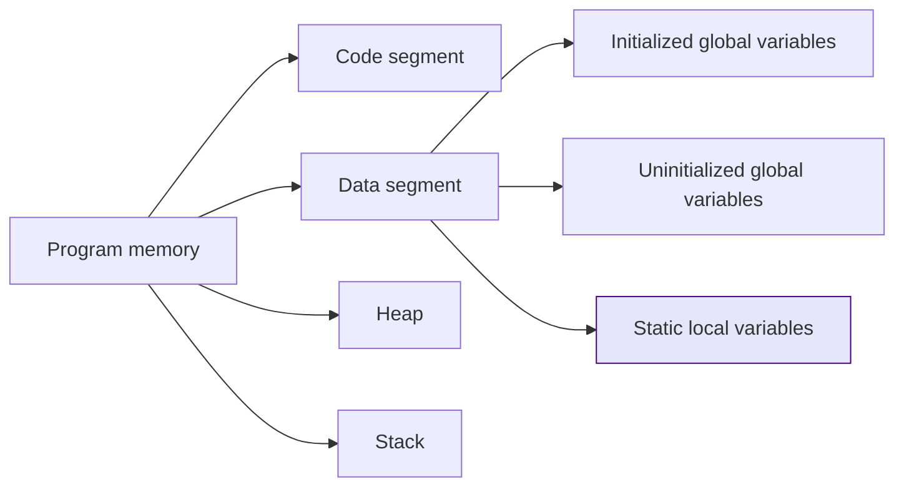

## Advanced Function Features

### Function Pointers

Function pointers can point to functions, enabling dynamic calls or passing as parameters:

```c
int add(int a, int b) {
    return a + b;
}

int main() {
    int (*funcPtr)(int, int) = add;  // Declare and initialize function pointer
    int result = funcPtr(5, 3);      // Call function through pointer
    printf("Result: %d\n", result);  // Outputs: Result: 8
    return 0;
}
```

#### Memory Model of Function Pointers

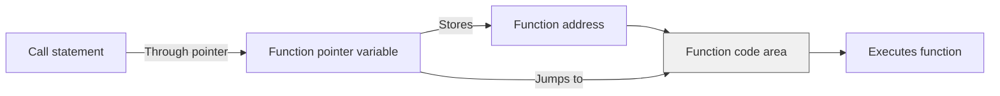

#### Advanced Application of Function Pointers: Callback Mechanism

```c
// Callback function type definition
typedef int (*Operation)(int, int);

// Higher-order function: accepts function pointer as parameter
int calculate(int a, int b, Operation op) {
    return op(a, b);
}

int add(int a, int b) { return a + b; }
int multiply(int a, int b) { return a * b; }

int main() {
    int sum = calculate(5, 3, add);        // 8
    int product = calculate(5, 3, multiply); // 15
}
```

### Variable Argument Functions

C language supports functions that accept a variable number of arguments, requiring macros from the `<stdarg.h>` header file:

```c
#include <stdarg.h>
#include <stdio.h>

void printNumbers(int count, ...) {
    va_list args;
    va_start(args, count);  // Initialize argument list
    
    for (int i = 0; i < count; i++) {
        int num = va_arg(args, int);  // Get next argument
        printf("%d ", num);
    }
    
    va_end(args);  // Clean up argument list
}

int main() {
    printNumbers(3, 1, 2, 3);  // Outputs: 1 2 3
    return 0;
}
```

#### Variable Argument Processing Flow

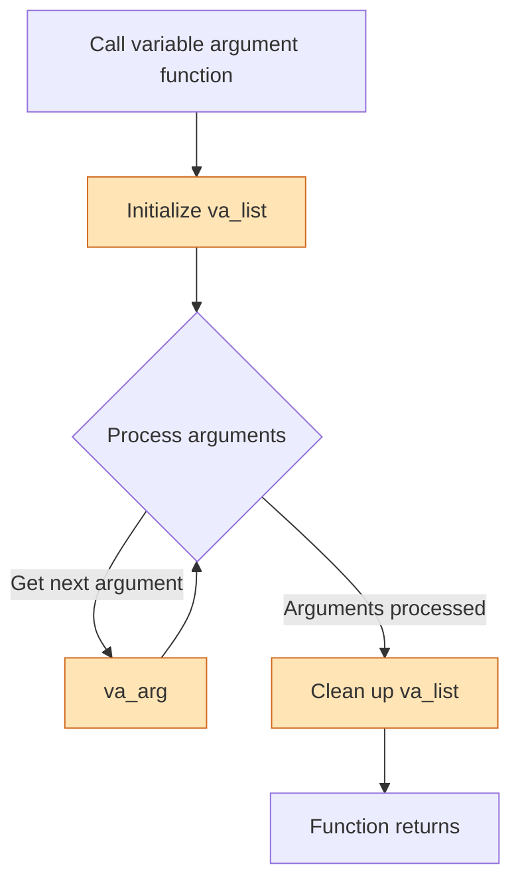

#### Memory Layout of Variable Arguments

On the stack, arguments are arranged from right to left:

```
|-----------------|
|  3rd argument   |  <- va_arg gets
|-----------------|
|  2nd argument   |  <- va_arg gets
|-----------------|
|  1st argument   |  <- va_arg gets
|-----------------|
|  Fixed parameter count |
|-----------------|
|  Return address  |
|-----------------|
|  Saved ebp       |
|-----------------|
```

### Inline Functions

Using the `inline` keyword suggests the compiler to insert the function body directly at the call site, reducing function call overhead:

```c
inline int square(int x) {
    return x * x;
}
```

#### Inline Function Compilation Process

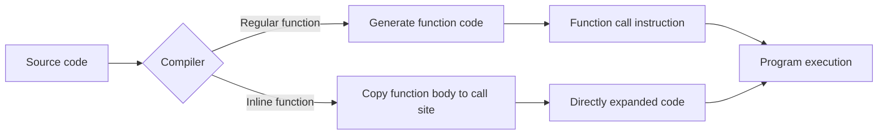

> **Note**: Inlining is a compiler optimization suggestion; actual inlining is determined by the compiler. Inline functions should typically be placed in header files.

### Static Functions

Functions modified with `static` can only be accessed within the current source file, enabling modular encapsulation:

```c
static void helperFunction() {
    printf("This function can only be called within the current file\n");
}
```

#### Role of Static Functions in Multi-File Projects

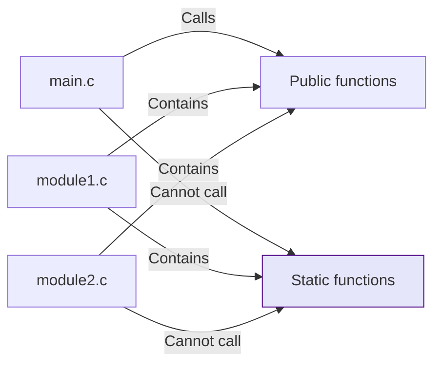

Static functions help avoid naming conflicts between different source files and are an effective means of implementing information hiding.

## Common Pitfalls and Best Practices

### Notes on Returning Pointers from Functions

- **Avoid returning addresses of local variables**: Local variables are destroyed when the function ends

  ```c
  int* dangerousFunction() {
      int x = 10;
      return &x;  // Error: returning address of local variable
  }
  ```

- **Correct approach**: Return dynamically allocated memory (caller is responsible for freeing)

  ```c
  int* createArray(int size) {
      return (int*)malloc(size * sizeof(int));
  }
  ```

#### Dangling Pointer Problem Diagram

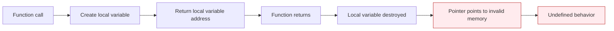

### Comparison Between Macros and Functions

Macros are simple text replacements, while functions have type checking and scope:

```c
#define SQUARE(x) ((x) * (x))

int safe_square(int x) {
    return x * x;
}
```

#### Potential Problems with Macro Expansion

```c
int a = 5;
int b = SQUARE(a++);  // Expands to ((a++) * (a++)), a increments twice
```

#### Comparison Table: Macros vs Functions

| Feature | Macro | Function |
|---------|-------|----------|
| Type Checking | None | Available |
| Call Overhead | None | Present |
| Debugging Support | Difficult | Easy |
| Code Bloat | Possible | Won't happen |
| Scope | Global | Has scope |
| Recursion | Not supported | Supported |

### Alternatives to Function Overloading

C language doesn't support function overloading (unlike C++), but similar functionality can be achieved through:

- Using different function names (e.g., `add_int`, `add_float`)
- Using variable argument functions
- Differentiating through parameter type identifiers

```c
// Approach 1: Different function names
int add_int(int a, int b) { return a + b; }
float add_float(float a, float b) { return a + b; }

// Approach 2: Using type identifier
enum Type { INT, FLOAT, DOUBLE };
void add(enum Type type, void *result, void *a, void *b) {
    switch(type) {
        case INT:
            *(int*)result = *(int*)a + *(int*)b;
            break;
        // Other type handling...
    }
}
```

## Functions and Program Structure

### Modular Programming

Well-structured C programs typically follow a modular structure:

```
project/
├── include/
│   └── mylib.h      # Header file containing function declarations
├── src/
│   ├── main.c       # Main program
│   └── mylib.c      # Function implementations
└── Makefile         # Build script
```

#### Standard Structure of Header Files

```c
#ifndef MYLIB_H
#define MYLIB_H

// Function declarations
int add(int a, int b);
void print_hello(void);

// Type definitions
typedef struct {
    int x;
    int y;
} Point;

#endif // MYLIB_H
```

### Function Design Principles

1. **Single Responsibility Principle**: A function should do only one thing
2. **Appropriate size**: Function bodies typically shouldn't exceed 50 lines
3. **Meaningful naming**: Use verb+noun naming convention (e.g., `calculate_sum`)
4. **Moderate parameter count**: Usually no more than 3-4 parameters
5. **Avoid side effects**: Minimize modifications to global state

## Summary

Functions are the cornerstone of C language programming. Mastering function definition, calling, parameter passing, scope rules, and advanced features enables us to write clear, maintainable code. By properly using functions, we can break down complex problems into smaller, more manageable parts, significantly improving development efficiency and code quality.

Key points reviewed in this chapter:

- Differences and importance of function definition vs declaration
- Underlying mechanism of function calls and stack frame structure
- Fundamental differences between pass by value and pass by pointer
- Execution flow and stack space usage of recursion
- Variable scope hierarchy and lifetime
- Advanced applications of function pointers and callback mechanisms
- Implementation principles of variable argument functions
- Optimization mechanisms of inline functions
- Modular role of static functions

In subsequent learning, we will further explore the application of functions in modular programming, library development, and system-level programming. Understanding these concepts will lay a solid foundation for learning more advanced C language features.
