# 从零入门 C 语言：Day6 - 函数详解

将所有代码都写在 `main` 函数中会导致程序结构混乱、难以维护和阅读。通过将代码分割成多个函数，我们可以显著提高代码的可读性、复用性和可维护性。本章将系统讲解 C 语言中函数的核心概念与使用技巧，并深入探讨其底层机制。

## 函数的定义与声明

### 函数定义

函数定义提供了函数的具体实现，包括其功能、输入参数和返回值的类型。C 语言中函数定义的基本语法如下：

```c
返回值类型 函数名(参数类型 参数名, ...) {
    // 函数体
    return 返回值;
}
```

以一个简单的加法函数为例：

```c
int add(int a, int b) {
    return a + b;
}
```

这个函数的组成要素：

- **函数名**：`add`，用于标识和调用该函数
- **返回值类型**：`int`，表示函数将返回一个整数值
- **参数列表**：`int a, int b`，表示函数需要接收两个整型参数
- **函数体**：`return a + b;`，实现函数的具体功能

#### 函数定义的底层机制

当编译器遇到函数定义时，会执行以下操作：

1. 为函数分配代码段内存空间
2. 生成函数入口地址（函数指针）
3. 建立参数传递和返回值的约定
4. 为局部变量分配栈空间

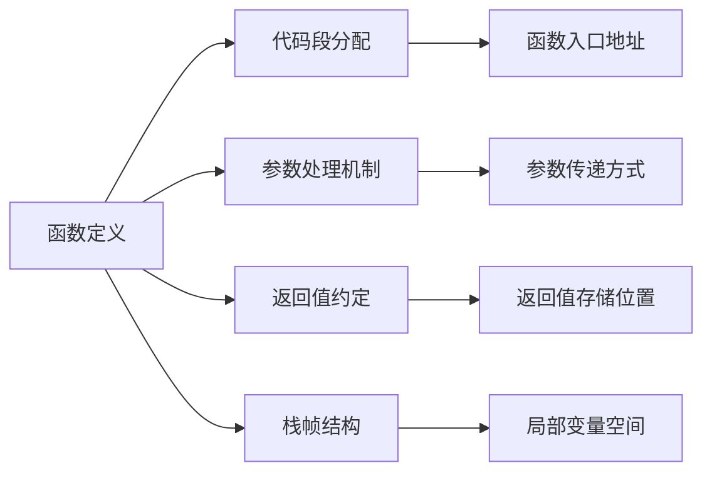

### 函数声明

函数声明（也称为函数原型）告诉编译器函数的名称、返回类型和参数类型，但不包含具体实现。函数声明通常放在源文件开头或头文件中，使编译器在遇到函数调用时能够进行类型检查。

```c
int add(int a, int b);  // 函数声明
```

函数声明与定义的主要区别在于：声明以分号结尾，没有函数体。良好的编程习惯是在使用函数前先进行声明，这样可以避免编译错误并提高代码可读性。

#### 为什么需要函数声明？

C 编译器是单遍编译器，它按顺序处理代码。如果没有函数声明，当编译器遇到函数调用时，无法确定函数的参数类型和返回类型，可能导致：

- 参数类型不匹配的错误
- 返回值处理不当
- 无法进行类型检查

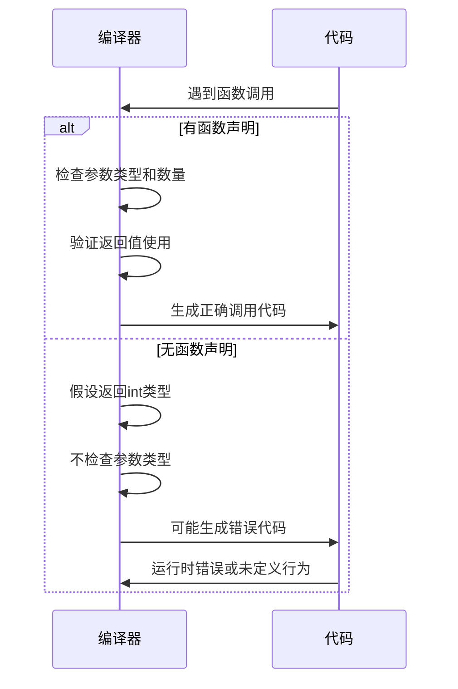

## 函数调用机制

### 函数调用过程

定义函数后，需要通过调用才能执行其功能。函数调用的基本语法为：

```c
返回值变量 = 函数名(实际参数);
```

- 返回值接收是**可选**的，如果不需要使用返回值，可以直接调用
- 实际参数必须与函数定义中的参数类型和数量匹配

继续以 `add` 函数为例：

```c
int result = add(5, 3);  // 调用函数，result 将得到 8
```

#### 函数调用的底层执行流程

C 语言函数调用遵循特定的调用约定（calling convention），不同平台可能有所不同，但基本流程如下：

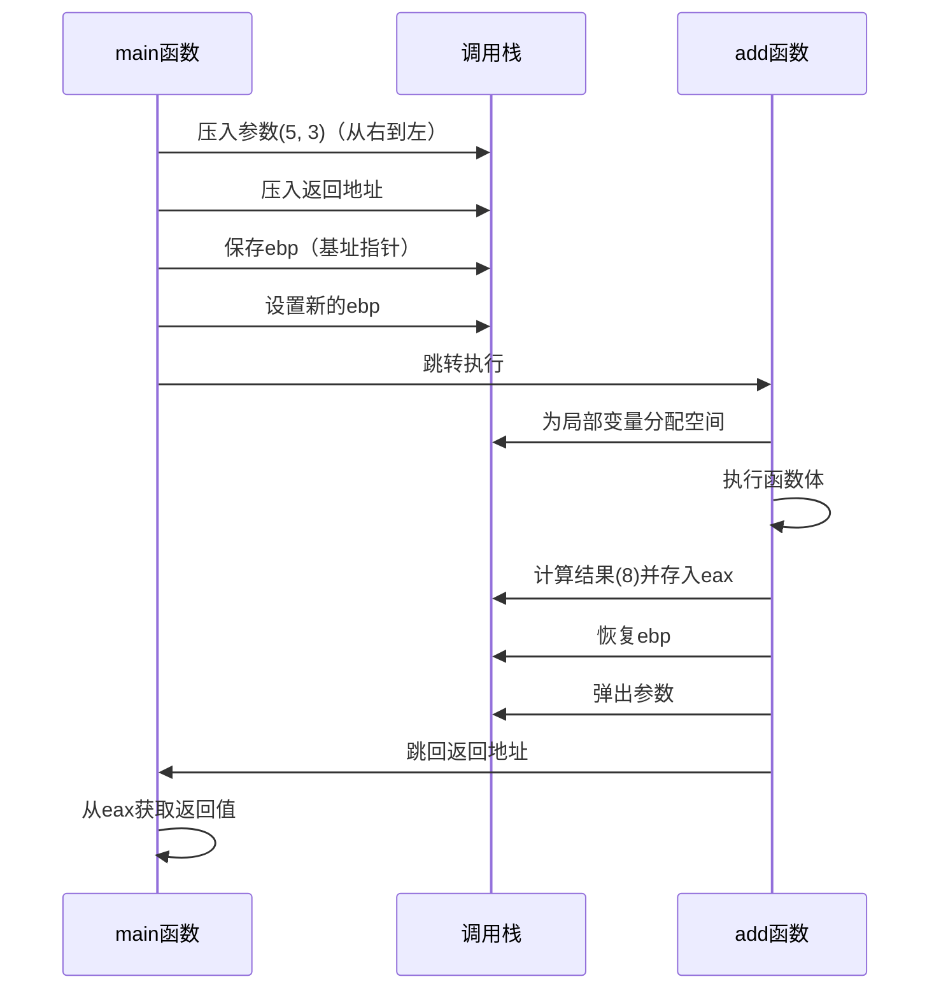

### 栈帧结构详解

函数调用时，会在栈上创建一个栈帧（stack frame），包含以下部分：

```
|-----------------|
|  调用者参数     |  <- esp (栈顶指针)
|-----------------|
|  返回地址       |
|-----------------|
|  保存的ebp      |  <- ebp (基址指针)
|-----------------|
|  局部变量       |
|-----------------|
|  临时空间       |
|-----------------|
```

- **ebp (Base Pointer)**：指向当前函数栈帧的基址
- **esp (Stack Pointer)**：指向栈顶
- **返回地址**：函数执行完毕后要跳转回的位置
- **局部变量**：函数内部定义的变量存储区域

## 参数传递机制

### 值传递

C 语言默认采用值传递方式，即函数接收的是实参的副本，对形参的修改不会影响原始数据：

```c
void changeValue(int x) {
    x = 10;  // 只修改了副本
}

int main() {
    int a = 5;
    changeValue(a);
    printf("%d", a);  // 输出仍然是 5
    return 0;
}
```

#### 值传递的内存模型

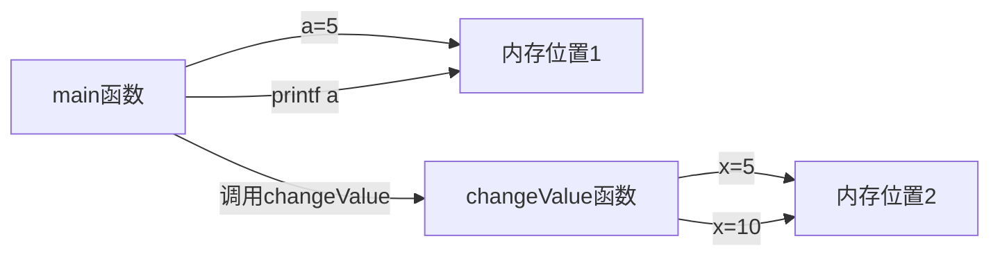

### 指针传递（模拟引用传递）

通过传递变量的地址（指针），函数可以修改调用者提供的原始数据：

```c
void changeValue(int *x) {
    *x = 10;  // 通过指针修改原始数据
}

int main() {
    int a = 5;
    changeValue(&a);  // 传递 a 的地址
    printf("%d", a);  // 输出 10
    return 0;
}
```

#### 指针传递的内存模型

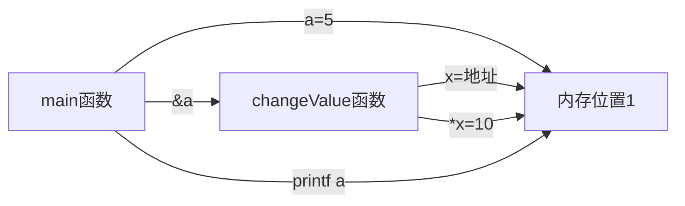

> **注意**：C 语言中没有真正的"引用传递"，这是通过指针实现的等效机制。

## 返回值处理

C 语言函数可以返回一个值，返回值类型在函数定义时指定：

```c
int max(int x, int y) {
    return (x > y) ? x : y;
}
```

如果函数不需要返回值，应使用 `void` 作为返回类型：

```c
void printHello() {
    printf("Hello, World!\n");
}
```

#### 返回值的实现机制

在大多数平台上，函数返回值通过寄存器传递：

- 整型和指针：通常通过 EAX/RAX 寄存器
- 浮点数：通常通过浮点寄存器
- 大型结构体：可能通过隐式指针参数传递

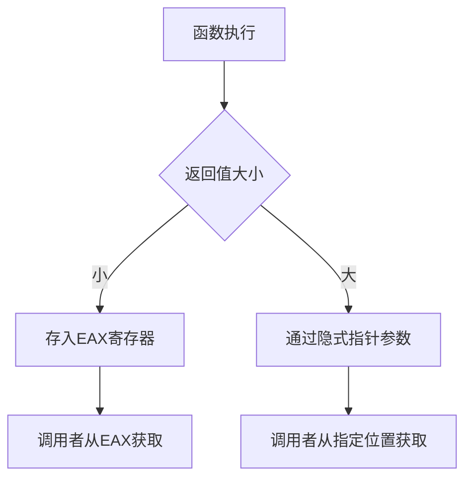

> **重要提示**：非 `void` 类型的函数必须在所有执行路径上都有返回值，否则会导致未定义行为。

## 递归函数

递归是指函数直接或间接调用自身的技术。有效的递归必须包含：

1. **基本情况**：可以直接求解的简单情况
2. **递归情况**：将问题分解为更小的子问题

```c
int factorial(int n) {
    if (n == 0)  // 基本情况
        return 1;
    return n * factorial(n - 1);  // 递归情况
}
```

#### 递归执行流程详解

```mermaid
graph TD
    A[factorial(5)] --> B[factorial(4)]
    B --> C[factorial(3)]
    C --> D[factorial(2)]
    D --> E[factorial(1)]
    E --> F[factorial(0)]
    F -->|返回1| E
    E -->|返回1*1| D
    D -->|返回2*1| C
    C -->|返回3*2| B
    B -->|返回4*6| A
    A -->|返回5*24| Result[结果: 120]
    
    classDef base fill:#d4f7e2,stroke:#2e8b57;
    class F base;
```

#### 递归的栈空间使用

每次递归调用都会在栈上创建新的栈帧，直到达到基本情况：

```
栈帧5: factorial(0) - 返回1
栈帧4: factorial(1) - 等待1*1
栈帧3: factorial(2) - 等待2*1
栈帧2: factorial(3) - 等待3*2
栈帧1: factorial(4) - 等待4*6
栈帧0: factorial(5) - 等待5*24
```

> **警告**：递归深度过大会导致栈溢出（stack overflow），应谨慎使用。

## 变量作用域与生命周期

### 作用域层次

C 语言中的变量作用域分为四个层次：

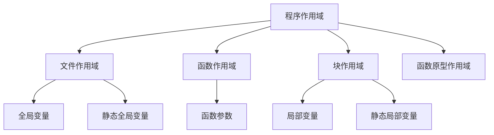

### 局部变量

在函数内部定义的变量，只能在该函数内访问，函数执行结束后自动销毁：

```c
void foo() {
    int x = 10;  // 局部变量
    printf("%d\n", x);
}

int main() {
    foo();      // 输出 10
    // printf("%d", x);  // 错误：x 在此作用域不可见
}
```

### 全局变量

在所有函数外部定义的变量，可在整个程序中访问：

```c
int globalVar = 10;  // 全局变量

void foo() {
    printf("%d\n", globalVar);  // 可以访问
}

int main() {
    foo();  // 输出 10
    printf("%d\n", globalVar);  // 输出 10
}
```

> **建议**：尽量减少全局变量的使用，以避免命名冲突和难以调试的问题。

### 静态局部变量

使用 `static` 修饰的局部变量，其生命周期延长至整个程序运行期间，但作用域仍限于定义它的函数：

```c
void counter() {
    static int count = 0;  // 静态局部变量
    count++;
    printf("调用次数: %d\n", count);
}

int main() {
    counter();  // 输出: 调用次数: 1
    counter();  // 输出: 调用次数: 2
    counter();  // 输出: 调用次数: 3
}
```

#### 静态变量的内存布局

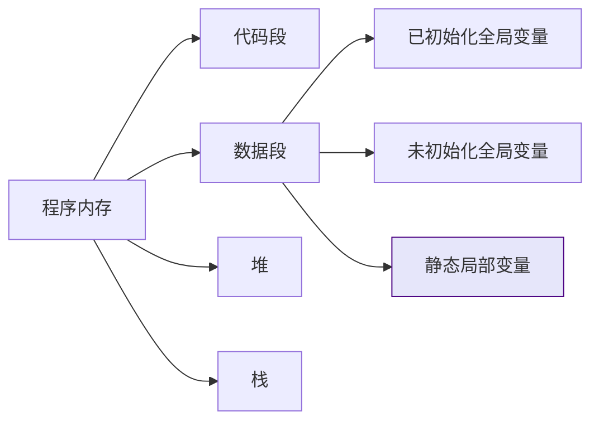

## 高级函数特性

### 函数指针

函数指针可以指向函数，实现动态调用或作为参数传递：

```c
int add(int a, int b) {
    return a + b;
}

int main() {
    int (*funcPtr)(int, int) = add;  // 声明并初始化函数指针
    int result = funcPtr(5, 3);      // 通过指针调用函数
    printf("结果: %d\n", result);    // 输出: 结果: 8
    return 0;
}
```

#### 函数指针的内存模型

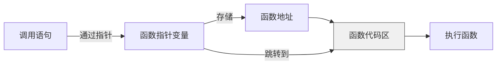

#### 函数指针的高级应用：回调机制

```c
// 回调函数类型定义
typedef int (*Operation)(int, int);

// 高阶函数：接受函数指针作为参数
int calculate(int a, int b, Operation op) {
    return op(a, b);
}

int add(int a, int b) { return a + b; }
int multiply(int a, int b) { return a * b; }

int main() {
    int sum = calculate(5, 3, add);        // 8
    int product = calculate(5, 3, multiply); // 15
}
```

### 可变参数函数

C 语言支持接受可变数量参数的函数，需使用 `<stdarg.h>` 头文件中的宏：

```c
#include <stdarg.h>
#include <stdio.h>

void printNumbers(int count, ...) {
    va_list args;
    va_start(args, count);  // 初始化参数列表
    
    for (int i = 0; i < count; i++) {
        int num = va_arg(args, int);  // 获取下一个参数
        printf("%d ", num);
    }
    
    va_end(args);  // 清理参数列表
}

int main() {
    printNumbers(3, 1, 2, 3);  // 输出: 1 2 3
    return 0;
}
```

#### 可变参数处理流程

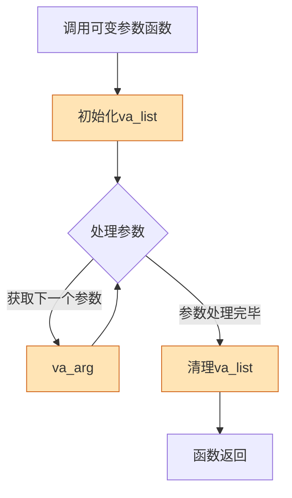

#### 可变参数的内存布局

在栈上，参数按从右到左的顺序排列：

```
|-----------------|
|  第3个参数      |  <- va_arg获取
|-----------------|
|  第2个参数      |  <- va_arg获取
|-----------------|
|  第1个参数      |  <- va_arg获取
|-----------------|
|  固定参数count  |
|-----------------|
|  返回地址       |
|-----------------|
|  保存的ebp      |
|-----------------|
```

### 内联函数

使用 `inline` 关键字建议编译器将函数体直接插入调用处，减少函数调用开销：

```c
inline int square(int x) {
    return x * x;
}
```

#### 内联函数的编译过程

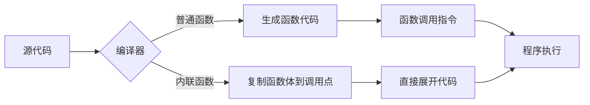

> **注意**：内联是编译器优化建议，实际是否内联由编译器决定。内联函数通常应放在头文件中。

### 静态函数

使用 `static` 修饰的函数只能在当前源文件中访问，实现模块化封装：

```c
static void helperFunction() {
    printf("此函数只能在当前文件中调用\n");
}
```

#### 静态函数在多文件项目中的作用

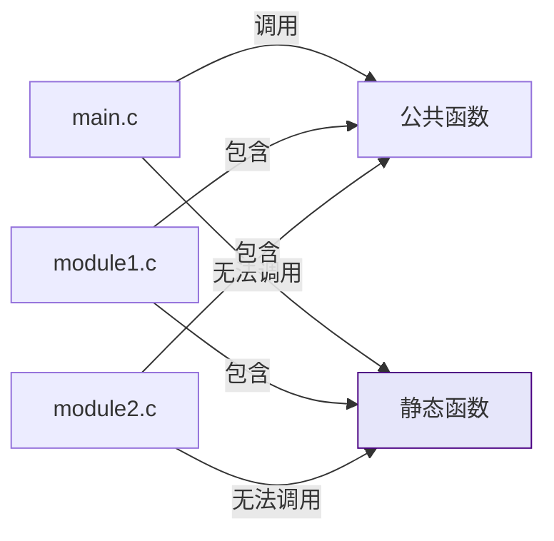

静态函数有助于避免不同源文件间的命名冲突，是实现信息隐藏的有效手段。

## 常见陷阱与最佳实践

### 函数返回指针的注意事项

- **避免返回局部变量的地址**：局部变量在函数结束后会被销毁

  ```c
  int* dangerousFunction() {
      int x = 10;
      return &x;  // 错误：返回局部变量地址
  }
  ```

- **正确做法**：返回动态分配的内存（调用者负责释放）

  ```c
  int* createArray(int size) {
      return (int*)malloc(size * sizeof(int));
  }
  ```

#### 悬空指针问题图解


### 宏与函数的比较

宏是简单的文本替换，而函数有类型检查和作用域：

```c
#define SQUARE(x) ((x) * (x))

int safe_square(int x) {
    return x * x;
}
```

#### 宏展开的潜在问题

```c
int a = 5;
int b = SQUARE(a++);  // 展开为 ((a++) * (a++))，a 增加两次
```

#### 宏与函数的对比表

| 特性 | 宏 | 函数 |
|------|----|------|
| 类型检查 | 无 | 有 |
| 调用开销 | 无 | 有 |
| 调试支持 | 困难 | 容易 |
| 代码膨胀 | 可能 | 不会 |
| 作用域 | 全局 | 有作用域 |
| 递归 | 不支持 | 支持 |

### 函数重载的替代方案

C 语言不支持函数重载（与 C++ 不同），可通过以下方式实现类似功能：

- 使用不同的函数名（如 `add_int`, `add_float`）
- 使用可变参数函数
- 通过参数类型标识符区分

```c
// 方案1：不同函数名
int add_int(int a, int b) { return a + b; }
float add_float(float a, float b) { return a + b; }

// 方案2：使用类型标识符
enum Type { INT, FLOAT, DOUBLE };
void add(enum Type type, void *result, void *a, void *b) {
    switch(type) {
        case INT:
            *(int*)result = *(int*)a + *(int*)b;
            break;
        // 其他类型处理...
    }
}
```

## 函数与程序结构

### 模块化编程

良好的 C 程序通常采用模块化结构：

```
project/
├── include/
│   └── mylib.h      # 头文件，包含函数声明
├── src/
│   ├── main.c       # 主程序
│   └── mylib.c      # 函数实现
└── Makefile         # 构建脚本
```

#### 头文件的标准结构

```c
#ifndef MYLIB_H
#define MYLIB_H

// 函数声明
int add(int a, int b);
void print_hello(void);

// 类型定义
typedef struct {
    int x;
    int y;
} Point;

#endif // MYLIB_H
```

### 函数设计原则

1. **单一职责原则**：一个函数只做一件事
2. **适当大小**：函数体通常不超过 50 行
3. **有意义的命名**：使用动词+名词的命名方式（如 `calculate_sum`）
4. **参数数量适中**：通常不超过 3-4 个参数
5. **避免副作用**：尽量减少对全局状态的修改

## 总结

函数是 C 语言程序设计的基石。掌握函数的定义、调用、参数传递、作用域规则以及高级特性，能够帮助我们编写结构清晰、易于维护的代码。通过合理使用函数，我们可以将复杂问题分解为更小、更易管理的部分，显著提高开发效率和代码质量。

本章重点内容回顾：

- 函数定义与声明的区别及重要性
- 函数调用的底层机制与栈帧结构
- 值传递与指针传递的本质区别
- 递归的执行流程与栈空间使用
- 变量作用域层次与生命周期
- 函数指针的高级应用与回调机制
- 可变参数函数的实现原理
- 内联函数的优化机制
- 静态函数的模块化作用

在后续学习中，我们将进一步探索函数在模块化编程、库开发和系统级编程中的应用。理解这些概念将为学习更高级的 C 语言特性打下坚实基础。
