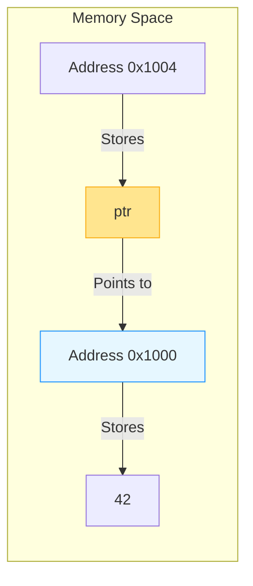
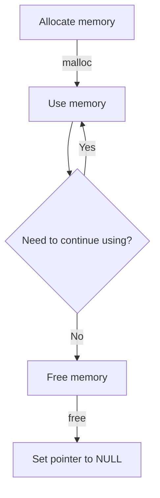

# Pointers: The Core Key to Memory Manipulation in C

Pointers are the most distinctive and powerful feature of the C language—they function like a precision key that directly unlocks the world of memory. Mastering pointers grants you the ability to **directly manipulate memory**, enabling efficient data structures, dynamic memory management, and system-level programming. This chapter will guide you from scratch to understand this seemingly mysterious concept using clear logic and intuitive diagrams.

## Why Do We Need Pointers? Starting from the Real World

Imagine you're in a library:

- **Ordinary variables**: Like holding a book directly (data)
- **Pointers**: Like an index card on the bookshelf (storing the book's location)

When you need to:

- Modify variable values outside functions
- Efficiently handle large data structures
- Implement dynamic memory allocation
- Build complex data structures like linked lists/trees

Pointers become your **memory navigator**. They don't store data itself, but rather the **exact memory address** where data resides.



> 💡 **Core Definition**: A pointer is a **variable that stores a memory address**. Through dereferencing operations, we can access the data stored at that address.

## Pointer Basics: Two Key Operators

### 1. Address-of Operator `&`

Obtains the **exact location** of a variable in memory

### 2. Dereference Operator `*`

Accesses the stored data **through an address**

```c
#include <stdio.h>

int main() {
    int num = 42;        // Ordinary integer variable
    int *ptr = &num;     // Pointer variable: stores address of num
    
    printf("┌──────────────┬──────────────┬──────────────┐\n");
    printf("│ Variable Type │      Value   │    Description  │\n");
    printf("├──────────────┼──────────────┼──────────────┤\n");
    printf("│ num (int)    │     %2d     │ Original data │\n", num);
    printf("│ &num (address)│    %p    │ Memory address of num │\n", (void*)&num);
    printf("│ ptr (int*)   │    %p    │ Same as &num    │\n", (void*)ptr);
    printf("│ *ptr (int)   │     %2d     │ Value pointed to by ptr  │\n", *ptr);
    printf("└──────────────┴──────────────┴──────────────┘\n");
    
    return 0;
}
```

**Sample Output**:

```
┌──────────────┬──────────────┬──────────────┐
│ Variable Type │      Value   │    Description  │
├──────────────┼──────────────┼──────────────┤
│ num (int)    │     42      │ Original data │
│ &num (address)│    0x7ffd12  │ Memory address of num │
│ ptr (int*)   │    0x7ffd12  │ Same as &num    │
│ *ptr (int)   │     42      │ Value pointed to by ptr  │
└──────────────┴──────────────┴──────────────┘
```

> ✅ **Golden Rule**:  
> `&` → **Get address** (from data to address)  
> `*` → **Dereference** (from address to data)

## Pointer Declaration and Initialization: Safety First

### Correct Declaration Methods

```c
int *ptr;        // ✅ Recommended: emphasizes it's a pointer variable
int* ptr;        // ⚠️ Syntax correct but easily misunderstood (not recommended)
int * ptr;       // ⚠️ Syntax correct but inconsistent style
```

> 💡 **Teaching Tip**: `int *ptr` means `ptr` is a pointer to `int`, not that `*ptr` is an integer. This notation helps avoid pitfalls when declaring multiple variables:
>
> ```c
> int* a, b;  // Error! a is a pointer, b is ordinary int
> int *a, *b; // Correct! Both are pointers
> ```

### Three Safe Initialization Methods

```c
#include <stdio.h>

int main() {
    int x = 10;
    
    // Method 1: Assign after declaration
    int *ptr1;
    ptr1 = &x;
    
    // Method 2: Initialize during declaration
    int *ptr2 = &x;
    
    // Method 3: Initialize to NULL (safe default)
    int *ptr3 = NULL;
    
    // Safe dereference check
    if (ptr3) {  // Equivalent to ptr3 != NULL
        printf("Value: %d\n", *ptr3);
    } else {
        printf("⚠️ Warning: ptr3 is a null pointer, cannot be dereferenced!\n");
    }
    
    return 0;
}
```

> ✅ **Best Practice**: **Never use uninitialized pointers**! Uninitialized pointers (wild pointers) point to random memory addresses, and dereferencing them causes program crashes.

## Pointer Arithmetic: Intelligent Address Calculation

Pointer arithmetic **automatically considers data type size**, which is the essential difference from ordinary integer operations:

```mermaid
flowchart LR
    subgraph int array [int array (each element 4 bytes)]
    A[Address 0x1000] -->|10| B[0x1004]
    B -->|20| C[0x1008]
    C -->|30| D[0x100C]
    end
    
    subgraph Pointer movement
    P[ptr] -->|ptr+0| A
    P -->|ptr+1| B
    P -->|ptr+2| C
    end
```

```c
#include <stdio.h>

int main() {
    int arr[] = {10, 20, 30, 40, 50};
    int *ptr = arr;  // Points to first element
    
    printf("┌──────┬──────────────┬──────────────┬──────────────┐\n");
    printf("│ Index│  arr[Index]  │  ptr+Index   │ *(ptr+Index) │\n");
    printf("├──────┼──────────────┼──────────────┼──────────────┤\n");
    
    for (int i = 0; i < 5; i++) {
        printf("│  %d   │      %2d      │    %p    │      %2d      │\n", 
               i, arr[i], (void*)(ptr+i), *(ptr+i));
    }
    
    printf("└──────┴──────────────┴──────────────┴──────────────┘\n");
    printf("💡 Note: ptr+1 actually increases by %zu bytes (size of int)\n", sizeof(int));
    
    return 0;
}
```

**Key Rules**:

- `ptr + n` = `ptr` + `n * sizeof(type)` bytes
- Only applicable to **continuous memory within arrays**
- Different pointer types have different arithmetic step sizes (`char*` step 1, `double*` step 8)

## Pointers and Arrays: Intimate but Not Equivalent

### Important Differences

| Concept       | Array                  | Pointer                |
|---------------|------------------------|------------------------|
| Essence       | Continuous memory block | Variable storing address |
| Size          | `sizeof(arr)` = total bytes | `sizeof(ptr)` = address size |
| Modifiability | Cannot reassign        | Can be reassigned      |

### Special Behavior of Array Names

In **most expressions**, array names **decay to pointers to the first element**:

```c
int arr[5];
int *ptr = arr;  // Equivalent to &arr[0]
```

But there are two exceptions:

1. `sizeof(arr)` → Returns total array size
2. `&arr` → Returns address of entire array (type `int(*)[5]`)

```c
#include <stdio.h>

int main() {
    int arr[3] = {10, 20, 30};
    
    printf("arr      = %p\n", (void*)arr);
    printf("&arr[0]  = %p\n", (void*)&arr[0]);
    printf("&arr     = %p\n", (void*)&arr);
    printf("sizeof(arr) = %zu\n", sizeof(arr));  // 12 (3*4)
    
    return 0;
}
```

> ⚠️ **Common Misconception**:  
> "Arrays are pointers" → **False!**  
> Correct understanding: **Array names typically behave as pointers in expressions**

## Pointers and Strings: Text Processing in C

In C, strings are essentially **null-terminated character arrays**, and pointers are core tools for manipulating strings:

```c
#include <stdio.h>
#include <ctype.h>

int main() {
    char str[] = "Hello";  // Modifiable character array
    char *ptr = str;       // Pointer to array
    
    // Safe modification method
    while (*ptr) {
        *ptr = toupper(*ptr);  // Convert to uppercase
        ptr++;
    }
    printf("Uppercase: %s\n", str);  // HELLO
    
    // ⚠️ Dangerous example: String literals cannot be modified!
    char *msg = "Danger";  // Points to read-only memory
    // *msg = 'd';         // Runtime error!
    
    return 0;
}
```

> ✅ **Safety Guidelines**:
>
> 1. Use `char str[]` to declare **modifiable** strings
> 2. Use `const char *ptr` to point to **read-only** string literals
> 3. Always check for string termination character `\0`

## Function Pointers: The Magic of Dynamic Invocation

Function pointers store **function entry addresses**, enabling runtime dynamic invocation:

```c
#include <stdio.h>

// Function definitions
int add(int a, int b) { return a + b; }
int multiply(int a, int b) { return a * b; }

int main() {
    // Function pointer declaration: return_type (*pointer_name)(parameter_types)
    int (*operation)(int, int);
    
    operation = add;        // Points to add function
    printf("5 + 3 = %d\n", operation(5, 3));
    
    operation = multiply;   // Points to multiply function
    printf("5 * 3 = %d\n", operation(5, 3));
    
    return 0;
}
```

**Application Scenarios**:

- Callback functions (e.g., GUI event handling)
- Implementing strategy patterns
- Building function tables (state machines)

```mermaid
flowchart LR
    subgraph Function Pointers
    A[operation] -->|Points to| B[add function]
    A -->|Reassigns to| C[multiply function]
    end
    D[Calling operation(5,3)] -->|Actually calls| B
    D -->|Actually calls| C
```

## Pointers and Structures: Building Complex Data

Structure pointers use the `->` operator to access members, which is more concise than `(*ptr).member`:

```c
#include <stdio.h>

struct Person {
    char name[50];
    int age;
};

int main() {
    struct Person person = {"Alice", 25};
    struct Person *ptr = &person;
    
    printf("┌──────────┬──────────────────────┐\n");
    printf("│ Access Method │        Result        │\n");
    printf("├──────────┼──────────────────────┤\n");
    printf("│ ptr->name│ %s%*s │\n", 
           person.name, (int)(20-strlen(person.name)), "");
    printf("│ (*ptr).age│ %d%*s │\n", 
           person.age, 21, "");
    printf("└──────────┴──────────────────────┘\n");
    
    return 0;
}
```

> 💡 **Technical Point**: `ptr->name` is syntactic sugar for `(*ptr).name`, specifically designed for structure pointers.

## Pointer Safety: Fatal Traps and Protection

### 1. Null Pointer Dereference

```c
int *ptr = NULL;
printf("%d", *ptr);  // Segmentation fault! Program crashes immediately
```

✅ **Protection Measures**:

```c
if (ptr != NULL) {
    // Safe operation
}
```

### 2. Dangling Pointer

```c
int *ptr = malloc(sizeof(int));
free(ptr);  // Memory has been released
*ptr = 10;  // Dangerous! Using already freed memory
```

✅ **Protection Measures**:

```c
free(ptr);
ptr = NULL;  // Immediately set to NULL
```

### 3. Memory Leak

```c
void leak() {
    int *ptr = malloc(100);
    // Forgot free(ptr) → Leaks 100 bytes per call
}
```

✅ **Protection Measures**:

- Follow the "one malloc corresponds to one free" principle
- Use tools for detection (Valgrind)



## Pointer Best Practices: Safety and Efficiency Guide

### ✅ Must-Do Checklist

1. **Initialize to NULL**  

   ```c
   int *ptr = NULL;  // 100x safer than uninitialized
   ```

2. **Check Before Dereferencing**  

   ```c
   if (ptr) { /* Safe operation */ }
   ```

3. **Set to NULL After Freeing**  

   ```c
   free(ptr);
   ptr = NULL;  // Prevents dangling pointer
   ```

4. **Match malloc/free**  

   ```c
   int *arr = malloc(10 * sizeof(int));
   // ... Use ...
   free(arr);  // Must be paired
   ```

5. **Protect Data with const**  

   ```c
   void print(const int *data);  // Promises not to modify data
   ```

### ⚠️ High-Risk Operations Warning

| Operation                | Risk Level | Alternative                     |
|--------------------------|------------|---------------------------------|
| Uninitialized pointer    | ⚠️⚠️⚠️     | Always initialize to NULL      |
| Dereferencing NULL pointer | ⚠️⚠️⚠️   | Check before operation         |
| Using already freed memory | ⚠️⚠️⚠️   | Set to NULL immediately after freeing |
| Pointer escape to stack variables | ⚠️⚠️ | Ensure pointer lifetime <= variable lifetime |

## Pointer Thinking Exercises

Try solving with pointers:

1. Implement `strcpy` function (without library functions)
2. Reverse a linked list
3. Dynamic allocation of 2D arrays
4. Calculator implementation using function pointers

**Thought Question**:  
> Why does C need pointers? Modern languages (like Java/Python) work without pointers?  
> **Answer**:  
>
> - C needs direct memory control (system programming/embedded)  
> - High-level languages use **references** to hide pointer details, but they still exist at the lower level  
> - Pointers provide **zero-cost abstraction**—direct memory access without performance loss

## Summary

Pointers are the **soul feature** of the C language:

- ✅ **Advantages**: Direct memory access, efficient data structures, system-level control
- ❌ **Risks**: Memory errors, difficult debugging, security vulnerabilities

**Beginner Growth Path**:

1. Start with basic concepts (`&` and `*`)
2. Understand pointer relationships using memory diagrams
3. Practice with safe scenarios like arrays/strings
4. Gradually approach dynamic memory
5. Finally tackle function pointers/complex data structures

> 🌟 **Ultimate Advice**:  
> "Pointers aren't meant to be 'understood'—they're meant to be 'felt'.  
> When you can construct memory layout diagrams in your mind,  
> pointers cease to be magic and become precision tools in your hands."

Mastering pointers unlocks the full power of C—from embedded systems to operating system kernels, pointers are the foundation for building efficient and reliable software. Remember: **Safety begins with caution, mastery comes through practice**.
