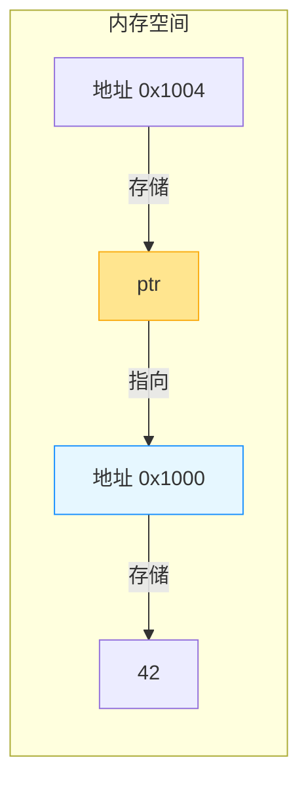
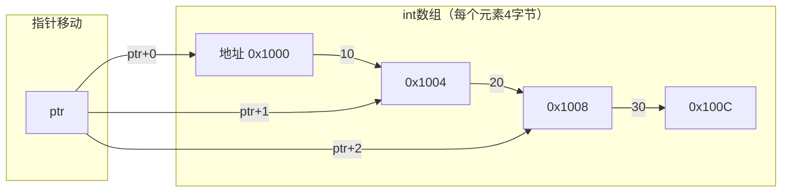
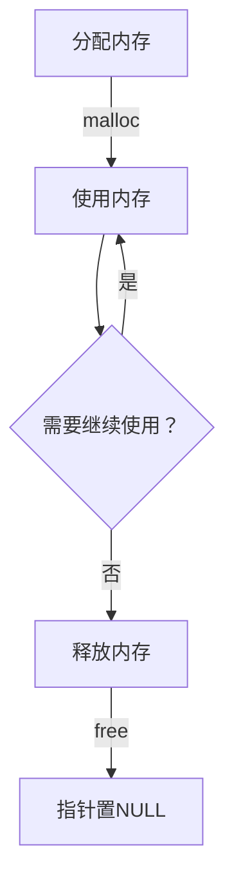

# 指针：C语言内存操作的核心钥匙

指针是C语言最具特色和威力的特性——它如同一把精密的钥匙，直接打开内存世界的大门。掌握指针，你将获得**直接操控内存**的能力，实现高效的数据结构、动态内存管理和系统级编程。本章将用清晰的逻辑和直观的图示，带你从零理解这个看似神秘的概念。

## 为什么需要指针？从现实世界说起

想象你在图书馆：

- **普通变量**：就像直接拿着一本书（数据）
- **指针**：则是书架上的索引卡（存储书的位置信息）

当你需要：

- 修改函数外部的变量值
- 高效处理大型数据结构
- 实现动态内存分配
- 构建链表/树等复杂数据结构

指针就是你的**内存导航仪**。它不存储数据本身，而是存储数据在内存中的**精确地址**。



> 💡 **核心定义**：指针是**存储内存地址的变量**。通过解引用操作，我们可以访问该地址存储的数据。

## 指针基础：两个关键操作符

### 1. 取地址操作符 `&`

获取变量在内存中的**精确位置**

### 2. 解引用操作符 `*`

通过地址**访问存储的数据**

```c
#include <stdio.h>

int main() {
    int num = 42;        // 普通整数变量
    int *ptr = &num;     // 指针变量：存储num的地址
    
    printf("┌──────────────┬──────────────┬──────────────┐\n");
    printf("│   变量类型   │     值      │    说明      │\n");
    printf("├──────────────┼──────────────┼──────────────┤\n");
    printf("│ num (int)    │     %2d     │ 原始数据     │\n", num);
    printf("│ &num (地址)  │    %p    │ num的内存地址 │\n", (void*)&num);
    printf("│ ptr (int*)   │    %p    │ 与&num相同    │\n", (void*)ptr);
    printf("│ *ptr (int)   │     %2d     │ ptr指向的值  │\n", *ptr);
    printf("└──────────────┴──────────────┴──────────────┘\n");
    
    return 0;
}
```

**输出示例**：

```
┌──────────────┬──────────────┬──────────────┐
│   变量类型   │     值      │    说明      │
├──────────────┼──────────────┼──────────────┤
│ num (int)    │     42      │ 原始数据     │
│ &num (地址)  │    0x7ffd12  │ num的内存地址 │
│ ptr (int*)   │    0x7ffd12  │ 与&num相同    │
│ *ptr (int)   │     42      │ ptr指向的值  │
└──────────────┴──────────────┴──────────────┘
```

> ✅ **黄金法则**：  
> `&` → **取地址**（从数据到地址）  
> `*` → **解引用**（从地址到数据）

## 指针声明与初始化：安全第一

### 正确声明方式

```c
int *ptr;        // ✅ 推荐：强调是指针变量
int* ptr;        // ⚠️ 语法正确但易误解（不推荐）
int * ptr;       // ⚠️ 语法正确但风格不一致
```

> 💡 **教学提示**：`int *ptr` 表示 `ptr` 是指向 `int` 的指针，而非 `*ptr` 是整数。这种写法能避免多变量声明时的陷阱：
>
> ```c
> int* a, b;  // 错误！a是指针，b是普通int
> int *a, *b; // 正确！两个都是指针
> ```

### 初始化的三种安全方式

```c
#include <stdio.h>

int main() {
    int x = 10;
    
    // 方式1：声明后赋值
    int *ptr1;
    ptr1 = &x;
    
    // 方式2：声明时初始化
    int *ptr2 = &x;
    
    // 方式3：初始化为NULL（安全默认值）
    int *ptr3 = NULL;
    
    // 安全解引用检查
    if (ptr3) {  // 等价于 ptr3 != NULL
        printf("值: %d\n", *ptr3);
    } else {
        printf("⚠️ 警告：ptr3是空指针，不可解引用！\n");
    }
    
    return 0;
}
```

> ✅ **最佳实践**：**永远不要使用未初始化的指针**！未初始化的指针（野指针）指向随机内存地址，解引用会导致程序崩溃。

## 指针算术：智能的地址计算

指针算术会**自动考虑数据类型大小**，这是与普通整数运算的本质区别：



```c
#include <stdio.h>

int main() {
    int arr[] = {10, 20, 30, 40, 50};
    int *ptr = arr;  // 指向首元素
    
    printf("┌──────┬──────────────┬──────────────┬──────────────┐\n");
    printf("│ 索引 │  arr[索引]   │  ptr+索引    │ *(ptr+索引)  │\n");
    printf("├──────┼──────────────┼──────────────┼──────────────┤\n");
    
    for (int i = 0; i < 5; i++) {
        printf("│  %d   │      %2d      │    %p    │      %2d      │\n", 
               i, arr[i], (void*)(ptr+i), *(ptr+i));
    }
    
    printf("└──────┴──────────────┴──────────────┴──────────────┘\n");
    printf("💡 注意：ptr+1 实际增加 %zu 字节（int大小）\n", sizeof(int));
    
    return 0;
}
```

**关键规则**：

- `ptr + n` = `ptr` + `n * sizeof(类型)` 字节
- 只适用于**数组内**的连续内存
- 不同类型的指针算术步长不同（`char*`步长1，`double*`步长8）

## 指针与数组：亲密但不等同

### 重要区别

| 概念        | 数组                  | 指针                  |
|-------------|-----------------------|-----------------------|
| 本质        | 连续内存块            | 存储地址的变量        |
| 大小        | `sizeof(arr)` = 总字节 | `sizeof(ptr)` = 地址大小 |
| 可修改性    | 不能重新指向          | 可以重新赋值          |

### 数组名的特殊行为

在**大多数表达式**中，数组名会**退化为指向首元素的指针**：

```c
int arr[5];
int *ptr = arr;  // 等价于 &arr[0]
```

但有两个例外：

1. `sizeof(arr)` → 返回整个数组大小
2. `&arr` → 返回整个数组的地址（类型为`int(*)[5]`）

```c
#include <stdio.h>

int main() {
    int arr[3] = {10, 20, 30};
    
    printf("arr      = %p\n", (void*)arr);
    printf("&arr[0]  = %p\n", (void*)&arr[0]);
    printf("&arr     = %p\n", (void*)&arr);
    printf("sizeof(arr) = %zu\n", sizeof(arr));  // 12 (3*4)
    
    return 0;
}
```

> ⚠️ **常见误区**：  
> "数组就是指针" → **错误！**  
> 正确理解：**数组名在表达式中通常表现为指针**

## 指针与字符串：C语言的文本处理

C语言中字符串本质是**以`\0`结尾的字符数组**，指针是操作字符串的核心工具：

```c
#include <stdio.h>

int main() {
    char str[] = "Hello";  // 可修改的字符数组
    char *ptr = str;       // 指向数组的指针
    
    // 安全修改方式
    while (*ptr) {
        *ptr = toupper(*ptr);  // 转为大写
        ptr++;
    }
    printf("大写: %s\n", str);  // HELLO
    
    // ⚠️ 危险示例：字符串字面量不可修改！
    char *msg = "Danger";  // 指向只读内存
    // *msg = 'd';         // 运行时错误！
    
    return 0;
}
```

> ✅ **安全准则**：
>
> 1. 用`char str[]`声明**可修改**的字符串
> 2. 用`const char *ptr`指向**只读**字符串字面量
> 3. 永远检查字符串终止符`\0`

## 函数指针：动态调用的魔法

函数指针存储**函数入口地址**，实现运行时动态调用：

```c
#include <stdio.h>

// 函数定义
int add(int a, int b) { return a + b; }
int multiply(int a, int b) { return a * b; }

int main() {
    // 函数指针声明：返回类型 (*指针名)(参数类型)
    int (*operation)(int, int);
    
    operation = add;        // 指向add函数
    printf("5 + 3 = %d\n", operation(5, 3));
    
    operation = multiply;   // 指向multiply函数
    printf("5 * 3 = %d\n", operation(5, 3));
    
    return 0;
}
```

**应用场景**：

- 回调函数（如GUI事件处理）
- 实现策略模式
- 构建函数表（状态机）

```mermaid
flowchart LR
    subgraph 函数指针
    A[operation] -->|指向| B[add函数]
    A -->|重新指向| C[multiply函数]
    end
    D[调用 operation(5,3)] -->|实际调用| B
    D -->|实际调用| C
```

## 指针与结构体：构建复杂数据

结构体指针使用`->`操作符访问成员，比`(*ptr).member`更简洁：

```c
#include <stdio.h>

struct Person {
    char name[50];
    int age;
};

int main() {
    struct Person person = {"Alice", 25};
    struct Person *ptr = &person;
    
    printf("┌──────────┬──────────────────────┐\n");
    printf("│ 访问方式 │        结果        │\n");
    printf("├──────────┼──────────────────────┤\n");
    printf("│ ptr->name│ %s%*s │\n", 
           person.name, (int)(20-strlen(person.name)), "");
    printf("│ (*ptr).age│ %d%*s │\n", 
           person.age, 21, "");
    printf("└──────────┴──────────────────────┘\n");
    
    return 0;
}
```

> 💡 **技术要点**：`ptr->name` 是 `(*ptr).name` 的语法糖，专为结构体指针设计。

## 指针安全：致命陷阱与防护

### 1. 空指针解引用

```c
int *ptr = NULL;
printf("%d", *ptr);  // 段错误！程序立即崩溃
```

✅ **防护措施**：

```c
if (ptr != NULL) {
    // 安全操作
}
```

### 2. 悬空指针（Dangling Pointer）

```c
int *ptr = malloc(sizeof(int));
free(ptr);  // 内存已释放
*ptr = 10;  // 危险！使用已释放内存
```

✅ **防护措施**：

```c
free(ptr);
ptr = NULL;  // 立即置空
```

### 3. 内存泄漏

```c
void leak() {
    int *ptr = malloc(100);
    // 忘记free(ptr) → 每次调用泄漏100字节
}
```

✅ **防护措施**：

- 遵循"一个malloc对应一个free"原则
- 使用工具检测（Valgrind）



## 指针最佳实践：安全高效指南

### ✅ 必做清单

1. **初始化为NULL**  

   ```c
   int *ptr = NULL;  // 比未初始化安全100倍
   ```

2. **解引用前检查**  

   ```c
   if (ptr) { /* 安全操作 */ }
   ```

3. **释放后立即置空**  

   ```c
   free(ptr);
   ptr = NULL;  // 防止悬空指针
   ```

4. **匹配malloc/free**  

   ```c
   int *arr = malloc(10 * sizeof(int));
   // ... 使用 ...
   free(arr);  // 必须配对
   ```

5. **用const保护数据**  

   ```c
   void print(const int *data);  // 承诺不修改数据
   ```

### ⚠️ 高危操作警示

| 操作                | 风险等级 | 替代方案                     |
|---------------------|----------|------------------------------|
| 未初始化指针        | ⚠️⚠️⚠️   | 始终初始化为NULL             |
| 解引用NULL指针      | ⚠️⚠️⚠️   | 检查后操作                   |
| 使用已释放内存      | ⚠️⚠️⚠️   | 释放后立即置NULL             |
| 指向栈变量的指针逃逸| ⚠️⚠️     | 确保指针生命周期 <= 变量生命周期 |

## 指针思维训练

尝试用指针解决：

1. 实现`strcpy`函数（不使用库函数）
2. 反转链表
3. 二维数组动态分配
4. 函数指针实现计算器

**思考题**：  
> 为什么C语言需要指针？现代语言（如Java/Python）没有指针也能工作？  
> **答案**：  
>
> - C需要直接内存控制（系统编程/嵌入式）  
> - 高级语言用**引用**隐藏指针细节，但底层仍存在  
> - 指针提供**零成本抽象**——无性能损失的直接内存访问

## 总结

指针是C语言的**灵魂特性**：

- ✅ **优势**：直接内存访问、高效数据结构、系统级控制
- ❌ **风险**：内存错误、调试困难、安全漏洞

**新手成长路线**：

1. 从基础概念开始（`&`和`*`）
2. 用内存图理解指针关系
3. 从数组/字符串等安全场景实践
4. 逐步接触动态内存
5. 最后挑战函数指针/复杂数据结构

> 🌟 **终极建议**：  
> "指针不是用来'理解'的，而是用来'感受'的。  
> 当你能在脑中构建内存布局图时，  
> 指针就不再是魔法，而是你手中的精密工具。"

掌握指针，你将真正解锁C语言的全部威力——从嵌入式系统到操作系统内核，指针都是构建高效可靠软件的基石。记住：**安全始于谨慎，精通源于实践**。
