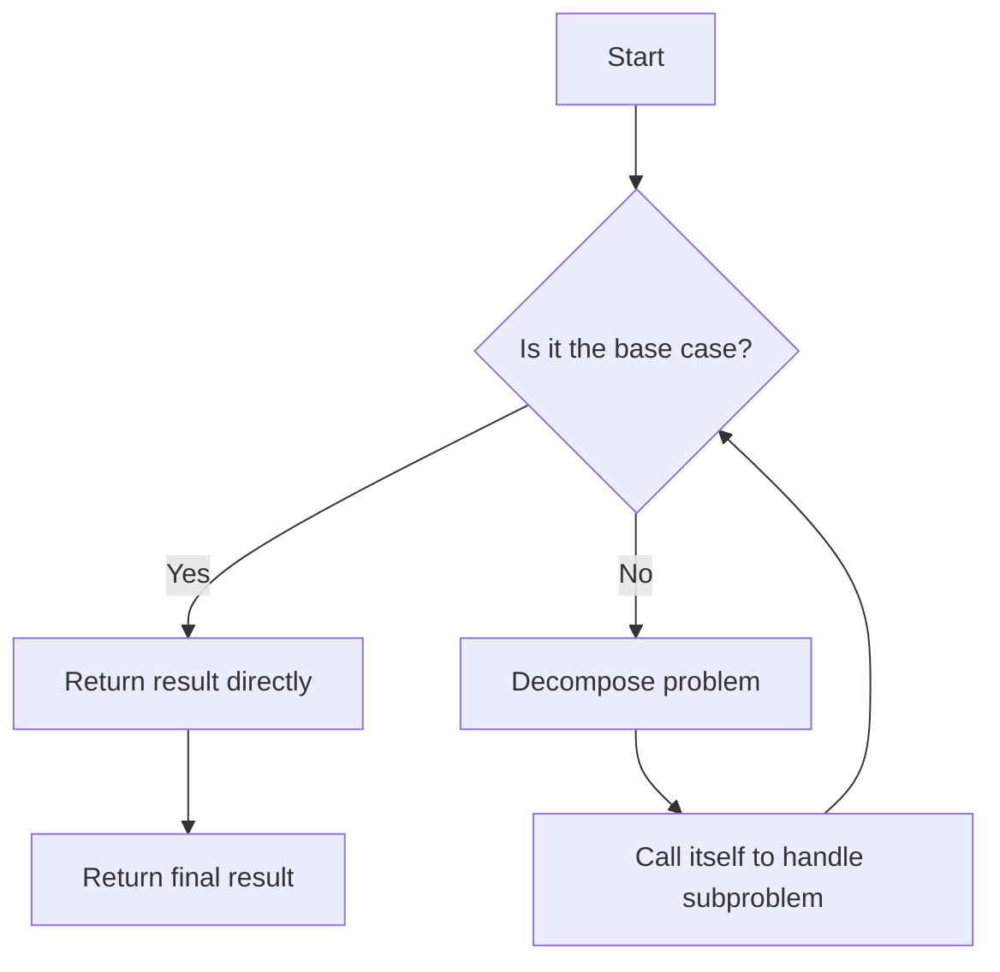
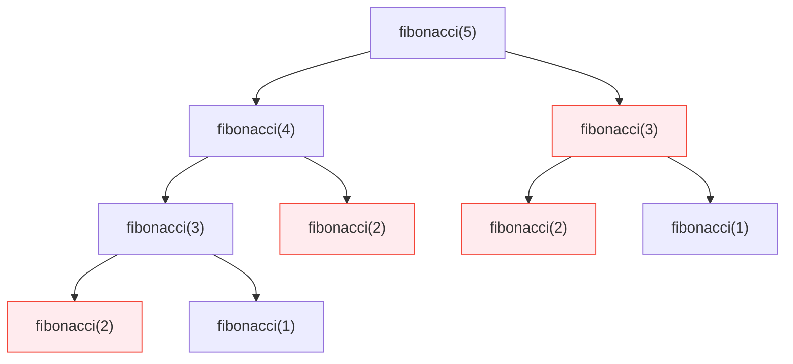

# Recursion: Solving Complex Problems with the "Divide and Conquer" Mindset

In the C language, recursion is an elegant and powerful programming technique—**a function directly or indirectly calls itself**, breaking down complex problems into smaller, structurally similar subproblems. This "divide and conquer" strategy is particularly suitable for handling tasks with self-similar characteristics, such as tree structure traversal and mathematical series calculations. This chapter will guide you from scratch to understand the core concepts of recursion and master safe and efficient usage methods.

## The Essence of Recursion: A Self-Replicating Thought Pattern

### Why Do We Need Recursion?

Imagine you need to calculate 5! (5 factorial). The traditional loop approach requires:

```c
int result = 1;
for(int i=1; i<=5; i++) {
    result *= i;
}
```

But mathematically, 5! = 5 × 4!, and 4! = 4 × 3!... This characteristic where **a problem can be decomposed into subproblems of the same form** is precisely where recursion shines.

> 💡 **Core Insight**: Recursion is not magic—it's a way of **naturally decomposing** problems. When a problem satisfies "solution to large problem = solution to small problem + simple operation," recursion is often the best choice.

### The Two Pillars of Recursion

Any effective recursive function must contain:

1. **Base Case**  
   - The simplest form of the problem that can be solved directly
   - The "safety valve" that **prevents infinite recursion**

2. **Recursive Case**  
   - Breaking the problem into smaller subproblems
   - Calling itself with **modified parameters**



### Classic Introductory Example: Countdown

```c
#include <stdio.h>

void countdown(int n) {
    // Base case: termination condition
    if (n <= 0) {
        printf("Launch!\n");
        return;
    }
    
    // Recursive case: decompose problem
    printf("%d...\n", n);
    countdown(n - 1);  // Smaller-scale subproblem
}

int main() {
    countdown(3);
    return 0;
}
```

**Execution Flow Visualization**:

```
countdown(3)
├─ Print "3..."
├─ Call countdown(2)
│  ├─ Print "2..."
│  ├─ Call countdown(1)
│  │  ├─ Print "1..."
│  │  ├─ Call countdown(0)
│  │  │  └─ Trigger base case → Print "Launch!"
│  │  └─ Return
│  └─ Return
└─ Return
```

> ✅ **Key Understanding**: Recursive calls **pause current execution**, first completing subproblems before backtracking to handle remaining logic. This is like Russian nesting dolls—you must open the innermost layer first before returning through each layer.

## How Recursion Works: The Dance of Stack Frames

When a function call occurs, the system creates a **stack frame** to store:

- Function parameters
- Local variables
- Return address

During recursive calls, these stack frames **stack layer by layer** until reaching the base case, then begin **unwinding layer by layer**.

```c
#include <stdio.h>

void showStack(int n) {
    printf("Entering function, n = %d\n", n);
    
    if (n <= 1) {
        printf("★ Reached base case, n = %d\n", n);
        return;
    }
    
    showStack(n - 1);
    printf("← Returning from function, n = %d\n", n);
}

int main() {
    showStack(3);
    return 0;
}
```

**Output Analysis**:

```
Entering function, n = 3
Entering function, n = 2
Entering function, n = 1
★ Reached base case, n = 1
← Returning from function, n = 2
← Returning from function, n = 3
```

```mermaid
flowchart LR
    subgraph Stack Frame Unfolding Process
    direction TB
    Frame3["n=3\nprintf(\"←...\")"] --> Frame2["n=2\nprintf(\"←...\")"]
    Frame2 --> Frame1["n=1\n★ Base case"]
    end
```

> ⚠️ **Important Warning**: C language has limited default stack space (typically 1-8MB). Excessively deep recursion leads to **stack overflow**, causing program crashes. Optimization techniques will be introduced later.

## Practical Exercises: Classic Recursion Problems

### 1. Factorial Calculation: The Mathematical Beauty of Recursion

**Mathematical Definition**:  
n! = n × (n-1)!, where 0! = 1

```c
#include <stdio.h>

long long factorial(int n) {
    // Base case: 0! = 1
    if (n == 0) {
        return 1;
    }
    
    // Recursive case: n! = n × (n-1)!
    return n * factorial(n - 1);
}

int main() {
    printf("5! = %lld\n", factorial(5));
    // Step-by-step decomposition: 5! = 5 × 4! = 5 × 4 × 3! = ... = 5×4×3×2×1×1
    return 0;
}
```

**Execution Process**:

```
factorial(5)
└─ 5 × factorial(4)
   └─ 4 × factorial(3)
      └─ 3 × factorial(2)
         └─ 2 × factorial(1)
            └─ 1 × factorial(0)
               └─ Return 1
```

> 💡 **Teaching Tip**: Emphasize the importance of `n==0` as the base case. If incorrectly written as `n<=1`, while the result may be the same, the logic is not rigorous (0! has a clear mathematical definition).

### 2. Fibonacci Sequence: Understanding Recursion Efficiency

**Problem Definition**:  
F(0)=0, F(1)=1, F(n)=F(n-1)+F(n-2)

```c
#include <stdio.h>

int fibonacci(int n) {
    // Base cases
    if (n == 0) return 0;
    if (n == 1) return 1;
    
    // Recursive case
    return fibonacci(n-1) + fibonacci(n-2);
}

int main() {
    for (int i = 0; i < 6; i++) {
        printf("F(%d)=%d ", i, fibonacci(i));
    }
    // Output: F(0)=0 F(1)=1 F(2)=1 F(3)=2 F(4)=3 F(5)=5
    return 0;
}
```

**Efficiency Trap**:  
When calculating `fibonacci(5)`:

- `fibonacci(4)` is calculated 1 time
- `fibonacci(3)` is calculated 2 times
- `fibonacci(2)` is calculated 3 times
- ...  
**Time Complexity: O(2ⁿ)** — exponential growth!



> ✅ **Optimization Tip**: For beginners, first understand basic recursion. Later learn **memoization** or **dynamic programming** for optimization. The current focus should be on understanding concepts rather than performance.

### 3. Binary Search: The Practical Value of Recursion

Efficiently search for elements in a **sorted array**:

```c
#include <stdio.h>

int binarySearch(int arr[], int left, int right, int target) {
    // Base case 1: Not found
    if (left > right) {
        return -1;
    }
    
    int mid = left + (right - left) / 2;
    
    // Base case 2: Target found
    if (arr[mid] == target) {
        return mid;
    }
    
    // Recursive case: Narrow search range
    if (arr[mid] > target) {
        return binarySearch(arr, left, mid - 1, target);
    } else {
        return binarySearch(arr, mid + 1, right, target);
    }
}

int main() {
    int sortedArr[] = {2, 5, 8, 12, 16, 23, 38, 56, 72, 91};
    int size = sizeof(sortedArr) / sizeof(sortedArr[0]);
    
    int index = binarySearch(sortedArr, 0, size-1, 23);
    if (index != -1) {
        printf("Found 23 at index %d\n", index);
    }
    return 0;
}
```

**Recursion Advantages**:  

- Code is concise and clear
- Naturally embodies the "divide and conquer" concept
- Each recursion **halves the problem size** (time complexity O(log n))

> 💡 **Learning Suggestion**: Compare with iterative implementation to understand how recursion simplifies logic. However, note that in actual engineering, iteration is usually more efficient (no stack overhead).

## String Recursion: Elegant Text Processing

### String Length Calculation

```c
#include <stdio.h>

int stringLength(const char *str) {
    // Base case: encountering string termination character
    if (*str == '\0') {
        return 0;
    }
    
    // Recursive case: 1 + length of remaining part
    return 1 + stringLength(str + 1);
}

int main() {
    char text[] = "Recursion";
    printf("'%s' length = %d\n", text, stringLength(text));
    // Step-by-step decomposition: R(1) + ecursion(8) = 1 + [e(1) + cursion(7)] = ...
    return 0;
}
```

**Pointer Technique**: `str + 1` points to the next character, perfectly demonstrating "problem size reduction."

### Palindrome Detection (Advanced)

```c
#include <stdio.h>
#include <ctype.h>
#include <string.h>

int isPalindrome(const char *str, int left, int right) {
    // Base case: pointers meet
    if (left >= right) {
        return 1; // Is palindrome
    }
    
    // Skip non-alphabetic characters
    if (!isalpha(str[left])) {
        return isPalindrome(str, left + 1, right);
    }
    if (!isalpha(str[right])) {
        return isPalindrome(str, left, right - 1);
    }
    
    // Compare characters (case-insensitive)
    if (tolower(str[left]) != tolower(str[right])) {
        return 0; // Not a palindrome
    }
    
    // Recursively check inner substring
    return isPalindrome(str, left + 1, right - 1);
}

int main() {
    char text[] = "A man, a plan, a canal: Panama";
    int len = strlen(text);
    printf("'%s' %s a palindrome\n", 
           text, 
           isPalindrome(text, 0, len - 1) ? "is" : "is not");
    return 0;
}
```

> ✅ **Best Practice**: Use `const` to modify input parameters to prevent accidental modification of the original string.

## Pitfall Avoidance Guide: Common Recursion Traps

### 1. Missing Base Case → Infinite Recursion

```c
// Dangerous example: missing base case
int badFactorial(int n) {
    return n * badFactorial(n - 1); // Never stops!
}
```

**Consequence**: Stack space exhausted → Program crashes (Segmentation Fault)

### 2. Incorrect Recursion Direction → Never Reaches Base Case

```c
// Error: n increases instead of decreases
void wrongCountdown(int n) {
    if (n == 0) return;
    printf("%d\n", n);
    wrongCountdown(n + 1); // Gets larger and larger!
}
```

### 3. Stack Overflow Risk

```c
// Dangerous: large input causes stack overflow
int deepRecursion(int n) {
    if (n == 0) return 1;
    return deepRecursion(n - 1);
}

int main() {
    deepRecursion(100000); // May crash!
}
```

> 💡 **Safety Threshold**: In typical systems, recursion depth **exceeding 10,000 levels** significantly increases risk. Check stack size with `ulimit -s`.

## Golden Development Guidelines

### ✅ Must-Do Checklist

1. **Double-Check Base Cases**  
   - Ensure all inputs can reach base cases
   - Use defensive programming like `assert(n >= 0)`

2. **Single-Step Progression Principle**  
   Each recursive call must **explicitly reduce problem size**:

   ```c
   // Correct: n → n-1
   factorial(n-1);
   
   // Error: n → n/2 (may not reach base case)
   badFactorial(n/2);
   ```

3. **Test with Small Inputs First**  
   Verify simple cases like `factorial(0)`, `factorial(1)` first

### ⚠️ Use with Caution Scenarios

| Scenario                | Recommendation                     |
|-------------------------|------------------------------------|
| Large-scale data processing | Prefer iteration             |
| Real-time systems       | Avoid recursion (unpredictable stack overhead) |
| Embedded systems        | Strictly limit recursion depth    |

### 🌟 Advanced Techniques (For Further Learning)

- **Tail Recursion Optimization**: Some compilers can convert specific recursions to iteration
- **Memoization**: Cache computed results (e.g., Fibonacci optimization)
- **Recursion to Iteration**: Simulate recursion process with explicit stack

## Recursion Thinking Exercises

Try solving with recursion:

1. Calculate maximum value in an array
2. Check if a linked list is a palindrome
3. Tower of Hanoi problem
4. Directory file traversal

**Thought Question**:  
> Can recursion and loops completely replace each other?  
> **Answer**: Theoretically yes, but:
>
> - Recursion is better suited for **divide-and-conquer problems**
> - Loops are better for **linear iterative tasks**
> - Selection criteria: **Code clarity > minor performance optimizations**

## Summary

Recursion is a sharp double-edged sword in C language:

- ✅ **Advantages**: Concise code, clear logic, naturally matches divide-and-conquer problems
- ❌ **Risks**: Stack overflow, inefficiency, difficult debugging

**Beginner Suggestions**:

1. Start with simple problems (factorial, countdown)
2. Draw recursion call trees to aid understanding
3. Always write base cases first
4. Verify logic with small inputs
5. For complex problems, consider iteration first

Mastering recursive thinking will unlock new dimensions for solving complex problems. Remember: **Good recursion = Clear base cases + Correct recursive progression**. As you practice more, you'll gradually appreciate the "beauty of recursion"—the elegant approach of solving complex problems with simple rules.
