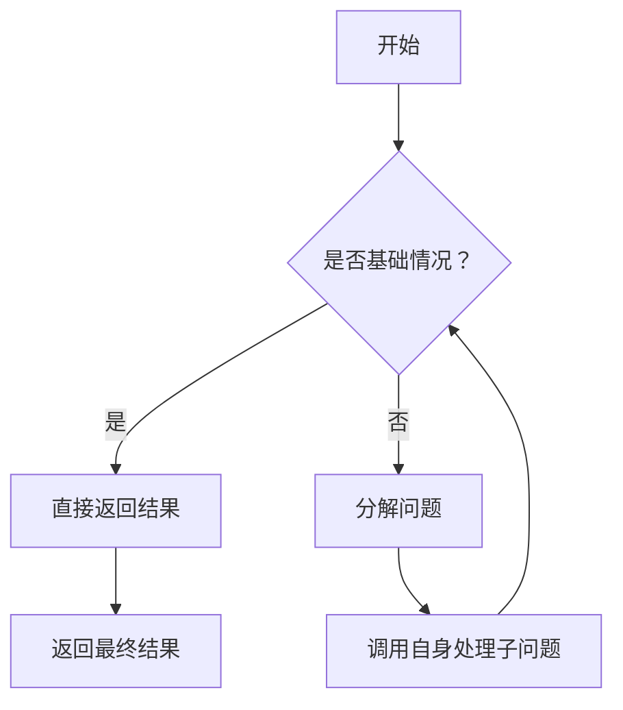
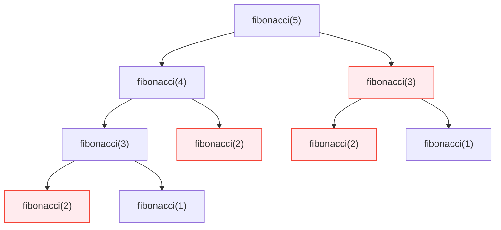

# 递归：用"分而治之"思维解决复杂问题

在C语言中，递归是一种优雅而强大的编程技术——**函数直接或间接调用自身**，将复杂问题分解为更小的、结构相似的子问题。这种"分而治之"的策略特别适合处理具有自相似特性的任务，如树形结构遍历、数学级数计算等。本章将带你从零理解递归的核心思想，并掌握安全高效的使用方法。

## 递归的本质：自我复制的思维模式

### 为什么需要递归？

想象你要计算5!（5的阶乘）。传统循环需要：

```c
int result = 1;
for(int i=1; i<=5; i++) {
    result *= i;
}
```

但数学上5! = 5 × 4!，而4! = 4 × 3!... 这种**问题可分解为相同形式的子问题**的特性，正是递归的用武之地。

> 💡 **核心洞察**：递归不是魔法，而是将问题**自然分解**的思维方式。当问题满足"大问题解 = 小问题解 + 简单操作"时，递归往往是最佳选择。

### 递归的两大基石

任何有效的递归函数必须包含：

1. **基础情况（Base Case）**  
   - 问题的最简形式，可直接求解
   - **防止无限递归的"安全阀"**

2. **递归情况（Recursive Case）**  
   - 将问题分解为更小的子问题
   - 通过**修改参数**调用自身



### 经典入门示例：倒计时

```c
#include <stdio.h>

void countdown(int n) {
    // 基础情况：停止条件
    if (n <= 0) {
        printf("发射！\n");
        return;
    }
    
    // 递归情况：分解问题
    printf("%d...\n", n);
    countdown(n - 1);  // 规模缩小的子问题
}

int main() {
    countdown(3);
    return 0;
}
```

**执行流程可视化**：

```
countdown(3)
├─ 打印 "3..."
├─ 调用 countdown(2)
│  ├─ 打印 "2..."
│  ├─ 调用 countdown(1)
│  │  ├─ 打印 "1..."
│  │  ├─ 调用 countdown(0)
│  │  │  └─ 触发基础情况 → 打印 "发射！"
│  │  └─ 返回
│  └─ 返回
└─ 返回
```

> ✅ **关键理解**：递归调用会**暂停当前执行**，先完成子问题，再回溯处理剩余逻辑。这就像俄罗斯套娃——必须先打开最内层，才能逐层返回。

## 递归工作原理：栈帧的舞蹈

当函数调用发生时，系统会创建**栈帧（Stack Frame）** 存储：

- 函数参数
- 局部变量
- 返回地址

递归调用时，这些栈帧会**层层堆叠**，直到达到基础情况，然后开始**逐层回退**。

```c
#include <stdio.h>

void showStack(int n) {
    printf("进入函数，n = %d\n", n);
    
    if (n <= 1) {
        printf("★ 达到基础情况，n = %d\n", n);
        return;
    }
    
    showStack(n - 1);
    printf("← 从函数返回，n = %d\n", n);
}

int main() {
    showStack(3);
    return 0;
}
```

**输出分析**：

```
进入函数，n = 3
进入函数，n = 2
进入函数，n = 1
★ 达到基础情况，n = 1
← 从函数返回，n = 2
← 从函数返回，n = 3
```

```mermaid
flowchart LR
    subgraph 栈帧展开过程
    direction TB
    Frame3["n=3\nprintf(\"←...\")"] --> Frame2["n=2\nprintf(\"←...\")"]
    Frame2 --> Frame1["n=1\n★ 基础情况"]
    end
```

> ⚠️ **重要警告**：C语言默认栈空间有限（通常1-8MB）。过深的递归会导致**栈溢出（Stack Overflow）**，程序崩溃。后续将介绍优化技巧。

## 实战演练：经典递归问题

### 1. 阶乘计算：递归的数学之美

**数学定义**：  
n! = n × (n-1)!，其中 0! = 1

```c
#include <stdio.h>

long long factorial(int n) {
    // 基础情况：0! = 1
    if (n == 0) {
        return 1;
    }
    
    // 递归情况：n! = n × (n-1)!
    return n * factorial(n - 1);
}

int main() {
    printf("5! = %lld\n", factorial(5));
    // 逐步分解：5! = 5 × 4! = 5 × 4 × 3! = ... = 5×4×3×2×1×1
    return 0;
}
```

**执行过程**：

```
factorial(5)
└─ 5 × factorial(4)
   └─ 4 × factorial(3)
      └─ 3 × factorial(2)
         └─ 2 × factorial(1)
            └─ 1 × factorial(0)
               └─ 返回 1
```

> 💡 **教学提示**：强调`n==0`作为基础情况的重要性。若错误写成`n<=1`，虽然结果相同，但逻辑不严谨（0!在数学中有明确定义）。

### 2. 斐波那契数列：理解递归效率

**问题定义**：  
F(0)=0, F(1)=1, F(n)=F(n-1)+F(n-2)

```c
#include <stdio.h>

int fibonacci(int n) {
    // 基础情况
    if (n == 0) return 0;
    if (n == 1) return 1;
    
    // 递归情况
    return fibonacci(n-1) + fibonacci(n-2);
}

int main() {
    for (int i = 0; i < 6; i++) {
        printf("F(%d)=%d ", i, fibonacci(i));
    }
    // 输出：F(0)=0 F(1)=1 F(2)=1 F(3)=2 F(4)=3 F(5)=5
    return 0;
}
```

**效率陷阱**：  
计算`fibonacci(5)`时：

- `fibonacci(4)`被计算1次
- `fibonacci(3)`被计算2次
- `fibonacci(2)`被计算3次
- ...  
**时间复杂度：O(2ⁿ)** —— 指数级增长！



> ✅ **优化提示**：对于初学者，先理解基础递归，后续可学习**记忆化（Memoization）** 或**动态规划**优化。当前阶段重点掌握思想而非性能。

### 3. 二分查找：递归的实用价值

在**有序数组**中高效查找元素：

```c
#include <stdio.h>

int binarySearch(int arr[], int left, int right, int target) {
    // 基础情况1：未找到
    if (left > right) {
        return -1;
    }
    
    int mid = left + (right - left) / 2;
    
    // 基础情况2：找到目标
    if (arr[mid] == target) {
        return mid;
    }
    
    // 递归情况：缩小搜索范围
    if (arr[mid] > target) {
        return binarySearch(arr, left, mid - 1, target);
    } else {
        return binarySearch(arr, mid + 1, right, target);
    }
}

int main() {
    int sortedArr[] = {2, 5, 8, 12, 16, 23, 38, 56, 72, 91};
    int size = sizeof(sortedArr) / sizeof(sortedArr[0]);
    
    int index = binarySearch(sortedArr, 0, size-1, 23);
    if (index != -1) {
        printf("找到23在索引 %d\n", index);
    }
    return 0;
}
```

**递归优势**：  

- 代码简洁清晰
- 自然体现"分而治之"思想
- 每次递归将问题规模**减半**（时间复杂度O(log n)）

> 💡 **学习建议**：对比迭代实现，理解递归如何简化逻辑。但注意：实际工程中，迭代通常更高效（无栈开销）。

## 字符串递归：处理文本的优雅方式

### 字符串长度计算

```c
#include <stdio.h>

int stringLength(const char *str) {
    // 基础情况：遇到字符串结束符
    if (*str == '\0') {
        return 0;
    }
    
    // 递归情况：1 + 剩余部分长度
    return 1 + stringLength(str + 1);
}

int main() {
    char text[] = "Recursion";
    printf("'%s' 长度 = %d\n", text, stringLength(text));
    // 逐步分解：R(1) + ecursion(8) = 1 + [e(1) + cursion(7)] = ...
    return 0;
}
```

**指针技巧**：`str + 1`指向下一个字符，完美体现"问题规模缩小"。

### 回文检测（进阶）

```c
#include <stdio.h>
#include <ctype.h>
#include <string.h>

int isPalindrome(const char *str, int left, int right) {
    // 基础情况：指针相遇
    if (left >= right) {
        return 1; // 是回文
    }
    
    // 跳过非字母字符
    if (!isalpha(str[left])) {
        return isPalindrome(str, left + 1, right);
    }
    if (!isalpha(str[right])) {
        return isPalindrome(str, left, right - 1);
    }
    
    // 比较字符（不区分大小写）
    if (tolower(str[left]) != tolower(str[right])) {
        return 0; // 不是回文
    }
    
    // 递归检查内部子串
    return isPalindrome(str, left + 1, right - 1);
}

int main() {
    char text[] = "A man, a plan, a canal: Panama";
    int len = strlen(text);
    printf("'%s' %s回文\n", 
           text, 
           isPalindrome(text, 0, len - 1) ? "是" : "不是");
    return 0;
}
```

> ✅ **最佳实践**：使用`const`修饰输入参数，防止意外修改原始字符串。

## 避坑指南：递归的常见陷阱

### 1. 遗漏基础情况 → 无限递归

```c
// 危险示例：缺少基础情况
int badFactorial(int n) {
    return n * badFactorial(n - 1); // 永不停止！
}
```

**后果**：栈空间耗尽 → 程序崩溃（Segmentation Fault）

### 2. 递归方向错误 → 永不触达基础情况

```c
// 错误：n递增而非递减
void wrongCountdown(int n) {
    if (n == 0) return;
    printf("%d\n", n);
    wrongCountdown(n + 1); // 越调越大！
}
```

### 3. 栈溢出风险

```c
// 危险：大输入导致栈溢出
int deepRecursion(int n) {
    if (n == 0) return 1;
    return deepRecursion(n - 1);
}

int main() {
    deepRecursion(100000); // 可能崩溃！
}
```

> 💡 **安全阈值**：在典型系统中，递归深度**超过10,000层**风险显著增加。可通过`ulimit -s`查看栈大小。

## 黄金开发准则

### ✅ 必做清单

1. **双重验证基础情况**  
   - 确保所有输入都能触达基础情况
   - 用`assert(n >= 0)`等防御性编程

2. **单步递进原则**  
   每次递归调用必须**明确缩小问题规模**：

   ```c
   // 正确：n → n-1
   factorial(n-1);
   
   // 错误：n → n/2（可能无法触达基础情况）
   badFactorial(n/2);
   ```

3. **小输入先行测试**  
   先验证`factorial(0)`, `factorial(1)`等简单情况

### ⚠️ 谨慎使用场景

| 场景                | 建议                     |
|---------------------|--------------------------|
| 大规模数据处理      | 优先考虑迭代             |
| 实时系统            | 避免递归（栈开销不可控） |
| 嵌入式系统          | 严格限制递归深度         |

### 🌟 高级技巧（进阶学习）

- **尾递归优化**：某些编译器可将特定递归转为迭代
- **记忆化技术**：缓存已计算结果（如斐波那契优化）
- **递归转迭代**：用显式栈模拟递归过程

## 递归思维训练

尝试用递归解决：

1. 计算数组最大值
2. 检查链表是否回文
3. 汉诺塔问题
4. 目录文件遍历

**思考题**：  
> 递归和循环能否完全互相替代？  
> **答案**：理论上可以，但：
>
> - 递归更适合**分治类问题**
> - 循环更适合**线性迭代任务**
> - 选择依据：**代码清晰度 > 性能微优化**

## 总结

递归是C语言中一把锋利的双刃剑：

- ✅ **优势**：代码简洁、逻辑清晰、自然匹配分治问题
- ❌ **风险**：栈溢出、效率低下、调试困难

**新手建议**：

1. 从简单问题入手（阶乘、倒计时）
2. 画出递归调用树辅助理解
3. 始终先写基础情况
4. 用小输入验证逻辑
5. 复杂问题优先考虑迭代

掌握递归思维，你将解锁解决复杂问题的新维度。记住：**好的递归 = 清晰的基础情况 + 正确的递归推进**。随着练习深入，你会逐渐体会到"递归之美"——用简单规则解决复杂问题的优雅之道。
