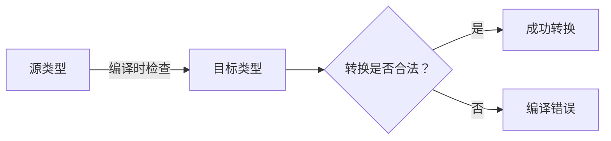
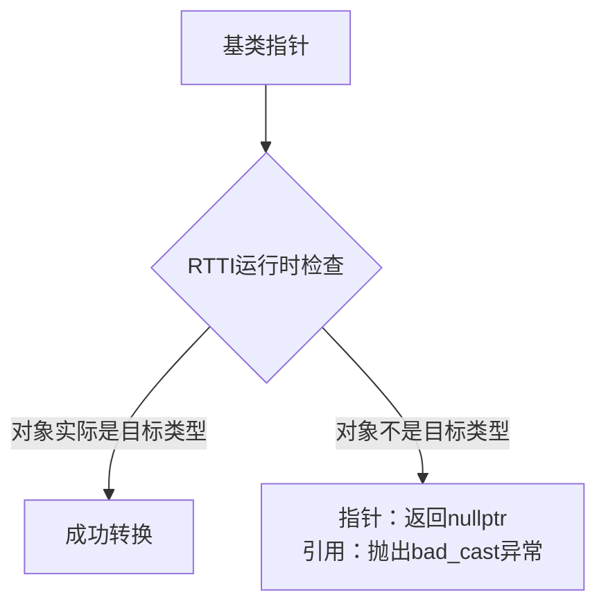
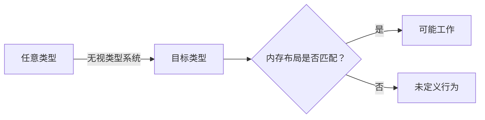
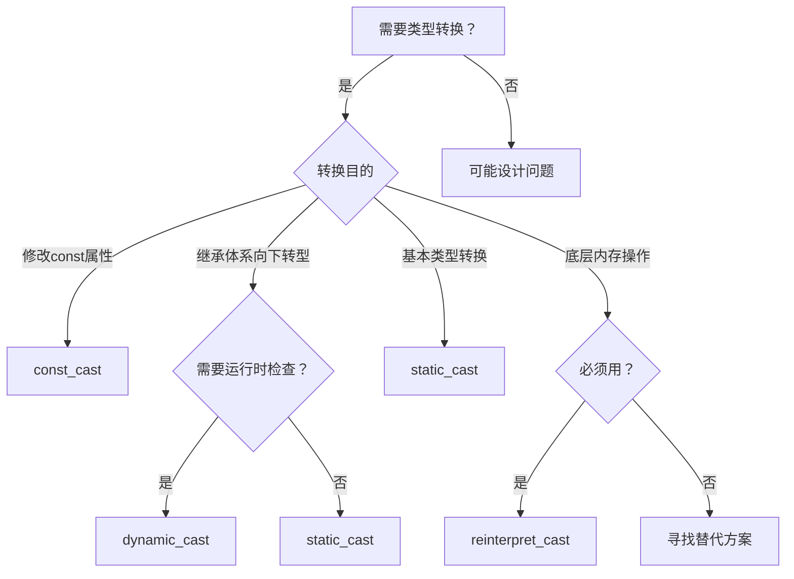

# C++ 类型转换 (Cast) 详解

C++ 提供了四种类型转换操作符（也称为 `cast`），分别是 `static_cast`、`dynamic_cast`、`const_cast` 和 `reinterpret_cast`。这些操作符取代了C语言中危险的强制类型转换，提供了更安全、更明确的类型转换机制。理解它们的区别和适用场景，是编写健壮C++代码的关键基础。

> **学习提示**：初学者常犯的错误是过度使用C风格的 `(type)value` 转换。C++的四种`cast`操作符通过明确的语法设计，帮助开发者清晰表达转换意图，同时让编译器进行更严格的检查。

## 1. `static_cast`：编译时安全转换

### 1.1 核心特点

`static_cast` 是**编译时**进行类型转换的操作符，适用于逻辑上合理的类型转换。它不会进行运行时类型检查，因此转换的安全性完全依赖于程序员的正确使用。



### 1.2 典型应用场景

#### 1.2.1 基本数据类型转换

这是最安全、最常见的用法，编译器会进行隐式类型检查：

```cpp
int main() {
    int i = 10;
    float f = static_cast<float>(i);  // 安全：int → float（精度提升）
    
    float pi = 3.14159;
    int n = static_cast<int>(pi);     // 需注意：float → int（精度损失，截断小数部分）
    std::cout << "n = " << n << std::endl;  // 输出：n = 3
}
```

> **关键区别**：与C风格转换相比，`static_cast` 明确表达了"这是有意的类型转换"，便于代码审查。

#### 1.2.2 继承体系中的类型转换

- **向上转型（安全）**：派生类 → 基类（隐式转换即可，但显式使用`static_cast`更清晰）
- **向下转型（危险）**：基类 → 派生类（**必须确保对象实际是目标派生类类型**）

```cpp
class Base { /*...*/ };
class Derived : public Base { /*...*/ };

int main() {
    // 安全的向上转型
    Derived d;
    Base* b_ptr = static_cast<Base*>(&d);  // 显式转换，虽可省略但推荐保留
    
    // 危险的向下转型（仅当确定类型时使用！）
    Base* base_ptr = new Derived();
    Derived* derived_ptr = static_cast<Derived*>(base_ptr);  // 可能导致未定义行为！
}
```

> **重要警示**：当`base_ptr`实际指向`Base`对象而非`Derived`时，`static_cast`的向下转型会导致未定义行为。此时应改用`dynamic_cast`。

#### 1.2.3 其他常见用途

- `void*` 与其他指针类型互转（常用于底层API）
- 枚举类型与整数互转
- 调用类的类型转换运算符

```cpp
// void* 转换示例
int num = 42;
void* vptr = &num;
int* iptr = static_cast<int*>(vptr);  // 安全转换

// 枚举转换示例
enum Color { RED, GREEN, BLUE };
Color c = GREEN;
int idx = static_cast<int>(c);  // 枚举 → 整数
```

### 1.3 使用注意事项

- ✅ **推荐使用场景**：基本类型转换、安全的向上转型、明确的指针类型转换
- ❌ **禁止使用场景**：
  - 移除`const`限定（应使用`const_cast`）
  - 在无关类型间强制转换（应使用`reinterpret_cast`）
  - 不确定类型的向下转型（应使用`dynamic_cast`）
- ⚠️ **关键原则**：转换必须在编译时逻辑上合理，否则会导致未定义行为

---

## 2. `dynamic_cast`：运行时安全向下转型

### 2.1 核心特点

`dynamic_cast` 是**唯一**提供运行时类型检查的转换操作符，专为继承体系设计。它依赖RTTI（Run-Time Type Information）机制，确保向下转型的安全性。



### 2.2 正确使用方式

#### 指针转换（推荐方式）

```cpp
Base* base_ptr = new Derived();
Derived* derived_ptr = dynamic_cast<Derived*>(base_ptr);

if (derived_ptr) {
    // 转换成功，安全使用派生类功能
    derived_ptr->derived_function();
} else {
    // 转换失败，处理错误情况
    std::cerr << "类型转换失败！" << std::endl;
}
```

#### 引用转换（需异常处理）

```cpp
try {
    Derived& derived_ref = dynamic_cast<Derived&>(*base_ptr);
    derived_ref.derived_function();
} catch (const std::bad_cast& e) {
    std::cerr << "引用转换失败: " << e.what() << std::endl;
}
```

### 2.3 必要条件

- **基类必须包含虚函数**（通常需要虚析构函数）
- **启用RTTI支持**（编译器默认开启，但嵌入式系统可能禁用）

```cpp
// 必须这样定义基类！
class Base {
public:
    virtual ~Base() {}  // 虚析构函数是RTTI的必要条件
};
```

### 2.4 使用建议

- ✅ **仅用于继承体系**：不要用于基本类型转换
- ✅ **优先指针转换**：比引用转换更易处理错误
- ❌ **避免过度使用**：频繁使用可能表明设计问题（考虑重构为虚函数）
- ⚠️ **性能考量**：比`static_cast`慢10-100倍，避免在性能关键路径使用

---

## 3. `const_cast`：修改常量属性

### 3.1 核心特点

`const_cast` **唯一用途**是添加或移除类型的`const`或`volatile`限定符。这是四种转换中**最受限**的操作符。

### 3.2 合法使用场景

#### 与旧式C API交互

```cpp
void legacy_c_function(char* str);  // 旧API不接受const

int main() {
    const std::string msg = "Hello";
    // 安全：原始对象非常量
    legacy_c_function(const_cast<char*>(msg.c_str()));
}
```

#### 临时修改对象属性（需谨慎！）

```cpp
class Data {
    mutable int cache;  // 允许const成员函数修改
public:
    int getValue() const {
        if (cache == 0) {
            // 通过const_cast修改mutable成员（合法但需注释说明）
            const_cast<Data*>(this)->cache = computeExpensiveValue();
        }
        return cache;
    }
};
```

### 3.3 致命陷阱

```cpp
const int x = 10;
int* p = const_cast<int*>(&x);
*p = 20;  // 未定义行为！修改真正const对象会导致程序崩溃
```

> **黄金法则**：只有当原始对象**本身不是const**时，通过`const_cast`移除const才是安全的。否则会导致未定义行为。

### 3.4 最佳实践

- 🔍 **先检查设计**：90%的const_cast需求源于设计缺陷
- 📝 **添加明确注释**：说明为什么必须使用const_cast
- 🚫 **避免修改真正const对象**：这是程序崩溃的常见原因

---

## 4. `reinterpret_cast`：底层内存操作

### 4.1 核心特点

`reinterpret_cast` 是**最危险**的转换操作符，直接操作内存表示。它不做任何类型检查，相当于告诉编译器"我知道自己在做什么"。



### 4.2 极少数合法场景

#### 指针与整数互转（系统编程）

```cpp
void* ptr = malloc(100);
uintptr_t addr = reinterpret_cast<uintptr_t>(ptr);  // 安全：标准保证
```

#### 二进制数据解析（需谨慎）

```cpp
uint32_t data = 0x12345678;
uint8_t* bytes = reinterpret_cast<uint8_t*>(&data);
// 注意：字节序问题！可能得到[0x78, 0x56, 0x34, 0x12]或[0x12, ...]
```

### 4.3 绝对禁止的用法

```cpp
int i = 42;
float* f = reinterpret_cast<float*>(&i);  // 危险！内存解释完全不同
std::cout << *f;  // 未定义行为：可能输出奇怪数字或程序崩溃
```

### 4.4 安全替代方案

| 需求                | 推荐替代方案                     |
|---------------------|-------------------------------|
| 指针转整数          | `std::uintptr_t` + `reinterpret_cast` |
| 类型双关            | `std::memcpy` 或 C++20 `std::bit_cast` |
| 对象布局检查        | `static_assert(sizeof(T) == N)` |

> **强烈建议**：除非编写操作系统、驱动程序或高性能库，否则应完全避免使用`reinterpret_cast`。

---

## 5. 四种类型转换对比指南

| 特性                | `static_cast`                  | `dynamic_cast`                 | `const_cast`                   | `reinterpret_cast`             |
|---------------------|-------------------------------|-------------------------------|-------------------------------|-------------------------------|
| **主要用途**        | 逻辑合理的编译时转换           | 安全的向下转型                 | 修改const/volatile属性         | 底层内存操作                  |
| **类型检查时机**    | 编译时                        | 运行时                        | 无                            | 无                            |
| **安全性**          | 中（依赖程序员判断）           | 高（自动验证类型）             | 低（易误用）                  | 极低（几乎无保障）            |
| **典型场景**        | 基本类型转换、向上转型         | 继承体系向下转型               | 与旧API交互                   | 系统级编程                    |
| **性能开销**        | 无                            | 高（RTTI检查）                | 无                            | 无                            |
| **新手使用频率**    | ★★★★☆                         | ★★☆☆☆                         | ★☆☆☆☆                         | ☆☆☆☆☆                         |
| **危险信号**        | 用于向下转型                  | 基类无虚函数                  | 修改真正const对象             | 用于非指针/整数转换           |

### 选择决策树



## 教学总结

1. **优先选择最安全的转换**：`static_cast` > `dynamic_cast` > `const_cast` > `reinterpret_cast`
2. **避免C风格转换**：`(type)value` 隐藏了转换意图，难以审查
3. **转换失败处理**：
   - 指针转换：检查是否为`nullptr`
   - 引用转换：使用`try/catch`捕获`std::bad_cast`
4. **设计优于强制转换**：频繁需要类型转换通常表明类设计需要改进

> **给初学者的建议**：在90%的日常编程中，你只需要掌握`static_cast`和`dynamic_cast`。当看到代码中出现`const_cast`或`reinterpret_cast`时，应视为"这里可能有设计问题"的警示信号。
