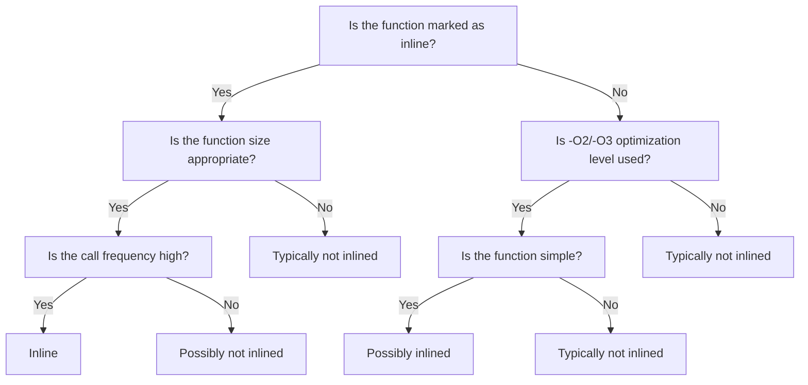
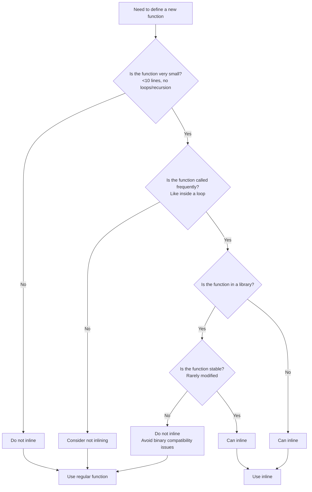

# Comprehensive Guide to C++ Inline Functions: From Theory to Practice

Inline functions are a sophisticated performance optimization technique in C++, skillfully balancing code readability and execution efficiency. For beginners, understanding inline functions not only helps in writing efficient code but also provides deeper insight into the workings of the C++ compiler. This article systematically explains the core concepts, applicable scenarios, and best practices of inline functions, helping you avoid common pitfalls.

> **Learning Objectives**: After completing this chapter, you will be able to
>
> - Accurately explain how inline functions work
> - Determine when to use inline functions
> - Avoid common pitfalls of inline functions
> - Understand best practices for inline functions in modern C++

## 1. The Essence of Inline Functions: More Than Just a Keyword

### 1.1 What Are Inline Functions?

Inline functions are **not** a special type of function, but rather a **compiler optimization request**. When you use the `inline` keyword, you're essentially telling the compiler: "Please consider replacing this function call with the function body directly, rather than generating regular function call instructions."


> **Beginner Tip**: Inline functions differ fundamentally from macro definitions. Macros are simple text replacements (handled by the preprocessor), while inline functions are real functions that benefit from type checking, scope rules, and other C++ features.

### 1.2 Declaring Inline Functions

There are three ways to declare inline functions in C++, each with its own appropriate use cases:

#### 1.2.1 Explicitly Using the `inline` Keyword

```cpp
// Declaration and definition in header file
inline double calculateArea(double radius) {
    return 3.14159 * radius * radius;
}
```

> **Important Rule**: The definition of an inline function **must** be placed in a header file because the compiler needs to see the function body at each call site to perform inlining.

#### 1.2.2 Defining Member Functions Inside a Class

```cpp
class Timer {
public:
    // Implicitly inline: Member functions defined inside a class are automatically considered inline
    void start() {
        startTime = std::chrono::high_resolution_clock::now();
    }
    
    // Also implicitly inline
    double elapsed() const {
        return std::chrono::duration<double>(
            std::chrono::high_resolution_clock::now() - startTime).count();
    }
    
private:
    std::chrono::time_point<std::chrono::high_resolution_clock> startTime;
};
```

#### 1.2.3 Using `inline` Outside the Class

```cpp
class Vector {
public:
    Vector(double x, double y, double z);
    double length() const;
};

// Explicitly add inline when implementing outside the class
inline Vector::Vector(double x, double y, double z) : x(x), y(y), z(z) {}

inline double Vector::length() const {
    return std::sqrt(x*x + y*y + z*z);
}
```

> **Common Misconception**: Many beginners believe that the `inline` keyword guarantees a function will be inlined. In reality, it's merely a request to the compiler, which retains final decision-making authority.

## 2. How Inline Functions Work

### 2.1 The Code Replacement Process

Consider this example:

```cpp
inline int square(int x) {
    return x * x;
}

int main() {
    int a = 5;
    int result = square(a);
    return 0;
}
```

If the compiler decides to inline the `square` function, the generated code would resemble:

```cpp
int main() {
    int a = 5;
    int result = a * a;  // square(a) is directly replaced
    return 0;
}
```

### 2.2 The Compiler's Inlining Decision Process

When deciding whether to inline a function, the compiler considers these factors:



> **Key Fact**: Modern compilers (such as GCC and Clang) automatically inline suitable small functions at `-O2` or `-O3` optimization levels, even without the `inline` keyword. The `inline` keyword primarily affects linkage behavior rather than forcing inlining.

## 3. Advantages and Limitations of Inline Functions

### 3.1 Advantages: Why Use Inline Functions?

#### 3.1.1 Eliminating Function Call Overhead

For frequently called small functions, inlining can significantly improve performance:

```cpp
// Non-inline version: Function call overhead accumulates in the loop
double sum(const std::vector<double>& values) {
    double result = 0.0;
    for (size_t i = 0; i < values.size(); ++i) {
        result += process(values[i]); // Function call overhead accumulates in the loop
    }
    return result;
}

// Inline version: Compiler may expand process directly
inline double process(double value) {
    return value * 2.5 + 3.0;
}
```

> **Performance Reference**: On modern CPUs, the overhead of a single function call is approximately 5-20 clock cycles. For functions called millions of times per second, inlining can yield 10-30% performance improvement.

#### 3.1.2 Type Safety and Avoiding Macro Pitfalls

Compared to C's macros, inline functions provide complete type checking:

```cpp
// Macro definition: Has type safety issues and side effects
#define SQUARE(x) ((x) * (x))
int i = 5;
int result = SQUARE(i++); // Expands to ((i++) * (i++)) - Undefined behavior!

// Inline function: Type-safe with no side effects
inline int square(int x) {
    return x * x;
}
int result = square(i++); // i++ is evaluated only once, result is 25
```

#### 3.1.3 Scope and Access Control

Inline functions follow C++'s normal scope rules and can access private members of a class:

```cpp
class Secret {
private:
    int secretValue;
    
public:
    // Inline functions can access private members
    inline int getSecret() const { 
        return secretValue; 
    }
};
```

### 3.2 Limitations: When to Avoid Inlining?

#### 3.2.1 Code Bloat Risk

Excessive use of inlining can increase executable size:


> **Rule of Thumb**: Functions with more than 10 lines of code or containing loops/recursion are generally unsuitable for inlining. Code bloat can reduce instruction cache hit rates, potentially degrading performance.

#### 3.2.2 Increased Compilation Time

Extensive use of inline functions can lengthen compilation time as the compiler needs to expand the function body at each call site and perform optimizations.

#### 3.2.3 Binary Compatibility Issues

**Critical Warning**: Modifying the implementation of an inline function requires recompiling all code that calls it. For library developers, this can cause binary incompatibility:

```cpp
// mylib.h
inline int utilityFunction(int x) {
    return x * 2; // Initial implementation
}

// User code (already compiled)
int result = utilityFunction(10); // Result is 20

// After library update
inline int utilityFunction(int x) {
    return x * 3; // New implementation
}

// Without recompiling user code, still gets 20 instead of 30!
```

## 4. Inline Functions vs. Macro Definitions: Clear Comparison

| Feature | Inline Function | Macro |
|---------|----------------|-------|
| **Type Safety** | ✅ Full type checking | ❌ No type checking |
| **Parameter Evaluation** | ✅ Evaluated once | ❌ May be evaluated multiple times |
| **Debugging Support** | ✅ Can be debugged step-by-step | ❌ Difficult to debug |
| **Scope Rules** | ✅ Follows C++ scoping | ❌ Global scope |
| **Access Control** | ✅ Supports private members | ❌ Not supported |
| **Recursion Support** | ✅ Can be recursive | ❌ Cannot be recursive |
| **Operator Precedence** | ✅ Follows normal rules | ❌ Must be handled carefully |
| **Compile-time Execution** | ❌ Not supported | ✅ Supports conditional compilation |

> **Decision Guide**: Inline functions are a better choice than macros in 95% of cases. Only use macros when you need preprocessor features (like conditional compilation).

## 5. Best Practices for Inline Functions

### 5.1 When to Inline?

#### 5.1.1 Accessor Functions (Getters/Setters)

```cpp
class Point {
private:
    double x, y;
    
public:
    // Ideal inline candidate: Short and frequently called
    inline double getX() const { return x; }
    inline double getY() const { return y; }
    inline void setX(double newX) { x = newX; }
    inline void setY(double newY) { y = newY; }
};
```

#### 5.1.2 Small Utility Functions

```cpp
// Math utility functions
inline double toRadians(double degrees) {
    return degrees * 0.017453292519943295; // PI/180
}

inline bool isEven(int num) {
    return (num % 2) == 0;
}
```

#### 5.1.3 Template Functions

```cpp
// Template functions should typically be inlined
template <typename T>
inline T max(T a, T b) {
    return (a > b) ? a : b;
}

template <typename T>
inline T clamp(T value, T min, T max) {
    if (value < min) return min;
    if (value > max) return max;
    return value;
}
```

### 5.2 When to Avoid Inlining?

| Scenario | Reason | Alternative |
|----------|--------|-------------|
| Function body exceeds 10 lines | High risk of code bloat | Regular function |
| Contains loops or recursion | Compiler typically refuses to inline | Regular function |
| Frequently modified interface | Binary compatibility issues | Keep non-inline |
| Virtual functions | Runtime polymorphism prevents inlining | Design pattern optimization |
| Large computational functions | Low inlining benefit | Regular function |

### 5.3 Inlining Strategies in Modern C++

#### 5.3.1 Trust the Compiler's Decision

```cpp
// No need for inline keyword, compiler may automatically inline at -O2
bool isEmpty(const std::string& str) {
    return str.empty();
}
```

> **Practical Advice**: During development, prioritize writing clear code without excessive use of `inline`. Only consider adding `inline` during performance optimization based on profiling results.

#### 5.3.2 Forced Inlining for Performance-Critical Code

For absolutely critical performance functions:

```cpp
// GCC/Clang
__attribute__((always_inline)) 
int criticalFunction(int x) {
    return x * x + 2 * x + 1;
}

// MSVC
__forceinline int criticalFunction(int x) {
    return x * x + 2 * x + 1;
}

// C++20 standard approach (supported by some compilers)
[[gnu::always_inline]] int criticalFunction(int x) {
    return x * x + 2 * x + 1;
}
```

> **Warning**: Use `always_inline` sparingly, as excessive use can degrade performance.

## 6. Practical Example Analysis

### 6.1 Inline Applications in Math Libraries

```cpp
namespace Math {
    // Ideal inline candidates: Short, pure computations
    inline double square(double x) { return x * x; }
    inline double cube(double x) { return x * x * x; }
    inline double degToRad(double deg) { return deg * 0.017453292519943295; }
    
    // Note: More complex functions may not be suitable for inlining
    double solveQuadratic(double a, double b, double c) {
        // Implementation of quadratic equation solver...
    }
}  // namespace Math
```

### 6.2 Vector Class in Game Development

```cpp
class Vector2D {
private:
    float x, y;

public:
    Vector2D(float x = 0, float y = 0) : x(x), y(y) {}
    
    // Inline accessors
    inline float getX() const { return x; }
    inline float getY() const { return y; }
    
    // Inline simple calculations
    inline float length() const { 
        return std::sqrt(x * x + y * y); 
    }
    
    // Inline dot product calculation
    inline float dot(const Vector2D& other) const {
        return x * other.x + y * other.y;
    }
    
    // Note: More complex operations may not be suitable for inlining
    Vector2D rotate(float radians) const {
        float cosR = std::cos(radians);
        float sinR = std::sin(radians);
        return Vector2D(x * cosR - y * sinR, x * sinR + y * cosR);
    }
};
```

### 6.3 String Processing Utilities

```cpp
namespace StringUtils {
    // Inline simple string checks
    inline bool startsWith(const std::string& str, const std::string& prefix) {
        return str.size() >= prefix.size() && 
               str.compare(0, prefix.size(), prefix) == 0;
    }
    
    // Inline simple string checks
    inline bool endsWith(const std::string& str, const std::string& suffix) {
        return str.size() >= suffix.size() && 
               str.compare(str.size() - suffix.size(), suffix.size(), suffix) == 0;
    }
    
    // Note: trim operations may not be suitable for inlining (more complex implementation)
    std::string trim(const std::string& str) {
        // Implementation of trim logic...
    }
}  // namespace StringUtils
```

## 7. Inline Function Decision Tree



## Teaching Summary

1. **The Essence of Inlining**: It's a compiler optimization request, not a forced instruction
2. **When to Use**:
   - Small, frequently called functions (like accessors)
   - Implementation of template functions
   - Short computations on performance-critical paths
3. **When to Avoid**:
   - Complex functions (>10 lines, with loops/recursion)
   - Library interface functions that change frequently
   - Virtual functions
4. **Modern Practices**:
   - Let the compiler decide (use -O2/-O3)
   - Only manually add `inline` when performance analysis confirms it's needed
   - Avoid excessive use of `always_inline`

> **Advice for Beginners**: When first learning C++, **don't deliberately use the `inline` keyword**. Focus first on writing clear, correct code. When you begin to focus on performance optimization, use profiling tools to identify critical functions for targeted inlining. Remember that premature optimization is the root of all evil—maintainable, readable code is more important than minor performance gains.
