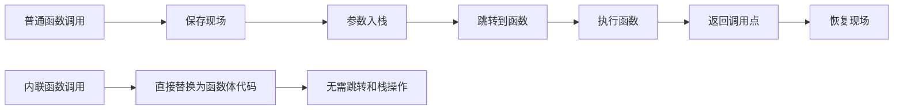
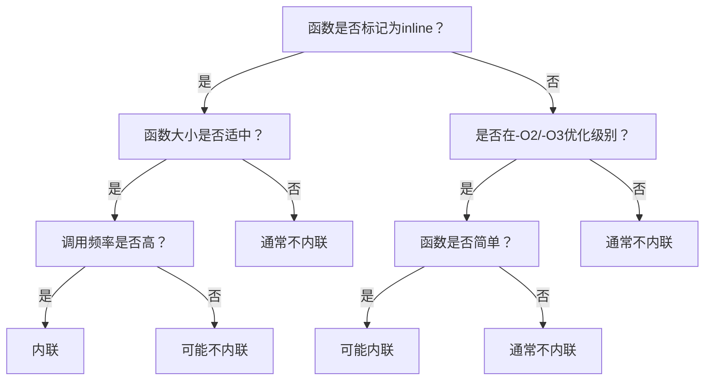
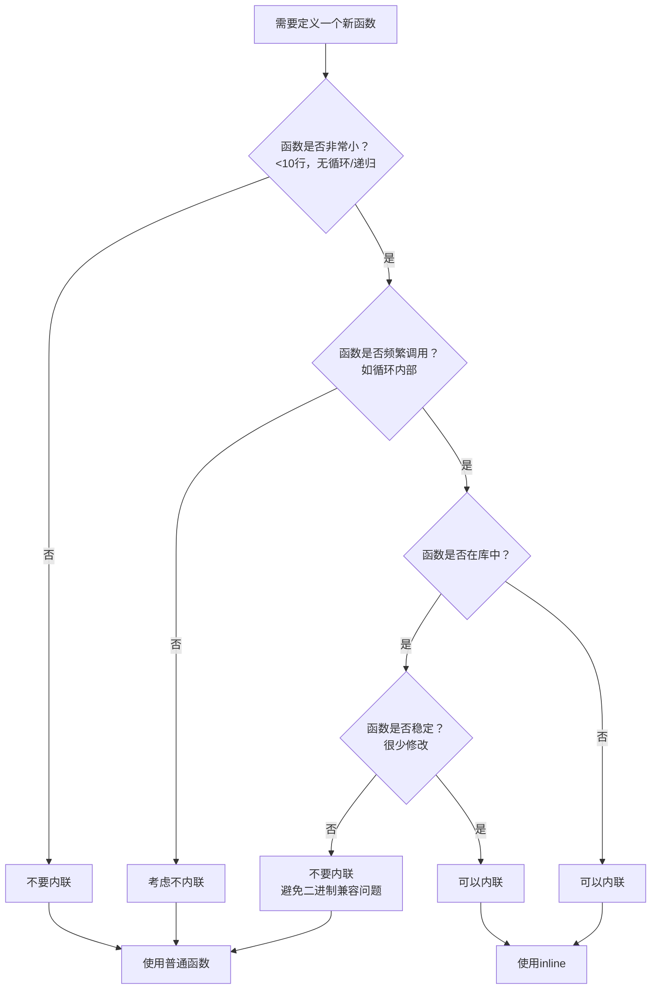

# C++内联函数全解析：从原理到实践

内联函数是C++中一项精妙的性能优化技术，它巧妙地平衡了代码可读性与执行效率。对于初学者而言，理解内联函数不仅有助于编写高效代码，更能深入理解C++编译器的工作机制。本文将系统讲解内联函数的核心概念、适用场景及最佳实践，帮助你避免常见误区。

> **学习目标**：学完本章后，你将能够
>
> - 准确解释内联函数的工作原理
> - 判断何时应该使用内联函数
> - 避免内联函数的常见陷阱
> - 理解现代C++中内联函数的最佳实践

## 1. 内联函数的本质：不只是关键字

### 1.1 什么是内联函数？

内联函数**不是**一种特殊的函数类型，而是一种**编译器优化请求**。当你使用`inline`关键字时，实际上是在告诉编译器："请考虑将这个函数的调用点直接替换为函数体，而不是生成常规的函数调用指令。"



> **初学者提示**：内联函数与宏定义有本质区别。宏是简单的文本替换（由预处理器处理），而内联函数是真正的函数，享有类型检查、作用域规则等C++特性。

### 1.2 内联函数的声明方式

C++中有三种声明内联函数的方式，各有适用场景：

#### 1.2.1 显式使用`inline`关键字

```cpp
// 头文件中声明并定义
inline double calculateArea(double radius) {
    return 3.14159 * radius * radius;
}
```

> **重要规则**：内联函数的定义**必须**放在头文件中，因为编译器需要在每个调用点看到函数体才能进行内联。

#### 1.2.2 类内直接定义成员函数

```cpp
class Timer {
public:
    // 隐式内联：类内定义的成员函数自动视为内联
    void start() {
        startTime = std::chrono::high_resolution_clock::now();
    }
    
    // 同样隐式内联
    double elapsed() const {
        return std::chrono::duration<double>(
            std::chrono::high_resolution_clock::now() - startTime).count();
    }
    
private:
    std::chrono::time_point<std::chrono::high_resolution_clock> startTime;
};
```

#### 1.2.3 类外使用`inline`关键字

```cpp
class Vector {
public:
    Vector(double x, double y, double z);
    double length() const;
};

// 类外实现时需显式添加inline
inline Vector::Vector(double x, double y, double z) : x(x), y(y), z(z) {}

inline double Vector::length() const {
    return std::sqrt(x*x + y*y + z*z);
}
```

> **常见误区**：很多初学者认为`inline`关键字保证函数一定会被内联，实际上它只是向编译器提出请求，最终决定权在编译器手中。

## 2. 内联函数的工作原理

### 2.1 代码替换过程

考虑以下示例：

```cpp
inline int square(int x) {
    return x * x;
}

int main() {
    int a = 5;
    int result = square(a);
    return 0;
}
```

如果编译器决定内联`square`函数，生成的代码将类似于：

```cpp
int main() {
    int a = 5;
    int result = a * a;  // square(a)被直接替换
    return 0;
}
```

### 2.2 编译器的内联决策过程

编译器决定是否内联时，会考虑以下因素：



> **关键事实**：现代编译器（如GCC、Clang）在`-O2`或`-O3`优化级别下，会自动内联适合的小函数，即使没有`inline`关键字。`inline`关键字主要影响链接行为，而非强制内联。

## 3. 内联函数的优势与局限

### 3.1 优势：为什么使用内联？

#### 3.1.1 消除函数调用开销

对于频繁调用的小函数，内联可以显著提升性能：

```cpp
// 非内联版本：每次循环都有函数调用开销
double sum(const std::vector<double>& values) {
    double result = 0.0;
    for (size_t i = 0; i < values.size(); ++i) {
        result += process(values[i]); // 函数调用开销在循环中累积
    }
    return result;
}

// 内联版本：编译器可能将process直接展开
inline double process(double value) {
    return value * 2.5 + 3.0;
}
```

> **性能参考**：在现代CPU上，一次函数调用的开销约为5-20个时钟周期。对于每秒调用百万次的小函数，内联可能带来10-30%的性能提升。

#### 3.1.2 类型安全与避免宏陷阱

与C语言的宏相比，内联函数提供完整的类型检查：

```cpp
// 宏定义：存在类型安全问题和副作用
#define SQUARE(x) ((x) * (x))
int i = 5;
int result = SQUARE(i++); // 展开为 ((i++) * (i++)) - 未定义行为!

// 内联函数：类型安全且无副作用
inline int square(int x) {
    return x * x;
}
int result = square(i++); // i++只计算一次，结果是25
```

#### 3.1.3 作用域与访问控制

内联函数遵循C++的正常作用域规则，可以访问类的私有成员：

```cpp
class Secret {
private:
    int secretValue;
    
public:
    // 内联函数可以访问私有成员
    inline int getSecret() const { 
        return secretValue; 
    }
};
```

### 3.2 局限：何时避免内联？

#### 3.2.1 代码膨胀风险

过度使用内联会导致可执行文件体积增大：


> **经验法则**：函数体超过10行代码或包含循环/递归时，通常不适合内联。代码膨胀可能导致指令缓存命中率下降，反而降低性能。

#### 3.2.2 编译时间增加

大量内联函数会延长编译时间，因为编译器需要在每个调用点展开函数体并进行优化。

#### 3.2.3 二进制兼容性问题

**关键警告**：修改内联函数的实现需要重新编译所有调用它的代码。对于库开发者，这可能导致二进制不兼容：

```cpp
// mylib.h
inline int utilityFunction(int x) {
    return x * 2; // 初始实现
}

// 用户代码（已编译）
int result = utilityFunction(10); // 结果为20

// 库更新后
inline int utilityFunction(int x) {
    return x * 3; // 新实现
}

// 用户不重新编译，仍得到20而非30！
```

## 4. 内联函数 vs 宏定义：清晰对比

| 特性 | 内联函数 | 宏定义 |
|------|---------|-------|
| **类型安全** | ✅ 完全类型检查 | ❌ 无类型检查 |
| **参数求值** | ✅ 只计算一次 | ❌ 可能多次计算 |
| **调试支持** | ✅ 可单步调试 | ❌ 调试困难 |
| **作用域规则** | ✅ 遵循C++作用域 | ❌ 全局作用域 |
| **访问控制** | ✅ 支持私有成员 | ❌ 不支持 |
| **递归支持** | ✅ 可以递归 | ❌ 不能递归 |
| **操作符优先级** | ✅ 遵循正常规则 | ❌ 需小心处理 |
| **编译期执行** | ❌ 不支持 | ✅ 支持条件编译 |

> **决策指南**：在95%的情况下，内联函数是比宏更好的选择。仅在需要预处理器特性（如条件编译）时才使用宏。

## 5. 内联函数的最佳实践

### 5.1 何时应该内联？

#### 5.1.1 存取器函数（Getters/Setters）

```cpp
class Point {
private:
    double x, y;
    
public:
    // 理想的内联候选：简短、频繁调用
    inline double getX() const { return x; }
    inline double getY() const { return y; }
    inline void setX(double newX) { x = newX; }
    inline void setY(double newY) { y = newY; }
};
```

#### 5.1.2 小型工具函数

```cpp
// 数学工具函数
inline double toRadians(double degrees) {
    return degrees * 0.017453292519943295; // PI/180
}

inline bool isEven(int num) {
    return (num % 2) == 0;
}
```

#### 5.1.3 模板函数

```cpp
// 模板函数通常应内联
template <typename T>
inline T max(T a, T b) {
    return (a > b) ? a : b;
}

template <typename T>
inline T clamp(T value, T min, T max) {
    if (value < min) return min;
    if (value > max) return max;
    return value;
}
```

### 5.2 何时应该避免内联？

| 场景 | 原因 | 替代方案 |
|------|------|---------|
| 函数体超过10行 | 代码膨胀风险高 | 普通函数 |
| 包含循环或递归 | 编译器通常拒绝内联 | 普通函数 |
| 频繁修改的接口 | 二进制兼容性问题 | 保持非内联 |
| 虚函数 | 运行时多态无法内联 | 设计模式优化 |
| 大型计算函数 | 内联收益低 | 普通函数 |

### 5.3 现代C++中的内联策略

#### 5.3.1 信任编译器的决策

```cpp
// 不需要inline关键字，编译器在-O2下可能自动内联
bool isEmpty(const std::string& str) {
    return str.empty();
}
```

> **实践建议**：在开发阶段，优先编写清晰的代码，不要过度使用`inline`。性能优化阶段再根据性能分析结果决定是否添加`inline`。

#### 5.3.2 性能关键代码的强制内联

对于绝对需要内联的性能关键函数：

```cpp
// GCC/Clang
__attribute__((always_inline)) 
int criticalFunction(int x) {
    return x * x + 2 * x + 1;
}

// MSVC
__forceinline int criticalFunction(int x) {
    return x * x + 2 * x + 1;
}

// C++20标准方式（部分编译器支持）
[[gnu::always_inline]] int criticalFunction(int x) {
    return x * x + 2 * x + 1;
}
```

> **警告**：`always_inline`应谨慎使用，过度使用可能导致性能下降。

## 6. 实用示例分析

### 6.1 数学库中的内联应用

```cpp
namespace Math {
    // 理想的内联候选：简短、纯计算
    inline double square(double x) { return x * x; }
    inline double cube(double x) { return x * x * x; }
    inline double degToRad(double deg) { return deg * 0.017453292519943295; }
    
    // 注意：较复杂的函数可能不适合内联
    double solveQuadratic(double a, double b, double c) {
        // 实现二次方程求解...
    }
}  // namespace Math
```

### 6.2 游戏开发中的向量类

```cpp
class Vector2D {
private:
    float x, y;

public:
    Vector2D(float x = 0, float y = 0) : x(x), y(y) {}
    
    // 内联存取器
    inline float getX() const { return x; }
    inline float getY() const { return y; }
    
    // 内联简单计算
    inline float length() const { 
        return std::sqrt(x * x + y * y); 
    }
    
    // 内联点积计算
    inline float dot(const Vector2D& other) const {
        return x * other.x + y * other.y;
    }
    
    // 注意：较复杂的操作可能不适合内联
    Vector2D rotate(float radians) const {
        float cosR = std::cos(radians);
        float sinR = std::sin(radians);
        return Vector2D(x * cosR - y * sinR, x * sinR + y * cosR);
    }
};
```

### 6.3 字符串处理工具

```cpp
namespace StringUtils {
    // 内联简单字符串检查
    inline bool startsWith(const std::string& str, const std::string& prefix) {
        return str.size() >= prefix.size() && 
               str.compare(0, prefix.size(), prefix) == 0;
    }
    
    // 内联简单字符串检查
    inline bool endsWith(const std::string& str, const std::string& suffix) {
        return str.size() >= suffix.size() && 
               str.compare(str.size() - suffix.size(), suffix.size(), suffix) == 0;
    }
    
    // 注意：trim操作可能不适合内联（实现较复杂）
    std::string trim(const std::string& str) {
        // 实现trim逻辑...
    }
}  // namespace StringUtils
```

## 7. 内联函数决策树



## 教学总结

1. **内联的本质**：是编译器优化请求，而非强制指令
2. **何时使用**：
   - 小型、频繁调用的函数（如存取器）
   - 模板函数的实现
   - 性能关键路径上的简短计算
3. **何时避免**：
   - 复杂函数（>10行，含循环/递归）
   - 频繁修改的库接口函数
   - 虚函数
4. **现代实践**：
   - 优先让编译器决定（使用-O2/-O3）
   - 仅在性能分析确认需要时手动添加`inline`
   - 避免过度使用`always_inline`

> **给初学者的建议**：刚开始学习C++时，**不要刻意使用`inline`关键字**。先专注于编写清晰、正确的代码。当你开始关注性能优化时，再根据性能分析工具的结果，有针对性地对关键函数使用内联。记住，过早优化是万恶之源——清晰可维护的代码比微小的性能提升更重要。
