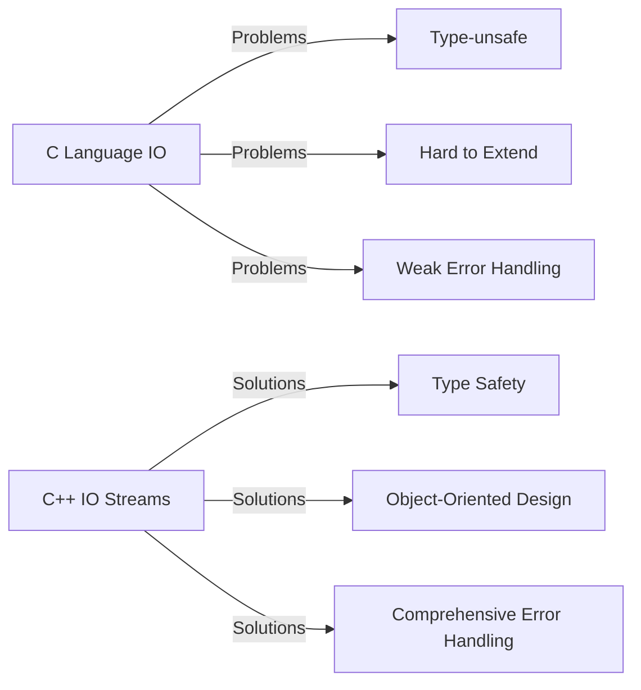
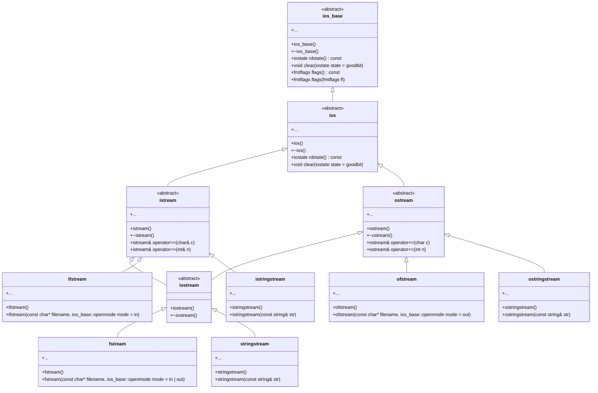
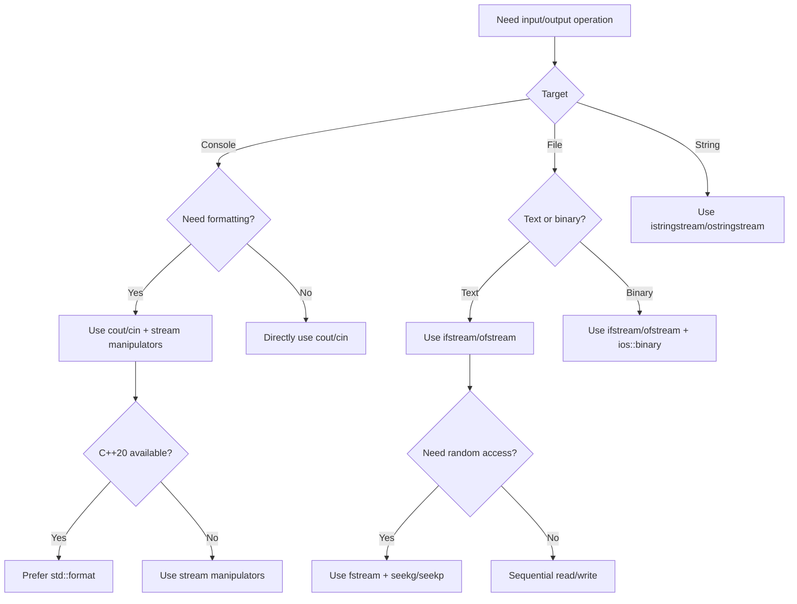

# C++ Input/Output Control (IO Streams): From Beginner to Expert

> **Learning Objectives**: After completing this chapter, you will be able to
>
> - Understand the fundamental principles and class hierarchy of C++ IO streams
> - Skillfully use standard input/output streams for console interaction
> - Master techniques and methods for formatted input/output
> - Correctly operate file streams for data persistence
> - Avoid common IO stream usage pitfalls

## 1. Why Do We Need C++ IO Streams?

In C language, we use functions like `printf` and `scanf` for input/output operations. While these functions are simple to use, they have several critical issues:

- **Type-unsafe**: Mismatch between format strings and parameter types can cause program crashes
- **Lack of object-oriented features**: Difficult to extend and reuse
- **Weak error handling mechanism**: Only return values to indicate errors

C++'s IO stream library solves these problems through an object-oriented approach, providing a type-safe, extensible, and easy-to-use input/output mechanism.



> **Beginner Tip**: Don't view C++ IO streams as a simple replacement for C language IO, but understand it as a completely new, safer input/output paradigm.

## 2. Fundamental Concepts of C++ IO Streams

### 2.1 Stream Class Hierarchy

C++ IO streams are based on a carefully designed class hierarchy. Understanding this structure is crucial to mastering IO streams:



### 2.2 Standard Stream Objects

C++ provides four predefined standard stream objects for basic input/output operations:

| Stream Object | Purpose | Characteristics |
|---------------|---------|----------------|
| `cin` | Standard input stream | Typically connected to keyboard input |
| `cout` | Standard output stream | Typically connected to screen output |
| `cerr` | Standard error stream | Unbuffered, outputs error messages immediately |
| `clog` | Buffered error stream | Buffered error message output |

> **Key Difference**: `cerr` is unbuffered, suitable for critical error messages; `clog` is buffered, suitable for non-critical log messages.

## 3. C++ vs C Language IO: Why Choose IO Streams?

### 3.1 Core Advantages Comparison

| Feature | C++ IO Streams | C Language IO | Advantage Explanation |
|---------|----------------|---------------|----------------------|
| **Type Safety** | ✅ Automatic type deduction | ❌ Manual format specifiers required | Avoids crashes due to type mismatches |
| **Extensibility** | ✅ Supports operator overloading | ❌ Cannot be extended | Can add IO support for custom types |
| **Error Handling** | ✅ State flag checking | ❌ Only return value checking | More precise error control |
| **Resource Management** | ✅ RAII automatic management | ❌ Manual closing required | Prevents resource leaks |
| **Format Control** | ✅ Stream manipulator chaining | ❌ Format strings | More readable and flexible |

### 3.2 Code Comparison Example

#### Type Safety Comparison

```cpp
// C++ IO Streams: Type-safe
int num = 42;
double pi = 3.14159;
std::cout << "Integer: " << num << ", Floating point: " << pi << std::endl;
// Compiler automatically handles types, no format errors to worry about

// C Language: Type-unsafe
printf("Integer: %d, Floating point: %f", num, pi); // Correct
printf("Integer: %f, Floating point: %d", num, pi); // Type mismatch, may cause crash!
```

#### Resource Management Comparison

```cpp
// C++: RAII automatically manages file resources
{
    std::ofstream outFile("data.txt");
    outFile << "Hello, C++!";
} // File automatically closed when outFile goes out of scope

// C Language: Manual resource management required
FILE* file = fopen("data.txt", "w");
if (file) {
    fprintf(file, "Hello, C!");
    fclose(file); // Must remember to close file, or resource leaks may occur
}
```

> **Beginner Tip**: The design philosophy of C++ IO streams is "Resource Acquisition Is Initialization" (RAII), which greatly simplifies resource management and reduces errors.

## 4. Standard Input/Output: Console Interaction

### 4.1 Basic Input/Output

#### Output Operations

```cpp
#include <iostream>

int main() {
    int age = 25;
    double height = 175.5;
    std::string name = "Zhang San";
    
    // Using << operator for chained output
    std::cout << "Name: " << name 
              << ", Age: " << age 
              << ", Height: " << height << "cm" 
              << std::endl;
    
    return 0;
}
```

#### Input Operations

```cpp
#include <iostream>
#include <string>

int main() {
    std::string name;
    int age;
    double height;
    
    std::cout << "Enter name: ";
    std::cin >> name;  // Reads a word (stops at space)
    
    std::cout << "Enter age: ";
    std::cin >> age;
    
    std::cout << "Enter height: ";
    std::cin >> height;
    
    std::cout << "Your input information:" << std::endl;
    std::cout << "Name: " << name << std::endl;
    std::cout << "Age: " << age << std::endl;
    std::cout << "Height: " << height << "cm" << std::endl;
    
    return 0;
}
```

> **Common Misconception**: `std::cin >>` stops reading at spaces, tabs, or newline characters. To read an entire line of text containing spaces, use `std::getline()`.

### 4.2 Safe Input Handling

```cpp
#include <iostream>
#include <limits>
#include <string>

// Template function for safe integer input
template <typename T>
T safeInput(const std::string& prompt) {
    T value;
    while (true) {
        std::cout << prompt;
        if (std::cin >> value) {
            break; // Input successful
        }
        
        // Input failure handling
        std::cin.clear(); // Reset error state
        // Ignore remaining characters in input buffer
        std::cin.ignore(std::numeric_limits<std::streamsize>::max(), '\n');
        std::cerr << "Invalid input, please try again!" << std::endl;
    }
    return value;
}

int main() {
    int age = safeInput<int>("Enter age: ");
    double height = safeInput<double>("Enter height: ");
    std::string name;
    
    std::cout << "Enter name: ";
    std::cin.ignore(); // Clear newline character from input buffer
    std::getline(std::cin, name); // Read entire line (including spaces)
    
    std::cout << "Verification information:" << std::endl;
    std::cout << "Name: " << name << std::endl;
    std::cout << "Age: " << age << std::endl;
    std::cout << "Height: " << height << "cm" << std::endl;
    
    return 0;
}
```

> **Key Technique**: When mixing `>>` and `getline()`, remember to use `cin.ignore()` to clear the newline character from the buffer, otherwise `getline()` will immediately return an empty line.

## 5. Formatted Output: Precise Control of Display Effects

### 5.1 Basic Format Control

C++ provides rich format control tools, mainly implemented through stream manipulators in the `<iomanip>` header:

```cpp
#include <iostream>
#include <iomanip>

int main() {
    double pi = 3.1415926535;
    int num = 42;
    
    // 1. Control floating-point precision
    std::cout << "Default precision: " << pi << std::endl;
    std::cout << "Fixed 2 decimal places: " << std::fixed << std::setprecision(2) << pi << std::endl;
    std::cout << "Scientific notation: " << std::scientific << std::setprecision(4) << pi << std::endl;
    
    // 2. Control field width and padding
    std::cout << "Default width: " << num << std::endl;
    std::cout << "Width 5: " << std::setw(5) << num << std::endl;
    std::cout << "Width 5 padded with *: " << std::setw(5) << std::setfill('*') << num << std::endl;
    
    // 3. Control alignment
    std::cout << std::setw(10) << std::left << "Left aligned" << std::endl;
    std::cout << std::setw(10) << std::right << "Right aligned" << std::endl;
    std::cout << std::setw(10) << std::internal << "-123" << std::endl;
    
    return 0;
}
```

### 5.2 Practical Formatting Examples

#### Currency Formatting

```cpp
#include <iostream>
#include <iomanip>
#include <locale>

int main() {
    double price = 12345.6789;
    
    // Set locale (requires system support)
    std::cout.imbue(std::locale(""));
    
    // Currency formatting: thousand separators, fixed 2 decimal places
    std::cout << "Total: " << std::fixed << std::setprecision(2) 
              << std::showpoint << price << std::endl;
    
    // Output: Total: 12,345.68 (depends on system locale settings)
    
    return 0;
}
```

#### Table Alignment

```cpp
#include <iostream>
#include <iomanip>

int main() {
    // Table header
    std::cout << std::setw(10) << std::left << "Name"
              << std::setw(8) << std::right << "Age"
              << std::setw(12) << std::right << "Height(cm)" << std::endl;
    
    // Separator line
    std::cout << std::setfill('-') << std::setw(30) << "" << std::setfill(' ') << std::endl;
    
    // Data rows
    std::cout << std::setw(10) << std::left << "Zhang San"
              << std::setw(8) << std::right << 25
              << std::setw(12) << std::right << 175.5 << std::endl;
    
    std::cout << std::setw(10) << std::left << "Li Si"
              << std::setw(8) << std::right << 30
              << std::setw(12) << std::right << 180.0 << std::endl;
    
    return 0;
}
```

> **Output Effect**:
>
> ```
> Name      Age    Height(cm)
> ------------------------------
> Zhang San   25        175.5
> Li Si       30        180.0
> ```

### 5.3 Modern C++ Formatting: std::format

C++20 introduced `std::format`, providing a safer and more flexible formatting approach:

```cpp
#include <iostream>
#include <format>

int main() {
    double pi = 3.1415926535;
    int num = 42;
    
    // Type-safe formatting
    std::cout << std::format("Pi: {:.2f}\n", pi); // Output: Pi: 3.14
    
    // Complex formatting
    std::cout << std::format("{:*^20}\n", "Centered"); // Fill with * to center text
    // Output: *******Centered********
    
    // Table formatting
    std::cout << std::format("{:<10}{:>8}{:>12}\n", "Name", "Age", "Height(cm)");
    std::cout << std::format("{:-<30}\n", "");
    std::cout << std::format("{:<10}{:>8}{:>12.1f}\n", "Zhang San", 25, 175.5);
    std::cout << std::format("{:<10}{:>8}{:>12.1f}\n", "Li Si", 30, 180.0);
    
    return 0;
}
```

> **Advantage**: `std::format` is more concise than traditional stream manipulators and type-safe, avoiding issues with mismatched format strings and parameters.

## 6. File Streams: Persistent Data Storage

### 6.1 Basic File Operations

#### Writing to Files

```cpp
#include <fstream>
#include <iostream>
#include <string>

int main() {
    // Create output file stream
    std::ofstream outFile("example.txt");
    
    // Check if file opened successfully
    if (!outFile) {
        std::cerr << "Cannot open file for writing!" << std::endl;
        return 1;
    }
    
    // Write data
    outFile << "Line 1: Hello, File!" << std::endl;
    outFile << "Line 2: C++ File Operation Example" << std::endl;
    
    // Close file (RAII will automatically close, but explicit close is clearer)
    outFile.close();
    std::cout << "Data successfully written to file." << std::endl;
    
    return 0;
}
```

#### Reading from Files

```cpp
#include <fstream>
#include <iostream>
#include <string>

int main() {
    // Create input file stream
    std::ifstream inFile("example.txt");
    
    // Check if file opened successfully
    if (!inFile) {
        std::cerr << "Cannot open file for reading!" << std::endl;
        return 1;
    }
    
    // Read file line by line
    std::string line;
    int lineNumber = 1;
    
    while (std::getline(inFile, line)) {
        std::cout << "Line " << lineNumber++ << ": " << line << std::endl;
    }
    
    // Check if terminated due to error
    if (inFile.bad()) {
        std::cerr << "Error occurred while reading file!" << std::endl;
    }
    
    // File stream object automatically closes when out of scope
    return 0;
}
```

### 6.2 Binary File Operations

```cpp
#include <fstream>
#include <iostream>

struct Person {
    char name[50];
    int age;
    double height;
};

int main() {
    // Write to binary file
    {
        std::ofstream outFile("person.dat", std::ios::binary);
        if (!outFile) {
            std::cerr << "Cannot open binary file for writing!" << std::endl;
            return 1;
        }
        
        Person p = {"Zhang San", 25, 175.5};
        outFile.write(reinterpret_cast<const char*>(&p), sizeof(p));
    }
    
    // Read from binary file
    {
        std::ifstream inFile("person.dat", std::ios::binary);
        if (!inFile) {
            std::cerr << "Cannot open binary file for reading!" << std::endl;
            return 1;
        }
        
        Person p;
        inFile.read(reinterpret_cast<char*>(&p), sizeof(p));
        
        if (inFile) {
            std::cout << "Name: " << p.name << std::endl;
            std::cout << "Age: " << p.age << std::endl;
            std::cout << "Height: " << p.height << "cm" << std::endl;
        } else {
            std::cerr << "Incomplete read or error occurred!" << std::endl;
        }
    }
    
    return 0;
}
```

> **Key Tip**: When performing binary file operations, ensure memory layout consistency of data structures across different platforms, otherwise compatibility issues may arise.

### 6.3 File Stream State Checking

File streams provide various state flags to check if operations were successful:

| State Flag | Meaning | Checking Method |
|------------|---------|-----------------|
| `goodbit` | No errors | `stream.good()` |
| `eofbit` | End of file reached | `stream.eof()` |
| `failbit` | Operation failed (recoverable) | `stream.fail()` |
| `badbit` | Serious error (unrecoverable) | `stream.bad()` |

```cpp
#include <fstream>
#include <iostream>

int main() {
    std::ifstream file("data.txt");
    
    if (!file) {
        std::cerr << "File opening failed!" << std::endl;
        return 1;
    }
    
    int value;
    while (file >> value) {
        std::cout << "Read value: " << value << std::endl;
    }
    
    // Check reason for loop termination
    if (file.eof()) {
        std::cout << "End of file reached." << std::endl;
    } else if (file.fail()) {
        std::cerr << "Read failed: non-numeric data." << std::endl;
        file.clear(); // Clear error state
        file.ignore(std::numeric_limits<std::streamsize>::max(), '\n'); // Ignore invalid data
    } else if (file.bad()) {
        std::cerr << "Serious I/O error occurred!" << std::endl;
    }
    
    return 0;
}
```

## 7. Advanced Techniques and Best Practices

### 7.1 Saving and Restoring Stream State

```cpp
#include <iostream>
#include <iomanip>

void printFormatted(double value) {
    // Save current format state
    std::ios init(nullptr);
    init.copyfmt(std::cout);
    
    // Set specific format
    std::cout << std::fixed << std::setprecision(2);
    std::cout << "Formatted value: " << value << std::endl;
    
    // Restore original format
    std::cout.copyfmt(init);
}

int main() {
    double pi = 3.1415926535;
    
    std::cout << "Original value: " << pi << std::endl;
    printFormatted(pi);
    std::cout << "After restoration: " << pi << std::endl;
    
    return 0;
}
```

### 7.2 Custom Stream Manipulators

```cpp
#include <iostream>

// Create color control manipulators
std::ostream& red(std::ostream& os) {
    return os << "\033[31m"; // ANSI red code
}

std::ostream& green(std::ostream& os) {
    return os << "\033[32m"; // ANSI green code
}

std::ostream& reset(std::ostream& os) {
    return os << "\033[0m";  // Reset all attributes
}

int main() {
    std::cout << red << "Error message!" << reset << std::endl;
    std::cout << green << "Success message!" << reset << std::endl;
    
    // Can also be used in chain
    std::cout << red << "Warning: " << reset 
              << "File does not exist!" << std::endl;
    
    return 0;
}
```

> **Note**: ANSI color codes may not work in Windows Command Prompt; VT100 support needs to be enabled or Windows API used.

### 7.3 Performance Optimization Techniques

#### Reducing Format Switching

```cpp
// Inefficient: Setting format for each output
for (int i = 0; i < 1000; ++i) {
    std::cout << std::setw(8) << i << std::endl;
}

// Efficient: Set format once
std::cout << std::setw(8);
for (int i = 0; i < 1000; ++i) {
    std::cout << i << std::endl;
}
```

#### Buffer Management

```cpp
// Immediately output critical messages
std::cout << "Important operation started..." << std::flush;

// Perform time-consuming operation...
for (int i = 0; i < 1000000; ++i) {
    // Simulate work
}

std::cout << "Operation completed!" << std::endl;
```

#### Stream Binding

```cpp
// Ensure output buffer is flushed before input
std::cin.tie(&std::cout);

// Now this code will output prompt first, then wait for input
std::cout << "Enter value: ";
std::cin >> value;
```

## 8. Common Problems and Solutions

### 8.1 Mixing `>>` and `getline()`

```cpp
#include <iostream>
#include <string>

int main() {
    int age;
    std::string name;
    
    std::cout << "Enter age: ";
    std::cin >> age;
    
    // Incorrect: Remaining newline in buffer causes getline() to return immediately
    // std::cout << "Enter name: ";
    // std::getline(std::cin, name);
    
    // Correct approach: Clear newline character from buffer
    std::cin.ignore(std::numeric_limits<std::streamsize>::max(), '\n');
    
    std::cout << "Enter name: ";
    std::getline(std::cin, name);
    
    std::cout << "Name: " << name << ", Age: " << age << std::endl;
    
    return 0;
}
```

### 8.2 Handling Input Errors

```cpp
#include <iostream>
#include <limits>

int main() {
    int value;
    
    while (true) {
        std::cout << "Enter an integer: ";
        
        if (std::cin >> value) {
            break; // Input successful
        }
        
        // Input failure handling
        std::cin.clear(); // Reset error state
        // Ignore remaining characters in input buffer
        std::cin.ignore(std::numeric_limits<std::streamsize>::max(), '\n');
        std::cerr << "Invalid input, please try again!" << std::endl;
    }
    
    std::cout << "The integer you entered is: " << value << std::endl;
    return 0;
}
```

### 8.3 File Path Issues

```cpp
#include <fstream>
#include <iostream>
#include <filesystem>

namespace fs = std::filesystem;

int main() {
    // Get current working directory
    std::cout << "Current working directory: " << fs::current_path() << std::endl;
    
    // Relative path
    std::ofstream file("data.txt");
    
    // Absolute path (more reliable)
    fs::path absolutePath = fs::current_path() / "data.txt";
    std::ofstream file2(absolutePath);
    
    if (!file2) {
        std::cerr << "Cannot open file: " << absolutePath << std::endl;
        return 1;
    }
    
    file2 << "Test content" << std::endl;
    std::cout << "File written to: " << absolutePath << std::endl;
    
    return 0;
}
```

> **Best Practice**: When handling file paths, use `std::filesystem` (C++17) to avoid platform differences.

## 9. IO Stream Decision Guide



## Teaching Summary

1. **Core Advantages**: C++ IO streams provide type-safe, object-oriented, and easily extensible input/output mechanisms
2. **Basic Usage**:
   - Console: `cin`/`cout` + `>>`/`<<` operators
   - Files: `ifstream`/`ofstream` + RAII resource management
3. **Format Control**:
   - Basic: `setw`, `setprecision`, `fixed`, etc.
   - Advanced: Custom stream manipulators, `std::format` (C++20)
4. **Error Handling**:
   - Check stream state (`good()`, `fail()`, etc.)
   - Use `clear()` and `ignore()` to restore stream state
5. **Best Practices**:
   - Prefer RAII for resource management
   - Be mindful of buffer issues when mixing input types
   - Prefer `std::format` in C++20

> **Advice for Beginners**:
>
> 1. **Forget printf/scanf**: `cout`/`cin` is safer and won't crash due to type mismatches
> 2. **Understand RAII Principle**: File streams automatically close when objects go out of scope
> 3. **Start Simple**: Master basic input/output before learning format control
> 4. **Use IDE Hints**: IDEs will suggest available stream manipulators when typing `cout <<`
> 5. **Prefer C++20**: If your environment supports it, prefer `std::format` for formatting

Remember, good IO handling is the foundation of program robustness. With this chapter's knowledge, you're now equipped to write safer, more professional C++ programs!
