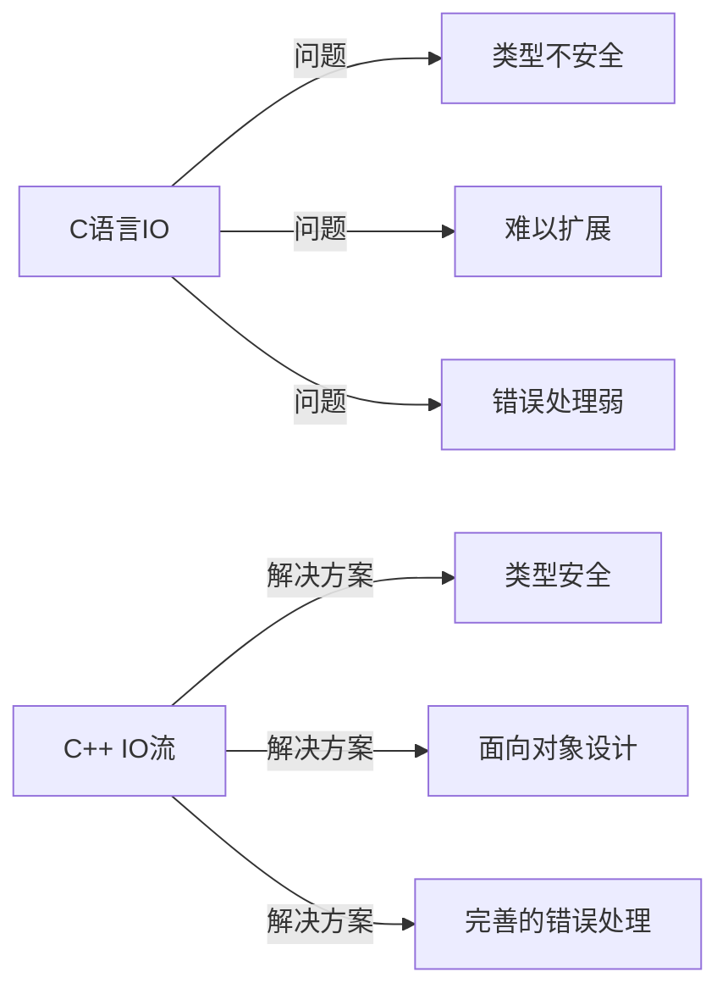
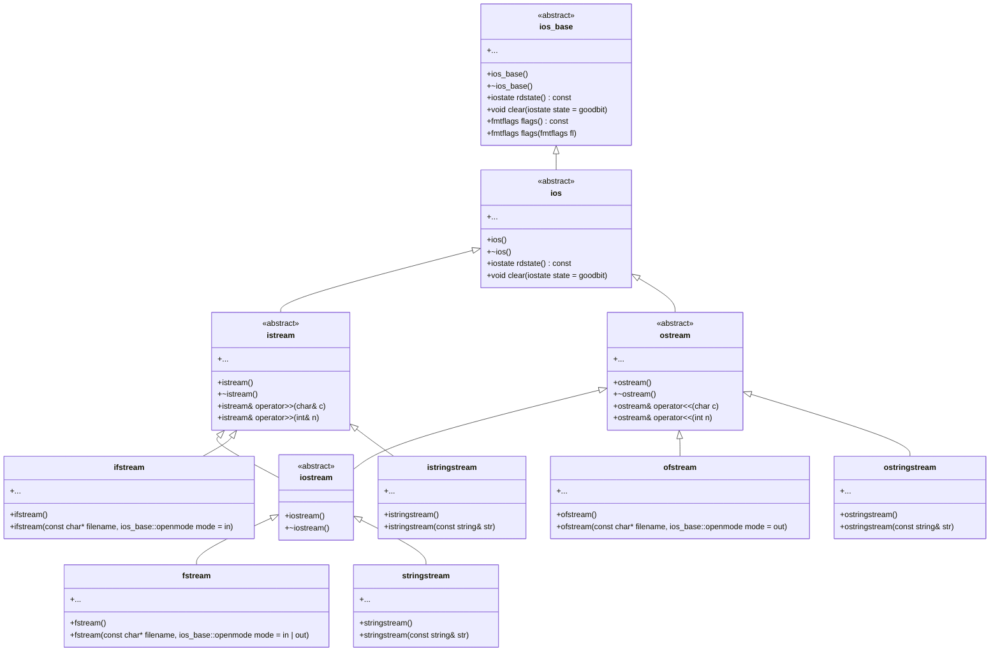
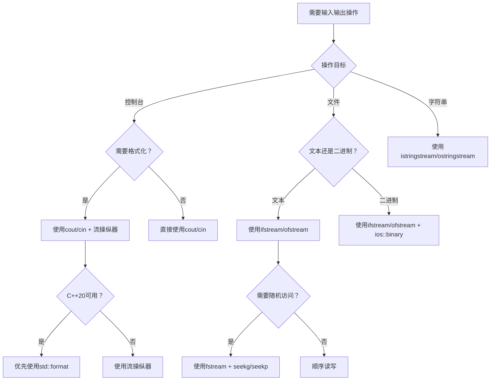

# C++输入输出控制(IO流)：从入门到精通

> **学习目标**：学完本章后，你将能够
>
> - 理解C++ IO流的基本原理和类层次结构
> - 熟练使用标准输入输出流进行控制台交互
> - 掌握格式化输入输出的技巧和方法
> - 正确操作文件流进行数据持久化
> - 避免常见的IO流使用陷阱

## 1. 为什么需要C++ IO流？

在C语言中，我们使用`printf`和`scanf`等函数进行输入输出操作。虽然这些函数简单易用，但存在几个关键问题：

- **类型不安全**：格式字符串与参数类型不匹配会导致程序崩溃
- **缺乏面向对象特性**：无法扩展和重用
- **错误处理机制薄弱**：仅通过返回值判断错误

C++的IO流库通过面向对象的方式解决了这些问题，提供了类型安全、可扩展且易于使用的输入输出机制。



> **初学者提示**：不要将C++ IO流视为C语言IO的简单替代品，而应理解它是一种全新的、更安全的输入输出范式。

## 2. C++ IO流基础概念

### 2.1 流类层次结构

C++ IO流基于一个精心设计的类层次结构，理解这个结构对掌握IO流至关重要：



### 2.2 标准流对象

C++提供了四个预定义的标准流对象，用于基本的输入输出操作：

| 流对象 | 用途 | 特点 |
|--------|------|------|
| `cin` | 标准输入流 | 通常关联到键盘输入 |
| `cout` | 标准输出流 | 通常关联到屏幕输出 |
| `cerr` | 标准错误流 | 无缓冲，立即输出错误信息 |
| `clog` | 缓冲错误流 | 有缓冲的错误信息输出 |

> **关键区别**：`cerr`是无缓冲的，适合输出关键错误信息；`clog`是有缓冲的，适合输出非关键日志信息。

## 3. C++ vs C语言IO：为什么选择IO流？

### 3.1 核心优势对比

| 特性 | C++ IO流 | C语言IO | 优势说明 |
|------|----------|---------|----------|
| **类型安全** | ✅ 自动类型推导 | ❌ 需手动指定格式符 | 避免类型不匹配导致的崩溃 |
| **可扩展性** | ✅ 支持运算符重载 | ❌ 无法扩展 | 可为自定义类型添加IO支持 |
| **错误处理** | ✅ 状态标志检查 | ❌ 仅返回值检查 | 更精细的错误控制 |
| **资源管理** | ✅ RAII自动管理 | ❌ 需手动关闭 | 避免资源泄漏 |
| **格式控制** | ✅ 流操纵器链式调用 | ❌ 格式字符串 | 更易读、更灵活 |

### 3.2 代码对比示例

#### 类型安全对比

```cpp
// C++ IO流：类型安全
int num = 42;
double pi = 3.14159;
std::cout << "整数：" << num << "，浮点数：" << pi << std::endl;
// 编译器自动处理类型，无需担心格式错误

// C语言：类型不安全
printf("整数：%d，浮点数：%f", num, pi); // 正确
printf("整数：%f，浮点数：%d", num, pi); // 类型不匹配，可能导致崩溃！
```

#### 资源管理对比

```cpp
// C++：RAII自动管理文件资源
{
    std::ofstream outFile("data.txt");
    outFile << "Hello, C++!";
} // outFile对象离开作用域时自动关闭文件

// C语言：需手动管理资源
FILE* file = fopen("data.txt", "w");
if (file) {
    fprintf(file, "Hello, C!");
    fclose(file); // 必须记得关闭文件，否则可能导致资源泄漏
}
```

> **初学者提示**：C++ IO流的设计哲学是"资源获取即初始化"(RAII)，这大大简化了资源管理，减少了错误。

## 4. 标准输入输出：控制台交互

### 4.1 基本输入输出

#### 输出操作

```cpp
#include <iostream>

int main() {
    int age = 25;
    double height = 175.5;
    std::string name = "张三";
    
    // 使用<<运算符链式输出
    std::cout << "姓名：" << name 
              << "，年龄：" << age 
              << "，身高：" << height << "cm" 
              << std::endl;
    
    return 0;
}
```

#### 输入操作

```cpp
#include <iostream>
#include <string>

int main() {
    std::string name;
    int age;
    double height;
    
    std::cout << "请输入姓名：";
    std::cin >> name;  // 读取单词（遇到空格停止）
    
    std::cout << "请输入年龄：";
    std::cin >> age;
    
    std::cout << "请输入身高：";
    std::cin >> height;
    
    std::cout << "您输入的信息：" << std::endl;
    std::cout << "姓名：" << name << std::endl;
    std::cout << "年龄：" << age << std::endl;
    std::cout << "身高：" << height << "cm" << std::endl;
    
    return 0;
}
```

> **常见误区**：`std::cin >>`遇到空格、制表符或换行符会停止读取。要读取包含空格的整行文本，应使用`std::getline()`。

### 4.2 安全输入处理

```cpp
#include <iostream>
#include <limits>
#include <string>

// 安全读取整数的模板函数
template <typename T>
T safeInput(const std::string& prompt) {
    T value;
    while (true) {
        std::cout << prompt;
        if (std::cin >> value) {
            break; // 输入成功
        }
        
        // 输入失败处理
        std::cin.clear(); // 重置错误状态
        // 忽略输入缓冲区中的剩余字符
        std::cin.ignore(std::numeric_limits<std::streamsize>::max(), '\n');
        std::cerr << "输入无效，请重试！" << std::endl;
    }
    return value;
}

int main() {
    int age = safeInput<int>("请输入年龄：");
    double height = safeInput<double>("请输入身高：");
    std::string name;
    
    std::cout << "请输入姓名：";
    std::cin.ignore(); // 清除输入缓冲区中的换行符
    std::getline(std::cin, name); // 读取整行（包含空格）
    
    std::cout << "验证信息：" << std::endl;
    std::cout << "姓名：" << name << std::endl;
    std::cout << "年龄：" << age << std::endl;
    std::cout << "身高：" << height << "cm" << std::endl;
    
    return 0;
}
```

> **关键技巧**：当混合使用`>>`和`getline()`时，记得用`cin.ignore()`清除缓冲区中的换行符，否则`getline()`会立即返回空行。

## 5. 格式化输出：精确控制显示效果

### 5.1 基本格式控制

C++提供了丰富的格式控制工具，主要通过`<iomanip>`头文件中的流操纵器实现：

```cpp
#include <iostream>
#include <iomanip>

int main() {
    double pi = 3.1415926535;
    int num = 42;
    
    // 1. 控制浮点数精度
    std::cout << "默认精度: " << pi << std::endl;
    std::cout << "固定2位小数: " << std::fixed << std::setprecision(2) << pi << std::endl;
    std::cout << "科学计数法: " << std::scientific << std::setprecision(4) << pi << std::endl;
    
    // 2. 控制字段宽度和填充
    std::cout << "默认宽度: " << num << std::endl;
    std::cout << "宽度5: " << std::setw(5) << num << std::endl;
    std::cout << "宽度5填充*: " << std::setw(5) << std::setfill('*') << num << std::endl;
    
    // 3. 控制对齐方式
    std::cout << std::setw(10) << std::left << "左对齐" << std::endl;
    std::cout << std::setw(10) << std::right << "右对齐" << std::endl;
    std::cout << std::setw(10) << std::internal << "-123" << std::endl;
    
    return 0;
}
```

### 5.2 实用格式化示例

#### 金额格式化

```cpp
#include <iostream>
#include <iomanip>
#include <locale>

int main() {
    double price = 12345.6789;
    
    // 设置本地化（需要系统支持）
    std::cout.imbue(std::locale(""));
    
    // 金额格式化：千位分隔符，固定2位小数
    std::cout << "总价: " << std::fixed << std::setprecision(2) 
              << std::showpoint << price << std::endl;
    
    // 输出：总价: 12,345.68（取决于系统区域设置）
    
    return 0;
}
```

#### 表格对齐

```cpp
#include <iostream>
#include <iomanip>

int main() {
    // 表头
    std::cout << std::setw(10) << std::left << "姓名"
              << std::setw(8) << std::right << "年龄"
              << std::setw(12) << std::right << "身高(cm)" << std::endl;
    
    // 分隔线
    std::cout << std::setfill('-') << std::setw(30) << "" << std::setfill(' ') << std::endl;
    
    // 数据行
    std::cout << std::setw(10) << std::left << "张三"
              << std::setw(8) << std::right << 25
              << std::setw(12) << std::right << 175.5 << std::endl;
    
    std::cout << std::setw(10) << std::left << "李四"
              << std::setw(8) << std::right << 30
              << std::setw(12) << std::right << 180.0 << std::endl;
    
    return 0;
}
```

> **输出效果**：
>
> ```
> 姓名      年龄    身高(cm)
> ------------------------------
> 张三        25        175.5
> 李四        30        180
> ```

### 5.3 现代C++格式化：std::format

C++20引入了`std::format`，提供了更安全、更灵活的格式化方式：

```cpp
#include <iostream>
#include <format>

int main() {
    double pi = 3.1415926535;
    int num = 42;
    
    // 类型安全的格式化
    std::cout << std::format("圆周率：{:.2f}\n", pi); // 输出：圆周率：3.14
    
    // 复杂格式化
    std::cout << std::format("{:*^20}\n", "居中显示"); // 用*填充使文本居中
    // 输出：*******居中显示********
    
    // 表格格式化
    std::cout << std::format("{:<10}{:>8}{:>12}\n", "姓名", "年龄", "身高(cm)");
    std::cout << std::format("{:-<30}\n", "");
    std::cout << std::format("{:<10}{:>8}{:>12.1f}\n", "张三", 25, 175.5);
    std::cout << std::format("{:<10}{:>8}{:>12.1f}\n", "李四", 30, 180.0);
    
    return 0;
}
```

> **优势**：`std::format`比传统的流操纵器更简洁，且类型安全，避免了格式字符串与参数不匹配的问题。

## 6. 文件流：持久化数据存储

### 6.1 基本文件操作

#### 写入文件

```cpp
#include <fstream>
#include <iostream>
#include <string>

int main() {
    // 创建输出文件流
    std::ofstream outFile("example.txt");
    
    // 检查文件是否成功打开
    if (!outFile) {
        std::cerr << "无法打开文件进行写入！" << std::endl;
        return 1;
    }
    
    // 写入数据
    outFile << "第一行：Hello, 文件！" << std::endl;
    outFile << "第二行：C++文件操作示例" << std::endl;
    
    // 关闭文件（RAII会自动关闭，但显式关闭更清晰）
    outFile.close();
    std::cout << "数据已成功写入文件。" << std::endl;
    
    return 0;
}
```

#### 读取文件

```cpp
#include <fstream>
#include <iostream>
#include <string>

int main() {
    // 创建输入文件流
    std::ifstream inFile("example.txt");
    
    // 检查文件是否成功打开
    if (!inFile) {
        std::cerr << "无法打开文件进行读取！" << std::endl;
        return 1;
    }
    
    // 逐行读取文件
    std::string line;
    int lineNumber = 1;
    
    while (std::getline(inFile, line)) {
        std::cout << "第" << lineNumber++ << "行: " << line << std::endl;
    }
    
    // 检查是否因错误而终止
    if (inFile.bad()) {
        std::cerr << "读取文件时发生错误！" << std::endl;
    }
    
    // 文件流对象离开作用域时自动关闭
    return 0;
}
```

### 6.2 二进制文件操作

```cpp
#include <fstream>
#include <iostream>

struct Person {
    char name[50];
    int age;
    double height;
};

int main() {
    // 写入二进制文件
    {
        std::ofstream outFile("person.dat", std::ios::binary);
        if (!outFile) {
            std::cerr << "无法打开二进制文件进行写入！" << std::endl;
            return 1;
        }
        
        Person p = {"张三", 25, 175.5};
        outFile.write(reinterpret_cast<const char*>(&p), sizeof(p));
    }
    
    // 读取二进制文件
    {
        std::ifstream inFile("person.dat", std::ios::binary);
        if (!inFile) {
            std::cerr << "无法打开二进制文件进行读取！" << std::endl;
            return 1;
        }
        
        Person p;
        inFile.read(reinterpret_cast<char*>(&p), sizeof(p));
        
        if (inFile) {
            std::cout << "姓名: " << p.name << std::endl;
            std::cout << "年龄: " << p.age << std::endl;
            std::cout << "身高: " << p.height << "cm" << std::endl;
        } else {
            std::cerr << "读取不完整或发生错误！" << std::endl;
        }
    }
    
    return 0;
}
```

> **关键提示**：二进制文件操作时，确保数据结构在不同平台上的内存布局一致，否则可能导致兼容性问题。

### 6.3 文件流状态检查

文件流提供了多种状态标志，用于检查操作是否成功：

| 状态标志 | 含义 | 检查方法 |
|----------|------|----------|
| `goodbit` | 无错误 | `stream.good()` |
| `eofbit` | 到达文件末尾 | `stream.eof()` |
| `failbit` | 操作失败（可恢复） | `stream.fail()` |
| `badbit` | 严重错误（不可恢复） | `stream.bad()` |

```cpp
#include <fstream>
#include <iostream>

int main() {
    std::ifstream file("data.txt");
    
    if (!file) {
        std::cerr << "文件打开失败！" << std::endl;
        return 1;
    }
    
    int value;
    while (file >> value) {
        std::cout << "读取值: " << value << std::endl;
    }
    
    // 检查循环退出原因
    if (file.eof()) {
        std::cout << "已到达文件末尾。" << std::endl;
    } else if (file.fail()) {
        std::cerr << "读取失败：非数字数据。" << std::endl;
        file.clear(); // 清除错误状态
        file.ignore(std::numeric_limits<std::streamsize>::max(), '\n'); // 忽略无效数据
    } else if (file.bad()) {
        std::cerr << "发生严重I/O错误！" << std::endl;
    }
    
    return 0;
}
```

## 7. 高级技巧与最佳实践

### 7.1 流状态保存与恢复

```cpp
#include <iostream>
#include <iomanip>

void printFormatted(double value) {
    // 保存当前格式状态
    std::ios init(nullptr);
    init.copyfmt(std::cout);
    
    // 设置特定格式
    std::cout << std::fixed << std::setprecision(2);
    std::cout << "格式化值: " << value << std::endl;
    
    // 恢复原始格式
    std::cout.copyfmt(init);
}

int main() {
    double pi = 3.1415926535;
    
    std::cout << "原始值: " << pi << std::endl;
    printFormatted(pi);
    std::cout << "恢复后: " << pi << std::endl;
    
    return 0;
}
```

### 7.2 自定义流操纵器

```cpp
#include <iostream>

// 创建颜色控制操纵器
std::ostream& red(std::ostream& os) {
    return os << "\033[31m"; // ANSI红色代码
}

std::ostream& green(std::ostream& os) {
    return os << "\033[32m"; // ANSI绿色代码
}

std::ostream& reset(std::ostream& os) {
    return os << "\033[0m";  // 重置所有属性
}

int main() {
    std::cout << red << "错误信息！" << reset << std::endl;
    std::cout << green << "成功信息！" << reset << std::endl;
    
    // 也可以链式调用
    std::cout << red << "警告：" << reset 
              << "文件不存在！" << std::endl;
    
    return 0;
}
```

> **注意**：ANSI颜色代码在Windows命令提示符中可能不工作，需要启用VT100支持或使用Windows API。

### 7.3 性能优化技巧

#### 减少格式切换

```cpp
// 低效：每次输出都设置格式
for (int i = 0; i < 1000; ++i) {
    std::cout << std::setw(8) << i << std::endl;
}

// 高效：统一设置格式
std::cout << std::setw(8);
for (int i = 0; i < 1000; ++i) {
    std::cout << i << std::endl;
}
```

#### 缓冲区管理

```cpp
// 关键消息立即输出
std::cout << "重要操作开始..." << std::flush;

// 执行耗时操作...
for (int i = 0; i < 1000000; ++i) {
    // 模拟工作
}

std::cout << "操作完成！" << std::endl;
```

#### 流绑定

```cpp
// 确保在输入前刷新输出缓冲区
std::cin.tie(&std::cout);

// 现在以下代码会先输出提示，再等待输入
std::cout << "请输入值: ";
std::cin >> value;
```

## 8. 常见问题与解决方案

### 8.1 混合使用`>>`和`getline()`

```cpp
#include <iostream>
#include <string>

int main() {
    int age;
    std::string name;
    
    std::cout << "请输入年龄: ";
    std::cin >> age;
    
    // 错误：缓冲区中残留的换行符会导致getline()立即返回
    // std::cout << "请输入姓名: ";
    // std::getline(std::cin, name);
    
    // 正确做法：清除缓冲区中的换行符
    std::cin.ignore(std::numeric_limits<std::streamsize>::max(), '\n');
    
    std::cout << "请输入姓名: ";
    std::getline(std::cin, name);
    
    std::cout << "姓名: " << name << ", 年龄: " << age << std::endl;
    
    return 0;
}
```

### 8.2 处理输入错误

```cpp
#include <iostream>
#include <limits>

int main() {
    int value;
    
    while (true) {
        std::cout << "请输入一个整数: ";
        
        if (std::cin >> value) {
            break; // 输入成功
        }
        
        // 输入失败处理
        std::cin.clear(); // 重置错误状态
        // 忽略输入缓冲区中的剩余字符
        std::cin.ignore(std::numeric_limits<std::streamsize>::max(), '\n');
        std::cerr << "输入无效，请重试！" << std::endl;
    }
    
    std::cout << "您输入的整数是: " << value << std::endl;
    return 0;
}
```

### 8.3 文件路径问题

```cpp
#include <fstream>
#include <iostream>
#include <filesystem>

namespace fs = std::filesystem;

int main() {
    // 获取当前工作目录
    std::cout << "当前工作目录: " << fs::current_path() << std::endl;
    
    // 相对路径
    std::ofstream file("data.txt");
    
    // 绝对路径（更可靠）
    fs::path absolutePath = fs::current_path() / "data.txt";
    std::ofstream file2(absolutePath);
    
    if (!file2) {
        std::cerr << "无法打开文件: " << absolutePath << std::endl;
        return 1;
    }
    
    file2 << "测试内容" << std::endl;
    std::cout << "文件已写入: " << absolutePath << std::endl;
    
    return 0;
}
```

> **最佳实践**：在处理文件路径时，使用`std::filesystem`（C++17）可以避免平台差异问题。

## 9. IO流决策指南



## 教学总结

1. **核心优势**：C++ IO流提供类型安全、面向对象、易于扩展的输入输出机制
2. **基础使用**：
   - 控制台：`cin`/`cout` + `>>`/`<<`运算符
   - 文件：`ifstream`/`ofstream` + RAII资源管理
3. **格式控制**：
   - 基本：`setw`、`setprecision`、`fixed`等
   - 高级：自定义流操纵器、`std::format`（C++20）
4. **错误处理**：
   - 检查流状态（`good()`、`fail()`等）
   - 使用`clear()`和`ignore()`恢复流状态
5. **最佳实践**：
   - 优先使用RAII管理资源
   - 混合输入时注意缓冲区问题
   - C++20中优先使用`std::format`

> **给初学者的建议**：
>
> 1. **忘记printf/scanf**：用`cout`/`cin`更安全，不会因类型不匹配而崩溃
> 2. **理解RAII原则**：文件流对象离开作用域时会自动关闭文件
> 3. **从简单开始**：先掌握基本输入输出，再学习格式控制
> 4. **善用IDE提示**：输入`cout <<`时IDE会提示可用的流操纵器
> 5. **C++20优先**：如果环境支持，优先使用`std::format`进行格式化

记住，良好的IO处理是程序健壮性的基础。通过本章学习，你已经掌握了C++ IO流的核心知识，可以开始编写更安全、更专业的C++程序了！
