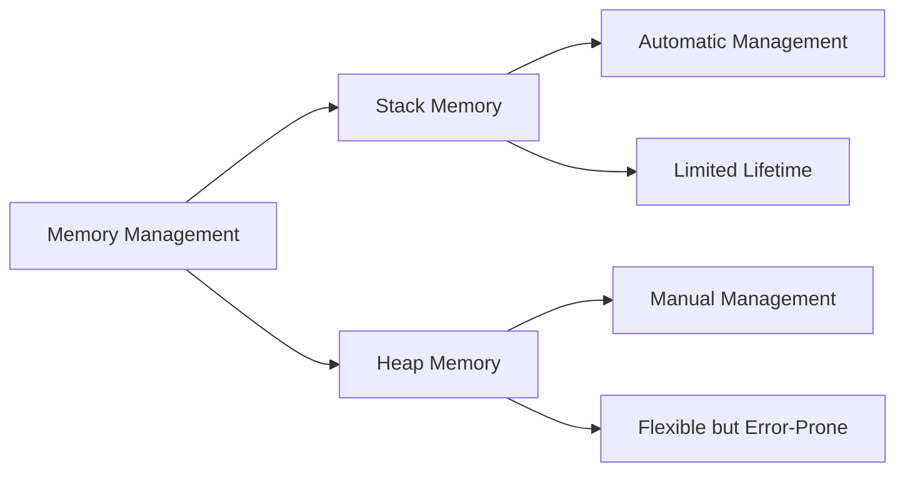
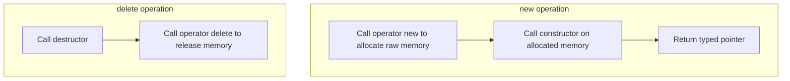

# C++ Memory Management: In-Depth Understanding of new and delete

> **Learning Objectives**: After completing this chapter, you will be able to
>
> - Understand the fundamental principles of C++ memory management and the mechanisms of `new`/`delete`
> - Master various forms of the `new` operator and their applicable scenarios
> - Avoid common memory management errors and pitfalls
> - Apply modern C++ best practices for safe and efficient memory management
> - Learn about new memory management features from C++11 to C++20

## 1. Memory Management Basics: Why Understand new/delete?

In C++, memory management is a core skill. Unlike languages with garbage collection mechanisms such as Java and C#, C++ gives programmers direct control over memory, which is both an advantage and a challenge.



> **Beginner's Tip**: Memory in C++ is divided into stack and heap. Stack memory is automatically managed by the compiler, while heap memory requires explicit management by the programmer. The `new` and `delete` operators are used for allocating and releasing heap memory.

### 1.1 The Essence of the `new` Operator

`new` is a **keyword** in C++ used to dynamically allocate heap memory at runtime. Compared to `malloc` in C, `new` not only allocates memory but also calls the object's constructor for initialization.

| Feature | `new` | `malloc` |
|---------|-------|----------|
| **Type** | C++ keyword | C library function |
| **Return Type** | Pointer of specific type | `void*` |
| **Insufficient Memory** | Throws `std::bad_alloc` exception | Returns `NULL` |
| **Constructor** | Automatically called | Not called |
| **Memory Size** | Automatically calculated | Must be specified manually |
| **Overloadability** | Overloadable | Not overloadable |

> **Key Difference**: `new` is type-safe, while `malloc` is not. After allocating memory with `malloc`, manual type conversion is required, which is error-prone.

### 1.2 Execution Process of new/delete

When you use `new` and `delete`, C++ performs multiple steps behind the scenes:



#### 1.2.1 Detailed Steps of new

1. **Memory Allocation**: Calls `operator new(size_t)` to allocate raw memory of sufficient size
2. **Object Construction**: Calls the object's constructor on the allocated memory
3. **Pointer Return**: Returns a typed pointer to the newly constructed object

#### 1.2.2 Detailed Steps of delete

1. **Object Destruction**: Calls the destructor of the object pointed to by the pointer
2. **Memory Release**: Calls `operator delete(void*)` to release memory

> **Important Note**: `new` and `delete` must be used in pairs, and `new[]` and `delete[]` must be used in pairs. Mixing them leads to undefined behavior.

## 2. Basic Usage of new

### 2.1 Allocating Single Objects

```cpp
// Allocate uninitialized int (value uncertain)
int* p1 = new int;

// Allocate and initialize to 42
int* p2 = new int(42);

// From C++11, use brace initialization (safer)
int* p3 = new int{42};

// Allocate custom type object
class MyClass {
public:
    MyClass(int x) : value(x) { 
        std::cout << "Constructing: " << value << std::endl; 
    }
    ~MyClass() { 
        std::cout << "Destructing: " << value << std::endl; 
    }
private:
    int value;
};

// Allocate and construct MyClass object
MyClass* obj = new MyClass(10);

// Must release after use
delete obj;  // Calls destructor and releases memory
```

> **Beginner's Tip**: Memory allocated with `new` must be released with `delete`, otherwise memory leaks occur. Forgetting to release is one of the most common errors in C++ programs.

### 2.2 Dynamic Array Allocation

```cpp
// Allocate 5 uninitialized ints
int* arr1 = new int[5];

// Allocate 5 ints initialized to 0 (from C++11)
int* arr2 = new int[5]{}; 

// Allocate and initialize first 3 elements
int* arr3 = new int[5]{1, 2, 3}; // Last 2 elements are 0

// Determine array size from user input
int size;
std::cin >> size;
int* dynamicArr = new int[size];

// Release array (must use delete[])
delete[] arr1;  // Correct
// delete arr1;  // Error! Leads to undefined behavior
```

> **Key Difference**: Single objects use `delete`, arrays use `delete[]`. This is because arrays require additional metadata to track the number of elements for proper destructor calls.

### 2.3 Handling Multidimensional Arrays

#### 2.3.1 Rectangular Memory Block (Contiguous Allocation)

```cpp
// 4 rows, 5 columns 2D array (contiguous memory)
int (*arr2d1)[5] = new int[4][5];

// Access element
arr2d1[1][2] = 10;

// Release memory
delete[] arr2d1;
```

#### 2.3.2 Segmented Allocation (Non-Contiguous Memory)

```cpp
// First allocate row pointer array
int** arr2d2 = new int*[4];

// Allocate memory for each row
for (int i = 0; i < 4; ++i) {
    arr2d2[i] = new int[5];
}

// Access element
arr2d2[1][2] = 10;

// Release memory (note the order!)
for (int i = 0; i < 4; ++i) {
    delete[] arr2d2[i];  // Release each row first
}
delete[] arr2d2;  // Then release row pointer array
```

> **Best Practice**: Prefer `std::vector` or `std::array` over raw arrays, as they automatically manage memory and prevent leaks.

## 3. Various Forms of new

### 3.1 Ordinary new

```cpp
int* p = new int(42);  // Allocate single int with value 42
```

### 3.2 Array new

```cpp
int* arr = new int[10];  // Allocate 10 contiguous ints

// From C++11, can use initializer list
int* arr2 = new int[5]{1, 2, 3, 4, 5};

// After use
delete[] arr;
delete[] arr2;
```

### 3.3 Placement new: Construct Objects at Specified Location

Placement new allows constructing objects on pre-allocated memory without memory allocation:

```cpp
#include <iostream>
#include <new>

class MyClass {
public:
    MyClass() { std::cout << "MyClass constructed." << std::endl; }
    ~MyClass() { std::cout << "MyClass destructed." << std::endl; }
};

int main() {
    // Pre-allocated memory (can be stack, heap, or shared memory)
    char buffer[sizeof(MyClass)]; 
    
    // Construct MyClass object on buffer
    MyClass* obj = new (buffer) MyClass();  

    // After use, explicitly call destructor
    obj->~MyClass();
}
```

> **Key Difference**: Placement new **does not allocate memory**, it only calls the constructor. Therefore, it cannot be released with `delete`, but must explicitly call the destructor.

#### 3.3.1 Typical Use Cases for Placement new

- **Memory Pool Optimization**: Avoid overhead of frequent memory allocation/deallocation
- **Real-time Systems**: Avoid uncertainty of memory allocation
- **Shared Memory**: Construct objects in inter-process shared memory regions
- **Memory-mapped I/O**: Construct objects in hardware-mapped memory regions

### 3.4 nothrow new: Allocation Without Exceptions

```cpp
#include <iostream>
#include <new>

int main() {
    // Returns nullptr on failure instead of throwing exception
    int* p = new (std::nothrow) int(42);
    
    if (p == nullptr) {
        std::cout << "Memory allocation failed" << std::endl;
    } else {
        std::cout << "Allocated value: " << *p << std::endl;
        delete p;
    }
}
```

> **Use Case**: In environments where exceptions cannot be handled (e.g., embedded systems), or when custom error handling logic is needed.

### 3.5 Placement new with Custom Parameters

```cpp
#include <iostream>

// Custom placement new
void* operator new(std::size_t size, const char* file, int line) {
    std::cout << "Allocation at " << file << ":" << line << std::endl;
    return ::operator new(size);
}

// Macro to simplify usage
#define MY_NEW new (__FILE__, __LINE__)

int main() {
    int* p = MY_NEW int(42);
    std::cout << "Allocated value: " << *p << std::endl;
    delete p;
}
```

> **Practical Value**: When debugging memory issues, can track memory allocation locations to help identify memory leaks.

## 4. Underlying Mechanisms of Memory Allocation

### 4.1 How operator new Works

The `new` operator calls the `operator new` function behind the scenes, with a typical implementation as follows:

```cpp
// Simplified implementation of operator new
void* operator new(std::size_t size) {
    void* ptr = std::malloc(size);
    if (ptr == nullptr) {
        throw std::bad_alloc();
    }
    return ptr;
}

// Simplified implementation of operator delete
void operator delete(void* ptr) noexcept {
    std::free(ptr);
}
```

> **Key Fact**: In most C++ implementations, `operator new` ultimately calls C's `malloc`, but provides safer error handling mechanisms.

### 4.2 Custom Global operator new/delete

You can overload global `operator new` and `delete` to implement custom memory allocation strategies:

```cpp
#include <cstdlib>
#include <iostream>

// Custom global operator new
void* operator new(std::size_t size) {
    std::cout << "Custom global new: Allocating " << size << " bytes" << std::endl;
    void* ptr = std::malloc(size);
    if (ptr == nullptr) {
        throw std::bad_alloc();
    }
    return ptr;
}

// Custom global operator delete
void operator delete(void* ptr) noexcept {
    std::cout << "Custom global delete: Releasing memory" << std::endl;
    std::free(ptr);
}

int main() {
    int* p = new int(42);  // Calls custom operator new
    delete p;              // Calls custom operator delete
}
```

> **Use Case**: Memory leak detection, performance analysis, memory pool implementation, etc.

### 4.3 Class-Specific Memory Allocation

You can overload `operator new` and `operator delete` for specific classes:

```cpp
#include <iostream>

class MyClass {
public:
    MyClass() { std::cout << "MyClass constructor" << std::endl; }
    ~MyClass() { std::cout << "MyClass destructor" << std::endl; }

    // Class-specific operator new
    void* operator new(std::size_t size) {
        std::cout << "MyClass::operator new: " << size << " bytes" << std::endl;
        return ::operator new(size);
    }

    // Class-specific operator delete
    void operator delete(void* ptr) noexcept {
        std::cout << "MyClass::operator delete" << std::endl;
        ::operator delete(ptr);
    }
};

int main() {
    MyClass* obj = new MyClass();
    delete obj;
}
```

> **Best Practice**: Class-specific memory allocation is suitable for scenarios requiring optimization of specific object allocation performance, such as frequent object creation/destruction in game development.

## 5. Evolution of Memory Management in C++ Versions

### 5.1 C++11: Foundation of Modern C++ Memory Management

#### 5.1.1 Unified Initialization Syntax

```cpp
// Use brace initialization to avoid narrowing conversions
int* p = new int{42};
double* d = new double{3.14};

// Array initialization
int* arr = new int[3]{1, 2, 3};
```

#### 5.1.2 Aligned Memory Allocation

```cpp
// Use alignas to specify alignment requirements
struct alignas(16) AlignedStruct {
    int data[4];
};

AlignedStruct* as = new AlignedStruct();  // 16-byte aligned
```

#### 5.1.3 Introduction of Smart Pointers

```cpp
#include <memory>

// Replace raw pointers
auto p = std::make_unique<int>(42);
auto sharedP = std::make_shared<int>(42);
```

> **Revolutionary Change**: Smart pointers introduced in C++11 greatly reduce the need for manual memory management and are the cornerstone of modern C++ memory management.

### 5.2 C++14: More Convenient Memory Management

```cpp
// From C++14, make_unique becomes standard
auto p = std::make_unique<int>(42);
```

### 5.3 C++17: Polymorphic Memory Resources (PMR)

C++17 introduced the polymorphic memory resources library, allowing containers to use custom memory allocation strategies:

```cpp
#include <memory_resource>

int main() {
    // Use stack buffer as memory source
    char buffer[1024];
    std::pmr::monotonic_buffer_resource pool{buffer, sizeof(buffer)};
    
    // Container using custom memory resource
    std::pmr::vector<int> vec{&pool};
    for (int i = 0; i < 100; ++i) {
        vec.push_back(i);  // Allocated from custom memory pool
    }
}
```

> **Application Scenarios**: High-performance computing, game development, embedded systems, and other fields requiring fine-grained memory allocation control.

### 5.4 C++20: New Heights in Memory Management

#### 5.4.1 constexpr new: Compile-time Dynamic Memory

```cpp
#include <iostream>

constexpr int getValue() {
    int* p = new int(42);  // Compile-time memory allocation!
    int value = *p;
    delete p;  // Compile-time memory release
    return value;
}

int main() {
    constexpr int result = getValue();  // Compile-time calculation
    static_assert(result == 42);
    
    std::cout << "Compile-time calculation result: " << result << std::endl;
}
```

> **Limitation**: All dynamically allocated memory must be released within the same constexpr evaluation; no memory leaks allowed.

#### 5.4.2 Enhanced PMR Library

```cpp
#include <memory_resource>
#include <string>
#include <vector>

int main() {
    // Use synchronized pool memory resource
    std::pmr::synchronized_pool_resource pool;

    // Use pmr strings and containers
    std::pmr::string str{"Hello PMR", &pool};
    std::pmr::vector<std::pmr::string> vec{&pool};
    
    vec.push_back(std::pmr::string{"C++20", &pool});
    vec.push_back(std::move(str));
}
```

#### 5.4.3 Coroutines and Memory Management

```cpp
#include <coroutine>
#include <iostream>

struct task {
    struct promise_type {
        task get_return_object() { return {}; }
        std::suspend_never initial_suspend() { return {}; }
        std::suspend_never final_suspend() noexcept { return {}; }
        void return_void() {}
        void unhandled_exception() {}
    };
};

task example() {
    // Memory allocation within coroutines is managed by the compiler
    int* data = new int[1000];
    // ...use data...
    delete[] data;
    co_return;
}

int main() {
    example();
}
```

> **Key Point**: Coroutine frameworks require efficient memory management to store coroutine state, and C++20 provides corresponding support.

## 6. Memory Management Best Practices

### 6.1 Prefer Smart Pointers

```cpp
// Bad practice: Raw pointers easily lead to memory leaks
void badFunction() {
    MyClass* obj = new MyClass();
    // If an exception occurs here, memory will leak
    delete obj;  // May be forgotten
}

// Good practice: Smart pointers automatically manage memory
void goodFunction() {
    auto obj = std::make_unique<MyClass>();
    // No need for manual delete, automatically released when out of scope
}

// shared_ptr for shared ownership
std::shared_ptr<MyClass> sharedObj = std::make_shared<MyClass>();
```

> **Golden Rule**: In 90% of cases, smart pointers should be used instead of raw pointers. Direct use of `new`/`delete` is only needed in special scenarios (e.g., implementing low-level data structures).

### 6.2 Preventing Common Memory Leak Traps

```cpp
// Dangerous pattern: Forgetting delete
void leakyFunction() {
    int* array = new int[1000];
    // Forgot delete[] array;
} // Memory leak!

// Error: Forgetting to use delete[] for arrays
void wrongDeleteFunction() {
    int* array = new int[1000];
    delete array;  // Error! Should use delete[]
}

// Correct approach: Use smart pointers
void correctFunction() {
    auto array = std::make_unique<int[]>(1000);
    // Automatically released correctly
}
```

### 6.3 Exception Safety: Resource Acquisition Is Initialization (RAII)

```cpp
class Resource {
public:
    Resource() { std::cout << "Resource acquired" << std::endl; }
    ~Resource() { std::cout << "Resource released" << std::endl; }
};

// Unsafe approach
void unsafeFunction() {
    Resource* r1 = new Resource();
    Resource* r2 = new Resource();  // If exception occurs here
    
    // Process r1 and r2
    
    delete r2;
    delete r1;  // Won't execute if previous exception occurs
}

// Safe approach: RAII
void safeFunction() {
    auto r1 = std::make_unique<Resource>();
    auto r2 = std::make_unique<Resource>();
    
    // Even with exceptions, r1 and r2 will be properly released
}
```

> **Core Principle**: Encapsulate resource management within objects, using object lifetimes to automatically manage resources.

### 6.4 Techniques for Large Memory Allocation

```cpp
void allocateLargeMemory() {
    const size_t largeSize = 1024 * 1024 * 1024;  // 1GB
    
    // Use nothrow new for large memory allocation
    int* largeArray = new(std::nothrow) int[largeSize];
    if (largeArray == nullptr) {
        std::cout << "Memory allocation failed, handle gracefully" << std::endl;
        return;
    }
    
    // Use memory
    
    delete[] largeArray;
}
```

> **Best Practice**: For large memory allocations, always check if allocation succeeded and provide graceful error handling.

## 7. Practical Examples

### 7.1 Custom Memory Pool: Performance Improvement

```cpp
#include <iostream>
#include <vector>
#include <cstdlib>

class MemoryPool {
private:
    struct Block {
        void* data;
        bool used;
    };
    
    std::vector<Block> blocks;
    size_t blockSize;
    
public:
    MemoryPool(size_t size, size_t count) : blockSize(size) {
        for (size_t i = 0; i < count; ++i) {
            void* data = std::malloc(blockSize);
            blocks.push_back({data, false});
        }
    }
    
    ~MemoryPool() {
        for (auto& block : blocks) {
            std::free(block.data);
        }
    }
    
    void* allocate() {
        for (auto& block : blocks) {
            if (!block.used) {
                block.used = true;
                return block.data;
            }
        }
        return nullptr;  // Memory pool exhausted
    }
    
    void deallocate(void* ptr) {
        for (auto& block : blocks) {
            if (block.data == ptr) {
                block.used = false;
                return;
            }
        }
    }
};

// Class using memory pool
class PooledObject {
private:
    int data;
    static MemoryPool pool;
    
public:
    PooledObject(int val) : data(val) {
        std::cout << "Constructing: " << data << std::endl;
    }
    
    ~PooledObject() {
        std::cout << "Destructing: " << data << std::endl;
    }
    
    // Overload operator new and delete to use memory pool
    static void* operator new(size_t size) {
        return pool.allocate();
    }
    
    static void operator delete(void* ptr) {
        pool.deallocate(ptr);
    }
};

// Initialize static memory pool
MemoryPool PooledObject::pool(sizeof(PooledObject), 100);
```

> **Performance Advantage**: Memory pools avoid the overhead of frequent system allocator calls, especially suitable for scenarios with frequent creation/destruction of small objects (e.g., game development).

### 7.2 Serialization and Deserialization: Application of placement new

```cpp
#include <fstream>
#include <iostream>
#include <new>

class Serializable {
public:
    int x;
    double y;
    char data[16];

    Serializable(int _x = 0, double _y = 0.0) : x(_x), y(_y) {
        std::fill(data, data + 16, 'A');
    }

    void serialize(std::ostream& os) const {
        os.write(reinterpret_cast<const char*>(this), sizeof(*this));
    }

    static Serializable* deserialize(std::istream& is) {
        char* buffer = new char[sizeof(Serializable)];
        is.read(buffer, sizeof(Serializable));

        if (!is) {
            delete[] buffer;
            return nullptr;
        }

        // Construct object on already allocated memory
        return new (buffer) Serializable();
    }

    void operator delete(void* ptr) {
        char* charPtr = reinterpret_cast<char*>(ptr);
        delete[] charPtr;
    }
};
```

> **Key Technique**: Placement new is very useful in serialization/deserialization, allowing direct construction of objects on already read raw data, avoiding additional copy overhead.

## 8. Common Misconceptions and Solutions

### 8.1 Confusing new/delete and new[]/delete[]

```cpp
// Error example
int* arr = new int[10];
delete arr;  // Should use delete[]

// Correct approach
int* arr = new int[10];
delete[] arr;
```

> **Solution**: Always use smart pointers (e.g., `std::unique_ptr<T[]>`) to manage arrays, avoiding manual `delete[]` calls.

### 8.2 Forgetting to Release Memory

```cpp
void leakyFunction() {
    int* p = new int(42);
    // Forgot delete p
} // Memory leak!
```

> **Solution**: Follow the RAII principle, using smart pointers or container classes to automatically manage memory.

### 8.3 Repeatedly Releasing Memory

```cpp
int* p = new int(42);
delete p;
delete p;  // Double deletion, undefined behavior!
```

> **Solution**: Set pointer to `nullptr` after release, or use smart pointers to avoid manual management.

### 8.4 Using Already Released Memory

```cpp
int* p = new int(42);
delete p;
*p = 10;  // Using already released memory, undefined behavior!
```

> **Solution**: Set pointer to `nullptr` immediately after release, or use smart pointers.

## 9. Memory Management Decision Guide

```mermaid
flowchart TD
    A[Need dynamic memory] --> B{Number of objects}
    B -->|Single| C{Need shared ownership?}
    C -->|Yes| D[Use shared_ptr]
    C -->|No| E[Use unique_ptr]
    
    B -->|Multiple| F{Need array semantics?}
    F -->|Yes| G[Use vector or unique_ptr<T[]>]
    F -->|No| H[Use vector or list containers]
    
    A --> I{Need custom allocation strategy?}
    I -->|Yes| J[Consider PMR or custom allocators]
    I -->|No| K[Standard allocator sufficient]
    
    D --> L[Avoid circular references]
    E --> M[Ensure unique ownership]
    G --> N[Avoid raw arrays]
    H --> O[Choose appropriate container]
```

## Teaching Summary

1. **Core Concepts**:
   - `new` allocates memory and calls constructor, `delete` calls destructor and releases memory
   - Stack memory is automatically managed, heap memory requires manual management
   - Smart pointers are the preferred choice for modern C++ memory management

2. **Key Differences**:
   - `new` vs `malloc`: Type safety, constructor calls
   - `new` vs `new[]`: Single object vs array
   - Ordinary `new` vs placement `new`: Memory allocation vs object construction only

3. **Best Practices**:
   - Prefer smart pointers (`unique_ptr`, `shared_ptr`)
   - Avoid manual `new`/`delete`
   - Follow RAII principle for resource management
   - Use container classes (`vector`, `string`, etc.) instead of raw arrays

4. **Modern C++ Evolution**:
   - C++11: Smart pointers, unified initialization
   - C++17: PMR library
   - C++20: constexpr new, enhanced PMR

> **Advice for Beginners**:
>
> 1. **Start with Smart Pointers**: Avoid direct `new`/`delete` when learning
> 2. **Understand RAII**: This is the core concept of C++ resource management
> 3. **Use Containers**: Prefer `std::vector`, `std::string`, and other standard containers
> 4. **Tool Assistance**: Use Valgrind, AddressSanitizer, and other tools to detect memory issues
> 5. **Progress Gradually**: Master basic usage first, then understand underlying mechanisms

Remember: In modern C++, direct use of `new` and `delete` is decreasing, but understanding their workings remains essential for becoming an advanced C++ programmer. Mastering these concepts will enable you to write both efficient and safe C++ code.
