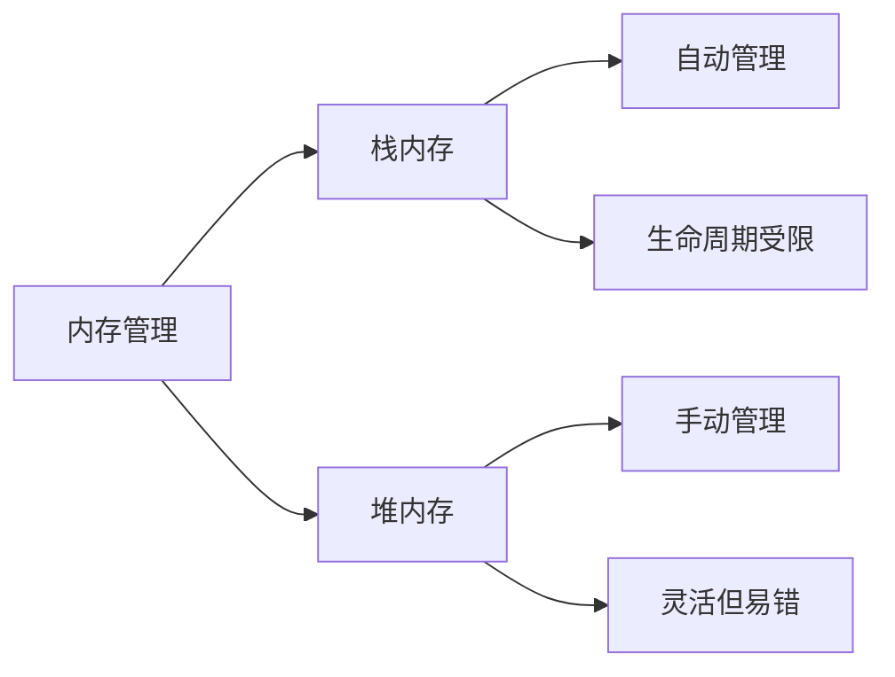

# C++内存管理：深入理解new与delete

> **学习目标**：学完本章后，你将能够
>
> - 理解C++内存管理的基本原理和new/delete的工作机制
> - 掌握各种形式的new操作符及其适用场景
> - 避免常见的内存管理错误和陷阱
> - 应用现代C++最佳实践进行安全高效的内存管理
> - 了解C++11至C++20中内存管理的新特性

## 1. 内存管理基础：为什么需要理解new/delete？

在C++中，内存管理是一项核心技能。与Java、C#等具有垃圾回收机制的语言不同，C++赋予程序员直接控制内存的权力，这既是优势也是挑战。



> **初学者提示**：C++中的内存分为栈(stack)和堆(heap)。栈内存由编译器自动管理，而堆内存需要程序员显式管理。`new`和`delete`操作符用于堆内存的分配和释放。

### 1.1 new操作符的本质

`new`是C++中的**关键字**，用于在运行时动态分配堆内存。与C语言的`malloc`相比，`new`不仅分配内存，还会调用对象的构造函数进行初始化。

| 特性 | `new` | `malloc` |
|------|-------|----------|
| **类型** | C++关键字 | C库函数 |
| **返回类型** | 具体类型的指针 | `void*` |
| **内存不足** | 抛出`std::bad_alloc`异常 | 返回`NULL` |
| **构造函数** | 自动调用 | 不调用 |
| **内存大小** | 自动计算 | 需手动指定 |
| **可重载性** | 可重载 | 不可重载 |

> **关键区别**：`new`是类型安全的，而`malloc`不是。使用`malloc`分配内存后，需要手动进行类型转换，容易出错。

### 1.2 new/delete的执行过程

当你使用`new`和`delete`时，C++在背后执行了多个步骤：


#### 1.2.1 new的详细步骤

1. **内存分配**：调用`operator new(size_t)`分配足够大小的原始内存
2. **对象构造**：在分配的内存上调用对象的构造函数
3. **返回指针**：返回指向新构造对象的类型化指针

#### 1.2.2 delete的详细步骤

1. **对象析构**：调用指针指向对象的析构函数
2. **内存释放**：调用`operator delete(void*)`释放内存

> **重要提示**：`new`和`delete`必须成对使用，`new[]`和`delete[]`必须成对使用。混用会导致未定义行为。

## 2. new的基本用法

### 2.1 分配单个对象

```cpp
// 分配未初始化的int（值不确定）
int* p1 = new int;

// 分配并初始化为42
int* p2 = new int(42);

// C++11起，使用花括号初始化（更安全）
int* p3 = new int{42};

// 分配自定义类型对象
class MyClass {
public:
    MyClass(int x) : value(x) { 
        std::cout << "构造: " << value << std::endl; 
    }
    ~MyClass() { 
        std::cout << "析构: " << value << std::endl; 
    }
private:
    int value;
};

// 分配并构造MyClass对象
MyClass* obj = new MyClass(10);

// 使用完毕后必须释放
delete obj;  // 会调用析构函数并释放内存
```

> **初学者提示**：使用`new`分配的内存必须用`delete`释放，否则会导致内存泄漏。忘记释放是C++程序中最常见的错误之一。

### 2.2 动态数组的分配

```cpp
// 分配5个未初始化的int
int* arr1 = new int[5];

// 分配5个初始化为0的int（C++11起）
int* arr2 = new int[5]{}; 

// 分配并初始化前3个元素
int* arr3 = new int[5]{1, 2, 3}; // 后2个为0

// 从用户输入确定数组大小
int size;
std::cin >> size;
int* dynamicArr = new int[size];

// 释放数组（必须使用delete[]）
delete[] arr1;  // 正确
// delete arr1;  // 错误！会导致未定义行为
```

> **关键区别**：单个对象使用`delete`，数组使用`delete[]`。这是因为数组需要额外的元数据来跟踪元素数量，以便正确调用每个元素的析构函数。

### 2.3 多维数组的处理

#### 2.3.1 矩形内存块（连续分配）

```cpp
// 4行5列的二维数组（连续内存）
int (*arr2d1)[5] = new int[4][5];

// 访问元素
arr2d1[1][2] = 10;

// 释放内存
delete[] arr2d1;
```

#### 2.3.2 分段分配（非连续内存）

```cpp
// 先分配行指针数组
int** arr2d2 = new int*[4];

// 为每行分配内存
for (int i = 0; i < 4; ++i) {
    arr2d2[i] = new int[5];
}

// 访问元素
arr2d2[1][2] = 10;

// 释放内存（注意顺序！）
for (int i = 0; i < 4; ++i) {
    delete[] arr2d2[i];  // 先释放每行
}
delete[] arr2d2;  // 再释放行指针数组
```

> **最佳实践**：优先使用`std::vector`或`std::array`代替原始数组，它们会自动管理内存，避免泄漏。

## 3. new的多种形态

### 3.1 普通new

```cpp
int* p = new int(42);  // 分配单个int，值为42
```

### 3.2 数组new

```cpp
int* arr = new int[10];  // 分配10个连续的int

// C++11起可以使用初始化列表
int* arr2 = new int[5]{1, 2, 3, 4, 5};

// 使用完毕后
delete[] arr;
delete[] arr2;
```

### 3.3 placement new：在指定位置构造对象

placement new允许在已分配的内存上构造对象，不进行内存分配：

```cpp
#include <iostream>
#include <new>

class MyClass {
public:
    MyClass() { std::cout << "MyClass constructed." << std::endl; }
    ~MyClass() { std::cout << "MyClass destructed." << std::endl; }
};

int main() {
    // 预先分配的内存（可以是栈、堆或共享内存）
    char buffer[sizeof(MyClass)]; 
    
    // 在buffer上构造MyClass对象
    MyClass* obj = new (buffer) MyClass();  

    // 使用完毕后，显式调用析构函数
    obj->~MyClass();
}
```

> **关键区别**：placement new**不分配内存**，只调用构造函数。因此，不能使用`delete`释放，而必须显式调用析构函数。

#### 3.3.1 placement new的典型应用场景

- **内存池优化**：避免频繁的内存分配/释放开销
- **实时系统**：避免内存分配的不确定性
- **共享内存**：在进程间共享的内存区域构造对象
- **内存映射IO**：在硬件映射的内存区域构造对象

### 3.4 nothrow new：不抛出异常的分配

```cpp
#include <iostream>
#include <new>

int main() {
    // 失败时不抛出异常，而是返回nullptr
    int* p = new (std::nothrow) int(42);
    
    if (p == nullptr) {
        std::cout << "内存分配失败" << std::endl;
    } else {
        std::cout << "分配的值: " << *p << std::endl;
        delete p;
    }
}
```

> **使用场景**：在无法处理异常的环境中（如嵌入式系统），或需要自定义错误处理逻辑时。

### 3.5 带自定义参数的placement new

```cpp
#include <iostream>

// 自定义placement new
void* operator new(std::size_t size, const char* file, int line) {
    std::cout << "Allocation at " << file << ":" << line << std::endl;
    return ::operator new(size);
}

// 宏简化使用
#define MY_NEW new (__FILE__, __LINE__)

int main() {
    int* p = MY_NEW int(42);
    std::cout << "分配的值: " << *p << std::endl;
    delete p;
}
```

> **实用价值**：在调试内存问题时，可以追踪内存分配的位置，帮助定位内存泄漏。

## 4. 内存分配的底层机制

### 4.1 operator new的工作原理

`new`操作符背后调用的是`operator new`函数，其典型实现如下：

```cpp
// operator new的简化实现
void* operator new(std::size_t size) {
    void* ptr = std::malloc(size);
    if (ptr == nullptr) {
        throw std::bad_alloc();
    }
    return ptr;
}

// operator delete的简化实现
void operator delete(void* ptr) noexcept {
    std::free(ptr);
}
```

> **关键事实**：大多数C++实现中，`operator new`最终会调用C语言的`malloc`，但提供了更安全的错误处理机制。

### 4.2 自定义全局operator new/delete

可以重载全局的`operator new`和`delete`，实现自定义内存分配策略：

```cpp
#include <cstdlib>
#include <iostream>

// 自定义全局operator new
void* operator new(std::size_t size) {
    std::cout << "自定义全局new: 分配 " << size << " 字节" << std::endl;
    void* ptr = std::malloc(size);
    if (ptr == nullptr) {
        throw std::bad_alloc();
    }
    return ptr;
}

// 自定义全局operator delete
void operator delete(void* ptr) noexcept {
    std::cout << "自定义全局delete: 释放内存" << std::endl;
    std::free(ptr);
}

int main() {
    int* p = new int(42);  // 调用自定义operator new
    delete p;              // 调用自定义operator delete
}
```

> **使用场景**：内存泄漏检测、性能分析、内存池实现等。

### 4.3 类特定的内存分配

可以为特定类重载`operator new`和`operator delete`：

```cpp
#include <iostream>

class MyClass {
public:
    MyClass() { std::cout << "MyClass构造函数" << std::endl; }
    ~MyClass() { std::cout << "MyClass析构函数" << std::endl; }

    // 类特定的operator new
    void* operator new(std::size_t size) {
        std::cout << "MyClass::operator new: " << size << "字节" << std::endl;
        return ::operator new(size);
    }

    // 类特定的operator delete
    void operator delete(void* ptr) noexcept {
        std::cout << "MyClass::operator delete" << std::endl;
        ::operator delete(ptr);
    }
};

int main() {
    MyClass* obj = new MyClass();
    delete obj;
}
```

> **最佳实践**：类特定的内存分配适用于需要优化特定类型对象分配性能的场景，如游戏开发中的频繁创建/销毁对象。

## 5. C++版本演进中的内存管理

### 5.1 C++11：现代C++的内存管理基础

#### 5.1.1 统一初始化语法

```cpp
// 使用花括号初始化，避免窄化转换
int* p = new int{42};
double* d = new double{3.14};

// 数组初始化
int* arr = new int[3]{1, 2, 3};
```

#### 5.1.2 对齐内存分配

```cpp
// 使用alignas指定对齐要求
struct alignas(16) AlignedStruct {
    int data[4];
};

AlignedStruct* as = new AlignedStruct();  // 16字节对齐
```

#### 5.1.3 智能指针的引入

```cpp
#include <memory>

// 替代裸指针
auto p = std::make_unique<int>(42);
auto sharedP = std::make_shared<int>(42);
```

> **革命性变化**：C++11引入的智能指针极大地减少了手动内存管理的需求，是现代C++内存管理的基石。

### 5.2 C++14：更便捷的内存管理

```cpp
// C++14起，make_unique成为标准
auto p = std::make_unique<int>(42);
```

### 5.3 C++17：多态内存资源(PMR)

C++17引入了多态内存资源库，允许容器使用自定义内存分配策略：

```cpp
#include <memory_resource>

int main() {
    // 使用栈上缓冲区作为内存源
    char buffer[1024];
    std::pmr::monotonic_buffer_resource pool{buffer, sizeof(buffer)};
    
    // 使用自定义内存资源的容器
    std::pmr::vector<int> vec{&pool};
    for (int i = 0; i < 100; ++i) {
        vec.push_back(i);  // 从自定义内存池分配
    }
}
```

> **应用场景**：高性能计算、游戏开发、嵌入式系统等需要精细控制内存分配的领域。

### 5.4 C++20：内存管理的新高度

#### 5.4.1 constexpr new：编译期动态内存

```cpp
#include <iostream>

constexpr int getValue() {
    int* p = new int(42);  // 编译期内存分配！
    int value = *p;
    delete p;  // 编译期内存释放
    return value;
}

int main() {
    constexpr int result = getValue();  // 编译期计算
    static_assert(result == 42);
    
    std::cout << "编译期计算结果: " << result << std::endl;
}
```

> **限制**：所有动态分配的内存必须在同一个constexpr评估中释放，不能有内存泄漏。

#### 5.4.2 PMR库的增强

```cpp
#include <memory_resource>
#include <string>
#include <vector>

int main() {
    // 使用同步池内存资源
    std::pmr::synchronized_pool_resource pool;

    // 使用pmr字符串和容器
    std::pmr::string str{"Hello PMR", &pool};
    std::pmr::vector<std::pmr::string> vec{&pool};
    
    vec.push_back(std::pmr::string{"C++20", &pool});
    vec.push_back(std::move(str));
}
```

#### 5.4.3 协程与内存管理

```cpp
#include <coroutine>
#include <iostream>

struct task {
    struct promise_type {
        task get_return_object() { return {}; }
        std::suspend_never initial_suspend() { return {}; }
        std::suspend_never final_suspend() noexcept { return {}; }
        void return_void() {}
        void unhandled_exception() {}
    };
};

task example() {
    // 协程内部的内存分配由编译器管理
    int* data = new int[1000];
    // ...使用data...
    delete[] data;
    co_return;
}

int main() {
    example();
}
```

> **关键点**：协程框架需要高效的内存管理来存储协程状态，C++20提供了相应的支持。

## 6. 内存管理最佳实践

### 6.1 优先使用智能指针

```cpp
// 不好的做法：裸指针容易导致内存泄漏
void badFunction() {
    MyClass* obj = new MyClass();
    // 如果这里发生异常，内存将泄漏
    delete obj;  // 可能忘记执行
}

// 好的做法：智能指针自动管理内存
void goodFunction() {
    auto obj = std::make_unique<MyClass>();
    // 不需要手动delete，离开作用域时自动释放
}

// shared_ptr用于共享所有权
std::shared_ptr<MyClass> sharedObj = std::make_shared<MyClass>();
```

> **黄金法则**：在90%的情况下，应该使用智能指针而非裸指针。只有在特殊场景（如实现底层数据结构）才需要直接使用`new`/`delete`。

### 6.2 防止内存泄漏的常见陷阱

```cpp
// 危险模式：忘记delete
void leakyFunction() {
    int* array = new int[1000];
    // 忘记 delete[] array;
} // 内存泄漏!

// 错误：忘记使用delete[]释放数组
void wrongDeleteFunction() {
    int* array = new int[1000];
    delete array;  // 错误!应该使用delete[]
}

// 正确做法：使用智能指针
void correctFunction() {
    auto array = std::make_unique<int[]>(1000);
    // 自动正确释放
}
```

### 6.3 异常安全：资源获取即初始化(RAII)

```cpp
class Resource {
public:
    Resource() { std::cout << "资源获取" << std::endl; }
    ~Resource() { std::cout << "资源释放" << std::endl; }
};

// 不安全的方式
void unsafeFunction() {
    Resource* r1 = new Resource();
    Resource* r2 = new Resource();  // 如果这里抛出异常
    
    // 处理r1和r2
    
    delete r2;
    delete r1;  // 如果前面有异常，这里不会执行
}

// 安全的方式：RAII
void safeFunction() {
    auto r1 = std::make_unique<Resource>();
    auto r2 = std::make_unique<Resource>();
    
    // 即使有异常，r1和r2也会被正确释放
}
```

> **核心原则**：将资源管理封装在对象中，利用对象的生命周期自动管理资源。

### 6.4 大内存分配的技巧

```cpp
void allocateLargeMemory() {
    const size_t largeSize = 1024 * 1024 * 1024;  // 1GB
    
    // 使用nothrow new处理大内存分配
    int* largeArray = new(std::nothrow) int[largeSize];
    if (largeArray == nullptr) {
        std::cout << "内存分配失败，优雅处理" << std::endl;
        return;
    }
    
    // 使用内存
    
    delete[] largeArray;
}
```

> **最佳实践**：对于大内存分配，始终检查分配是否成功，并提供优雅的错误处理。

## 7. 实战案例

### 7.1 自定义内存池：提升性能

```cpp
#include <iostream>
#include <vector>
#include <cstdlib>

class MemoryPool {
private:
    struct Block {
        void* data;
        bool used;
    };
    
    std::vector<Block> blocks;
    size_t blockSize;
    
public:
    MemoryPool(size_t size, size_t count) : blockSize(size) {
        for (size_t i = 0; i < count; ++i) {
            void* data = std::malloc(blockSize);
            blocks.push_back({data, false});
        }
    }
    
    ~MemoryPool() {
        for (auto& block : blocks) {
            std::free(block.data);
        }
    }
    
    void* allocate() {
        for (auto& block : blocks) {
            if (!block.used) {
                block.used = true;
                return block.data;
            }
        }
        return nullptr;  // 内存池已满
    }
    
    void deallocate(void* ptr) {
        for (auto& block : blocks) {
            if (block.data == ptr) {
                block.used = false;
                return;
            }
        }
    }
};

// 使用内存池的类
class PooledObject {
private:
    int data;
    static MemoryPool pool;
    
public:
    PooledObject(int val) : data(val) {
        std::cout << "构造: " << data << std::endl;
    }
    
    ~PooledObject() {
        std::cout << "析构: " << data << std::endl;
    }
    
    // 重载operator new和delete使用内存池
    static void* operator new(size_t size) {
        return pool.allocate();
    }
    
    static void operator delete(void* ptr) {
        pool.deallocate(ptr);
    }
};

// 初始化静态内存池
MemoryPool PooledObject::pool(sizeof(PooledObject), 100);
```

> **性能优势**：内存池避免了频繁调用系统分配器的开销，特别适合频繁创建/销毁小对象的场景（如游戏开发）。

### 7.2 序列化与反序列化：placement new的应用

```cpp
#include <fstream>
#include <iostream>
#include <new>

class Serializable {
public:
    int x;
    double y;
    char data[16];

    Serializable(int _x = 0, double _y = 0.0) : x(_x), y(_y) {
        std::fill(data, data + 16, 'A');
    }

    void serialize(std::ostream& os) const {
        os.write(reinterpret_cast<const char*>(this), sizeof(*this));
    }

    static Serializable* deserialize(std::istream& is) {
        char* buffer = new char[sizeof(Serializable)];
        is.read(buffer, sizeof(Serializable));

        if (!is) {
            delete[] buffer;
            return nullptr;
        }

        // 在已分配的内存上构造对象
        return new (buffer) Serializable();
    }

    void operator delete(void* ptr) {
        char* charPtr = reinterpret_cast<char*>(ptr);
        delete[] charPtr;
    }
};
```

> **关键技巧**：placement new在序列化/反序列化中非常有用，可以在已读取的原始数据上直接构造对象，避免额外的复制开销。

## 8. 常见误区与解决方案

### 8.1 混淆new/delete和new[]/delete[]

```cpp
// 错误示例
int* arr = new int[10];
delete arr;  // 应该使用delete[]

// 正确做法
int* arr = new int[10];
delete[] arr;
```

> **解决方案**：始终使用智能指针（如`std::unique_ptr<T[]>`）管理数组，避免手动调用`delete[]`。

### 8.2 忘记释放内存

```cpp
void leakyFunction() {
    int* p = new int(42);
    // 忘记delete p
} // 内存泄漏！
```

> **解决方案**：遵循RAII原则，使用智能指针或容器类自动管理内存。

### 8.3 重复释放内存

```cpp
int* p = new int(42);
delete p;
delete p;  // 重复释放，未定义行为！
```

> **解决方案**：释放后将指针置为`nullptr`，或使用智能指针避免手动管理。

### 8.4 使用已释放的内存

```cpp
int* p = new int(42);
delete p;
*p = 10;  // 使用已释放的内存，未定义行为！
```

> **解决方案**：释放后立即将指针置为`nullptr`，或使用智能指针。

## 9. 内存管理决策指南

```mermaid
flowchart TD
    A[需要动态内存] --> B{对象数量}
    B -->|单个| C{是否需要共享所有权？}
    C -->|是| D[使用shared_ptr]
    C -->|否| E[使用unique_ptr]
    
    B -->|多个| F{是否需要数组语义？}
    F -->|是| G[使用vector或unique_ptr<T[]>]
    F -->|否| H[使用vector或list等容器]
    
    A --> I{需要自定义分配策略？}
    I -->|是| J[考虑PMR或自定义分配器]
    I -->|否| K[标准分配器足够]
    
    D --> L[避免循环引用]
    E --> M[确保唯一所有权]
    G --> N[避免原始数组]
    H --> O[选择合适容器]
```

## 教学总结

1. **核心概念**：
   - `new`分配内存并调用构造函数，`delete`调用析构函数并释放内存
   - 栈内存自动管理，堆内存需要手动管理
   - 智能指针是现代C++内存管理的首选

2. **关键区别**：
   - `new` vs `malloc`：类型安全、构造函数调用
   - `new` vs `new[]`：单个对象 vs 数组
   - 普通`new` vs placement `new`：分配内存 vs 仅构造对象

3. **最佳实践**：
   - 优先使用智能指针（`unique_ptr`、`shared_ptr`）
   - 避免手动使用`new`/`delete`
   - 遵循RAII原则管理资源
   - 使用容器类（`vector`、`string`等）代替原始数组

4. **现代C++演进**：
   - C++11：智能指针、统一初始化
   - C++17：PMR库
   - C++20：constexpr new、增强的PMR

> **给初学者的建议**：
>
> 1. **从智能指针开始**：初学时尽量避免直接使用`new`/`delete`
> 2. **理解RAII**：这是C++资源管理的核心思想
> 3. **使用容器**：优先使用`std::vector`、`std::string`等标准容器
> 4. **工具辅助**：使用Valgrind、AddressSanitizer等工具检测内存问题
> 5. **循序渐进**：先掌握基本用法，再深入理解底层机制

记住：在现代C++中，直接使用`new`和`delete`的场景正在减少，但理解其工作原理仍然是成为高级C++程序员的必经之路。掌握这些知识，你将能够编写出既高效又安全的C++代码。
