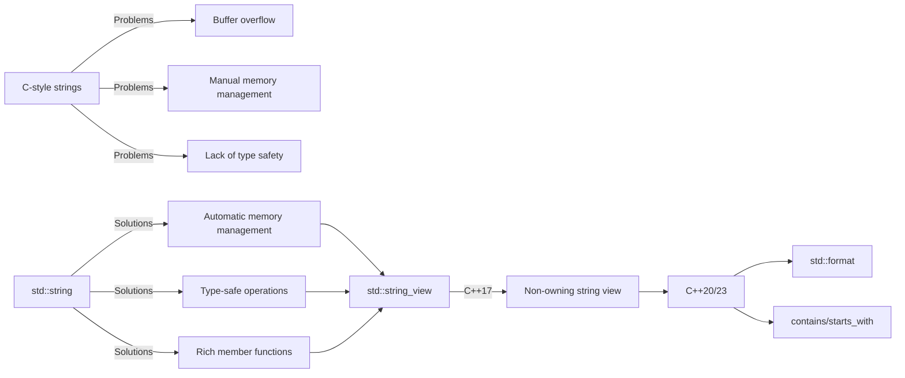
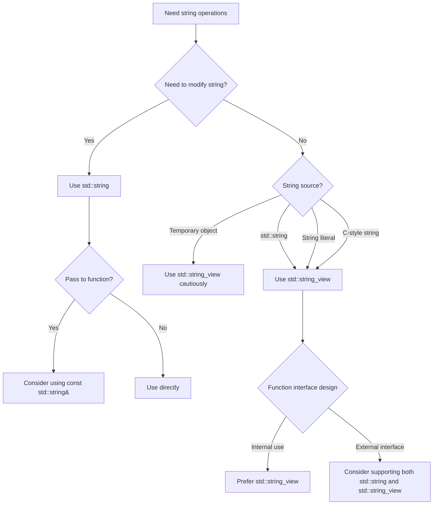

# C++ String Operations: From Basics to Modern Practices

> **Learning Objectives**: After completing this chapter, you will be able to
>
> - Understand the principles and applicable scenarios of different string representations in C++
> - Proficiently use `std::string` and `std::string_view` for string operations
> - Master new features in string processing from C++11 to C++23
> - Avoid common string operation errors and pitfalls
> - Choose the most suitable string processing strategy to improve code quality and performance

## 1. Evolution of String Processing: From C to Modern C++

C++'s string processing capabilities have significantly evolved from the C language inheritance to the modern standard library. Understanding this development process helps us select the most appropriate string processing method for current needs.



> **Beginner Tip**: Don't view C++ strings as a simple replacement for C strings. C++ provides safer and more efficient string processing mechanisms, and understanding how they work is key to writing robust code.

## 2. C-Style Strings: Historical Legacy and Pitfalls

### 2.1 What Are C-Style Strings?

C-style strings are **character arrays terminated with a null character ('\0')**, a string representation inherited by C++ from the C language:

```cpp
// Several ways to create C-style strings
char str1[] = "你好";         // Compiler automatically adds '\0'
char str2[6] = {'H', 'e', 'l', 'l', 'o', '\0'};
const char* str3 = "世界";    // String literal (should use const since C++11)
```

> **Key Difference**: Since C++11, the type of string literals is `const char[N]`, so they should be received with `const char*` instead of `char*` to avoid compiler warnings.

### 2.2 Basic Operation Functions

C-style string operation functions are in the `<cstring>` header file:

#### 2.2.1 String Length

```cpp
#include <cstring>

char greeting[] = "你好";
size_t length = strlen(greeting);  // Returns 5 (doesn't count termination character '\0')
```

> **Common Misconception**: `strlen` counts characters, not including the termination character `'\0'`. For multi-byte characters like Chinese, `strlen` returns the number of bytes, not characters.

#### 2.2.2 String Copy

```cpp
char source[] = "你好";
char destination[10];

// Unsafe, no boundary checking
strcpy(destination, source);    

// Safer, copies at most 9 characters (leaves 1 position for '\0')
strncpy(destination, source, 9); 
destination[9] = '\0';  // Ensure null termination
```

> **Security Warning**: `strcpy` and `strcat` are among the most dangerous functions in C, highly prone to buffer overflow. They should be avoided in modern C++.

#### 2.2.3 String Concatenation

```cpp
char str1[20] = "你好";
char str2[] = " 世界";
strcat(str1, str2);      // str1 becomes "你好 世界"

// Safer, concatenates at most 1 character
strncat(str1, "!", 1);   
str1[19] = '\0';         // Ensure doesn't exceed buffer size
```

#### 2.2.4 String Comparison

```cpp
char str1[] = "苹果";
char str2[] = "香蕉";
int result = strcmp(str1, str2);  // Returns negative value because str1 is lexicographically less than str2
```

> **Note**: `strcmp` doesn't return simple 0/1 values, but negative, 0, or positive values indicating less than, equal to, or greater than.

#### 2.2.5 String Search

```cpp
char text[] = "你好 世界";
char* ptr = strchr(text, 'o');    // Searches for character 'o', returns first occurrence position
char* subPtr = strstr(text, "lo"); // Searches for substring "lo", returns substring position
```

### 2.3 Limitations of C-Style Strings

C-style strings have the following serious issues:

| Problem | Description | Risk |
|---------|-------------|------|
| **Buffer Overflow** | No automatic boundary checking | Security vulnerabilities, program crashes |
| **Complex Memory Management** | Requires manual allocation/deallocation | Memory leaks, double frees |
| **Non-intuitive Operations** | Requires memorizing multiple functions | Poor code readability |
| **Lack of Encapsulation** | Data and operations are separate | Low code reusability |

```cpp
// Dangerous example: Buffer overflow
char smallBuffer[5];
strcpy(smallBuffer, "This is too long");  // Serious security vulnerability!
```

> **Best Practice**: In modern C++, avoid using C-style strings whenever possible, and prefer `std::string` or `std::string_view`.

## 3. std::string: C++ Standard String Class

### 3.1 std::string Basics

`std::string` is a string class provided by the C++ standard library that solves many problems of C-style strings:

```cpp
#include <string>
#include <iostream>

int main() {
    // Creating string objects
    std::string greeting = "你好";  // Created from string literal
    std::string empty;               // Empty string
    std::string repeated(5, 'a');    // Creates "aaaaa"
    
    std::cout << greeting << std::endl;      // Hello
    std::cout << repeated << std::endl;      // aaaaa
    std::cout << std::boolalpha << empty.empty() << std::endl; // true
    
    return 0;
}
```

> **Key Advantage**: `std::string` automatically manages memory, provides type-safe operations, and is compatible with C-style strings.

### 3.2 Basic Operations

#### 3.2.1 String Length and Capacity

```cpp
std::string str = "你好 世界";
size_t length = str.length();  // Or str.size() - returns 11
bool isEmpty = str.empty();    // Checks if empty - false
size_t capacity = str.capacity(); // Returns current allocated storage size
```

> **Performance Tip**: The value returned by `capacity()` is usually greater than `size()` because `std::string` reserves extra space to reduce reallocation frequency.

#### 3.2.2 Accessing Characters

```cpp
std::string str = "你好";
char first = str[0];         // 'H' - no boundary checking
char last = str.at(4);       // 'o' - with boundary checking, throws std::out_of_range on out-of-bounds
char front = str.front();    // 'H' - C++11
char back = str.back();      // 'o' - C++11
```

> **Safety Recommendation**: When unsure if an index is valid, use `at()` instead of `operator[]` to get boundary checking.

#### 3.2.3 Modifying Strings

```cpp
std::string str = "你好";
str += " 世界";           // Appends, now str is "你好 世界"
str.append("!");           // Appends, now str is "你好 世界!"
str.push_back('!');        // Adds single character, now str is "你好 世界!!"

str = "你好";             // Reassigns
str.insert(5, " 美丽"); // Inserts at position 5, now str is "你好 美丽"
str.erase(5, 10);          // Deletes 10 characters starting from position 5, restores to "你好"
str.replace(1, 2, "i");    // Replaces 2 characters starting at position 1, becomes "Hillo"
str.clear();               // Clears the string
```

> **Performance Tip**: When modifying strings frequently, consider using `reserve()` to pre-allocate memory to avoid multiple reallocations.

#### 3.2.4 String Comparison

```cpp
std::string s1 = "苹果";
std::string s2 = "香蕉";

bool equal = (s1 == s2);             // false
bool less = (s1 < s2);               // true, lexicographical comparison
int comparison = s1.compare(s2);     // Negative value, s1 is less than s2
```

> **Note**: The `compare()` method provides more flexible comparison options, such as `compare(pos, len, str2)`.

### 3.3 Substring Operations

```cpp
std::string str = "你好 世界";

// Extract substring
std::string sub = str.substr(6, 5);  // From position 6, length 5: "World"
std::string tail = str.substr(6);    // From position 6 to end: "World"

// Search operations
size_t pos = str.find("世界");      // Returns 6
size_t notFound = str.find("C++");   // Returns string::npos

// Search for characters
pos = str.find_first_of("aeiou");    // Returns 1 (e is first vowel)
pos = str.find_last_of("aeiou");     // Returns 7 (o is last vowel)
```

> **Key Tip**: `find()` family methods return `std::string::npos` to indicate not found, should check with `if (pos != std::string::npos)`.

## 4. Advanced std::string Operations

### 4.1 String Input/Output

```cpp
#include <string>
#include <iostream>

int main() {
    std::string name;
    
    std::cout << "请输入您的名字: ";
    std::cin >> name;  // Reads until whitespace
    std::cout << "您好, " << name << "!" << std::endl;
    
    std::cin.ignore();  // Ignore newline character in input buffer
    
    std::cout << "请输入您的全名: ";
    std::getline(std::cin, name);  // Reads entire line
    std::cout << "您好, " << name << "!" << std::endl;
    
    return 0;
}
```

> **Common Pitfall**: When mixing `>>` and `getline()`, remember to use `cin.ignore()` to clear the newline character from the buffer, otherwise `getline()` will immediately return an empty line.

### 4.2 String Streams

```cpp
#include <string>
#include <sstream>
#include <iostream>

int main() {
    // String output stream
    std::ostringstream oss;
    oss << "年龄: " << 25 << ", 身高: " << 175.5;
    std::string info = oss.str();
    std::cout << info << std::endl;  // Age: 25, Height: 175.5
    
    // String input stream
    std::string data = "123 456.7 文本";
    std::istringstream iss(data);
    int a;
    double b;
    std::string c;
    iss >> a >> b >> c;
    std::cout << "a=" << a << ", b=" << b << ", c=" << c << std::endl;
    
    return 0;
}
```

> **Practical Value**: String streams are powerful tools for parsing formatted text, safer and more flexible than manually splitting strings.

### 4.3 String Splitting

The C++ standard library doesn't directly provide a string splitting function, but it can be implemented like this:

```cpp
#include <string>
#include <vector>
#include <sstream>

std::vector<std::string> split(const std::string& s, char delimiter) {
    std::vector<std::string> tokens;
    std::string token;
    std::istringstream tokenStream(s);
    
    while (std::getline(tokenStream, token, delimiter)) {
        if (!token.empty()) {
            tokens.push_back(token);
        }
    }
    
    return tokens;
}

// Usage example
std::string text = "苹果,香蕉,橙子,葡萄";
std::vector<std::string> fruits = split(text, ',');
```

> **C++20 Alternative**: C++20 introduced `std::views::split`, but it requires the ranges library and is more complex.

## 5. C++11 String New Features

### 5.1 Move Semantics

```cpp
#include <string>
#include <utility>

std::string createLongString() {
    std::string result(10000, 'X');  // Creates large string
    return result;  // Return value optimization, uses move semantics
}

int main() {
    // Move assignment
    std::string source = "这是一个很长的字符串...";
    std::string dest;
    dest = std::move(source);  // Moves instead of copying, source may now be empty
    
    // Function returns large string
    std::string large = createLongString();  // Uses move semantics to avoid copying
    
    return 0;
}
```

> **Performance Advantage**: Move semantics avoids unnecessary deep copies, especially beneficial for large strings, significantly improving performance.

### 5.2 Raw String Literals

```cpp
#include <string>
#include <regex>

int main() {
    // Traditional string with escape sequences
    std::string path1 = "C:\\Program Files\\Some App\\file.txt";
    
    // Raw string - no need for escaping
    std::string path2 = R"(C:\Program Files\Some App\file.txt)";
    
    // Especially useful for regular expressions
    std::string regexPattern = R"(\d{3}-\d{2}-\d{4})";  // Matches SSN format
    
    // Using delimiters for strings containing right parentheses
    std::string code = R"code(
    if (x > 0) {
        std::cout << "x is positive" << std::endl;
    }
    )code";
    
    return 0;
}
```

> **Practical Value**: Raw string literals greatly simplify handling strings with many escape characters, especially useful for regular expressions, JSON, and code snippets.

### 5.3 Numeric Conversion Functions

```cpp
#include <string>

int main() {
    // String to numeric
    std::string numStr = "42";
    int num = std::stoi(numStr);             // String to integer
    
    std::string floatStr = "3.14159";
    double pi = std::stod(floatStr);         // String to double
    
    // Numeric to string
    int age = 25;
    std::string ageStr = std::to_string(age);
    
    return 0;
}
```

> **Advantage**: Compared to C's `atoi`, `sprintf`, and similar functions, these conversion functions are safer, easier to use, and support exception handling.

## 6. C++17 String View: std::string_view

### 6.1 What is std::string_view?

`std::string_view` is a lightweight, non-owning string reference introduced in C++17 that can significantly improve performance:

```mermaid
classDiagram
    class std::string {
        +char* data
        +size_t size
        +size_t capacity
        +Constructor
        +Destructor
        +Member functions
    }
    
    class std::string_view {
        +const char* data
        +size_t size
    }
    
    std::string_view ..> std::string : Reference
```

### 6.2 Basic Usage

```cpp
#include <string>
#include <string_view>

int main() {
    // Creating string_view from different sources
    std::string str = "你好 世界";
    std::string_view sv1 = str;              // Created from std::string
    std::string_view sv2 = "Direct literal";      // Created from string literal
    const char* cstr = "C-style string";
    std::string_view sv3 = cstr;             // Created from C-style string
    
    // Basic operations
    std::cout << "Length: " << sv1.length() << std::endl;
    std::cout << "First character: " << sv1[0] << std::endl;
    std::cout << "Substring: " << sv1.substr(0, 5) << std::endl;
    
    return 0;
}
```

### 6.3 string_view vs string

| Feature | std::string | std::string_view |
|---------|-------------|------------------|
| **Ownership** | Owns data | Only references data |
| **Modifiability** | Modifiable | Read-only |
| **Memory Management** | Automatic | No memory management |
| **Performance** | May have copy overhead | Zero-copy overhead |
| **Lifetime** | Manages its own data | Depends on external data lifetime |
| **Termination** | Guaranteed '\0' | Not guaranteed '\0' |

### 6.4 Performance Comparison

```cpp
#include <string>
#include <string_view>
#include <chrono>

void performanceTest() {
    const size_t iterations = 10000000;
    std::string longStr(1000, 'x');
    
    auto start = std::chrono::high_resolution_clock::now();
    
    // Using std::string
    for (size_t i = 0; i < iterations; ++i) {
        std::string s = longStr;
    }
    
    auto mid = std::chrono::high_resolution_clock::now();
    
    // Using std::string_view
    for (size_t i = 0; i < iterations; ++i) {
        std::string_view sv = longStr;
    }
    
    auto end = std::chrono::high_resolution_clock::now();
    
    auto string_time = std::chrono::duration_cast<std::chrono::milliseconds>(mid - start).count();
    auto view_time = std::chrono::duration_cast<std::chrono::milliseconds>(end - mid).count();
    
    std::cout << "std::string time: " << string_time << " ms" << std::endl;
    std::cout << "std::string_view time: " << view_time << " ms" << std::endl;
}
```

> **Performance Result**: On typical systems, `std::string_view` performs 10-100 times better than `std::string` because it avoids memory allocation and data copying.

### 6.5 Usage Considerations

```cpp
// Dangerous example: Dangling reference
std::string_view dangerous() {
    std::string local = "Temporary string";
    return local;  // Dangerous! local is destroyed when function ends
}

// Safe example
void safe() {
    std::string persistent = "Persistent string";
    std::string_view sv = persistent;  // Safe as long as persistent is alive
    
    // Process sv...
}
```

> **Key Tip**: `std::string_view` doesn't extend the lifetime of the data it references; you must ensure the referenced data remains valid during the `string_view`'s usage.

## 7. C++20/23 Latest Features

### 7.1 std::format (C++20)

```cpp
#include <format>
#include <iostream>

int main() {
    std::string name = "张三";
    int age = 30;
    double height = 175.5;
    
    // Basic formatting
    std::string result = std::format("姓名: {}, 年龄: {}, 身高: {:.1f}", name, age, height);
    std::cout << result << std::endl;
    // Output: Name: Zhang San, Age: 30, Height: 175.5
    
    // Format specifiers
    std::string result2 = std::format("姓名: {:10}|价格: {:8.2f}|数量: {:04d}", "苹果", 5.2, 12);
    std::cout << result2 << std::endl;
    // Output: Name: Apple     |Price:     5.20|Quantity: 0012
    
    return 0;
}
```

> **Advantage**: `std::format` provides type-safe formatting, avoiding type mismatch issues with `printf` family functions, with more concise syntax.

### 7.2 C++23 String New Methods

```cpp
#include <string>
#include <iostream>

int main() {
    std::string str = "Hello World";
    
    // contains method checks for substring
    bool has_hello = str.contains("Hello");  // true
    
    // starts_with checks prefix
    bool starts = str.starts_with("Hello");  // true
    
    // ends_with checks suffix
    bool ends = str.ends_with("World");  // true
    
    std::cout << std::boolalpha
              << "Contains 'Hello': " << has_hello << '\n'
              << "Starts with 'Hello': " << starts << '\n'
              << "Ends with 'World': " << ends << std::endl;
    
    return 0;
}
```

> **Practical Value**: These methods make common string checking operations more concise and readable, avoiding verbose `find()` checks.

## 8. String Type Selection Guide



### 8.1 Selection Recommendations

#### As Function Parameters

- **Read-only operations**: Prefer `std::string_view`

  ```cpp
  void processString(std::string_view sv) {
      // Read-only operations
  }
  ```

- **Need modification**: Use `std::string` or `std::string&`

  ```cpp
  void modifyString(std::string& str) {
      str += " modified";
  }
  ```

#### As Return Values

- **Return new string**: Return `std::string` directly

  ```cpp
  std::string createGreeting(const std::string& name) {
      return "Hello, " + name + "!";
  }
  ```

- **Return substring**: Consider returning `std::string` instead of `std::string_view`

  ```cpp
  std::string getSubstring(const std::string& str, size_t pos, size_t len) {
      return str.substr(pos, len);  // Returns new string, avoids dangling reference
  }
  ```

### 8.2 Performance Optimization Techniques

#### Pre-allocate Memory

```cpp
std::string buildMessage(const std::vector<std::string>& words) {
    // Calculate required total length
    size_t totalLength = 0;
    for (const auto& word : words) {
        totalLength += word.length() + 1;  // +1 for space
    }
    
    std::string result;
    result.reserve(totalLength);  // Pre-allocate memory
    
    for (const auto& word : words) {
        result += word + " ";
    }
    
    return result;
}
```

> **Performance Improvement**: Pre-allocating memory avoids multiple reallocations, significantly improving performance for large string operations.

#### Using String Streams

```cpp
std::string buildMessageStream(const std::vector<std::string>& words) {
    std::ostringstream oss;
    for (const auto& word : words) {
        oss << word << " ";
    }
    return oss.str();
}
```

> **Advantage**: String streams internally manage buffers, often more efficient than manual concatenation for complex formatting operations.

## 9. Practical Tips and Best Practices

### 9.1 Case Conversion

```cpp
#include <string>
#include <algorithm>
#include <cctype>

// Convert to uppercase
std::string toUpper(std::string s) {
    std::transform(s.begin(), s.end(), s.begin(),
                   [](unsigned char c) { return std::toupper(c); });
    return s;
}

// Convert to lowercase
std::string toLower(std::string s) {
    std::transform(s.begin(), s.end(), s.begin(),
                   [](unsigned char c) { return std::tolower(c); });
    return s;
}
```

> **Unicode Note**: The above methods only work for ASCII characters. For Unicode strings, use specialized libraries like ICU.

### 9.2 Chinese and Unicode Processing

```cpp
#include <string>
#include <iostream>

int main() {
    // UTF-8 encoded Chinese string
    std::string chinese = "你好，世界！";
    
    // Note: size() returns byte count, not character count
    std::cout << "Byte count: " << chinese.size() << std::endl;
    
    // C++20 introduced char8_t type
    const char8_t* cpp20_u8str = u8"C++20 UTF-8 string";
    
    return 0;
}
```

> **Key Tip**: C++ standard library has limited Unicode support. Consider using specialized Unicode libraries when processing multilingual text.

### 9.3 Common Pitfalls and Solutions

#### Mixing >> and getline()

```cpp
std::string name;
int age;

std::cout << "请输入年龄: ";
std::cin >> age;

// Error: Newline character left in buffer causes getline() to return immediately
// std::getline(std::cin, name);

// Correct approach: Clear newline character from buffer
std::cin.ignore(std::numeric_limits<std::streamsize>::max(), '\n');

std::cout << "请输入姓名: ";
std::getline(std::cin, name);
```

#### String Comparison Pitfalls

```cpp
std::string s1 = "apple";
std::string s2 = "Apple";

// Error: Case-sensitive
bool equal = (s1 == s2);  // false

// Correct: Case-insensitive comparison
bool caseInsensitiveEqual = 
    std::equal(s1.begin(), s1.end(), s2.begin(), s2.end(),
               [](char a, char b) { 
                   return std::tolower(a) == std::tolower(b); 
               });
```

## 10. String Type Comparison Summary

| Feature | C-style strings | std::string | std::string_view |
|---------|-----------------|-------------|------------------|
| **Memory Management** | Manual | Automatic | None (reference) |
| **Safety** | Low (prone to overflow) | High (boundary checks) | Medium (read-only) |
| **Performance** | High (direct operations) | Medium (possible copies) | High (zero-copy) |
| **Modifiability** | Modifiable | Modifiable | Read-only |
| **Lifetime** | Manual management | Automatic management | Depends on external |
| **Standard Support** | C standard | C++98 | C++17 |
| **Applicable Scenarios** | Interfacing with C libraries | General string operations | Read-only string processing |

## Teaching Summary

1. **Core Concepts**:
   - C-style strings: Character arrays terminated with `'\0'`, error-prone
   - `std::string`: Standard library string class, automatic memory management
   - `std::string_view`: C++17 introduced non-owning string view
   - `std::format`: C++20 introduced type-safe formatting

2. **Key Differences**:
   - Owning vs non-owning: `string` owns data, `string_view` only references
   - Modifiable vs read-only: `string` modifiable, `string_view` read-only
   - Performance considerations: `string_view` avoids copying but must consider lifetime

3. **Best Practices**:
   - Prefer `std::string` and `std::string_view`, avoid C-style strings
   - For function parameters, prefer `std::string_view` for read-only operations
   - Use `std::string` when string modification is needed
   - Consider pre-allocating memory or using string streams for large string operations
   - Prefer `std::format` for formatting in C++20 and above

4. **Evolution Trends**:
   - C++11: Move semantics, raw string literals, numeric conversions
   - C++17: `std::string_view`
   - C++20: `std::format`
   - C++23: `contains`, `starts_with`, `ends_with`

> **Advice for Beginners**:
>
> 1. **Start with `std::string`**: Avoid C-style strings when starting out
> 2. **Understand lifetimes**: Especially the usage scenarios of `std::string_view`
> 3. **Leverage the standard library**: Don't reinvent the wheel, prefer standard library features
> 4. **Pay attention to performance**: Consider pre-allocating memory for large string operations
> 5. **Progress gradually**: Master basics first, then learn C++17/20 new features

Mastering C++ string processing is fundamental to writing high-quality C++ code. As C++ standards evolve, string processing has become increasingly safe, efficient, and user-friendly. With this chapter's learning, you now have the capability to effectively handle strings in modern C++ projects.
