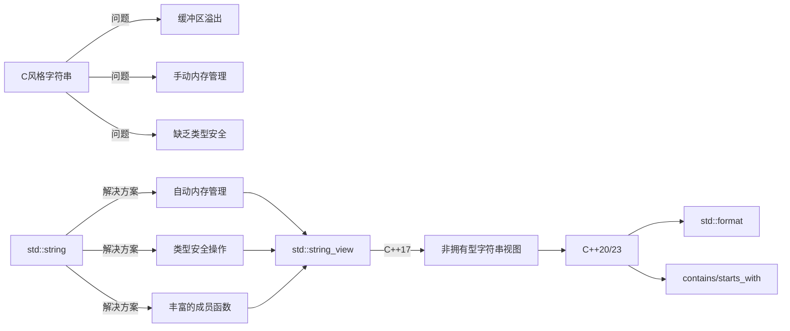
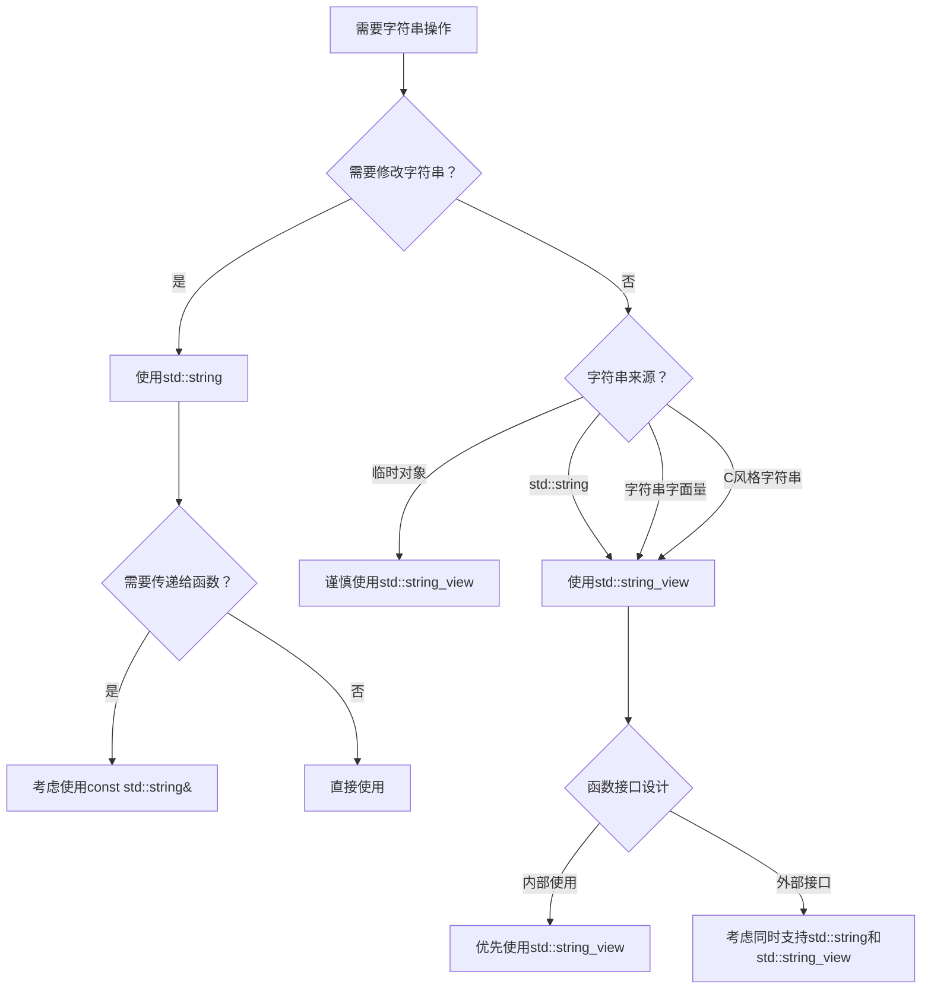

# C++字符串操作：从基础到现代实践

> **学习目标**：学完本章后，你将能够
>
> - 理解C++中不同字符串表示方式的原理和适用场景
> - 熟练使用`std::string`和`std::string_view`进行字符串操作
> - 掌握C++11至C++23中字符串处理的新特性
> - 避免常见的字符串操作错误和陷阱
> - 选择最适合的字符串处理策略以提高代码质量和性能

## 1. 字符串处理的演进：从C到现代C++

C++的字符串处理能力经历了从C语言继承到现代标准库的显著演进。理解这一发展过程有助于我们选择最适合当前需求的字符串处理方式。



> **初学者提示**：不要将C++字符串视为C字符串的简单替代品。C++提供了更安全、更高效的字符串处理机制，理解它们的工作原理是编写健壮代码的关键。

## 2. C风格字符串：历史遗产与陷阱

### 2.1 什么是C风格字符串？

C风格字符串是**以空字符('\0')结尾的字符数组**，这是C++从C语言继承的字符串表示方式：

```cpp
// 创建C风格字符串的几种方式
char str1[] = "Hello";         // 编译器自动添加'\0'
char str2[6] = {'H', 'e', 'l', 'l', 'o', '\0'};
const char* str3 = "World";    // 字符串字面量（C++11后应使用const）
```

> **关键区别**：C++11起，字符串字面量的类型是`const char[N]`，因此应使用`const char*`而非`char*`来接收，避免编译器警告。

### 2.2 基本操作函数

C风格字符串的操作函数在`<cstring>`头文件中：

#### 2.2.1 字符串长度

```cpp
#include <cstring>

char greeting[] = "Hello";
size_t length = strlen(greeting);  // 返回5（不计算结束符'\0'）
```

> **常见误区**：`strlen`计算的是字符数，不包括终止符`'\0'`。对于中文等多字节字符，`strlen`返回的是字节数而非字符数。

#### 2.2.2 字符串复制

```cpp
char source[] = "Hello";
char destination[10];

// 不安全，无边界检查
strcpy(destination, source);    

// 较安全，复制最多9个字符（留1个位置给'\0'）
strncpy(destination, source, 9); 
destination[9] = '\0';  // 确保结尾有空字符
```

> **安全警告**：`strcpy`和`strcat`是C语言中最危险的函数之一，极易导致缓冲区溢出。在现代C++中应避免使用。

#### 2.2.3 字符串连接

```cpp
char str1[20] = "Hello";
char str2[] = " World";
strcat(str1, str2);      // str1变成"Hello World"

// 较安全，连接最多1个字符
strncat(str1, "!", 1);   
str1[19] = '\0';         // 确保不超过缓冲区大小
```

#### 2.2.4 字符串比较

```cpp
char str1[] = "apple";
char str2[] = "banana";
int result = strcmp(str1, str2);  // 返回负值，因为str1字典序小于str2
```

> **注意**：`strcmp`返回值不是简单的0/1，而是负值、0或正值，表示小于、等于或大于。

#### 2.2.5 字符串查找

```cpp
char text[] = "Hello World";
char* ptr = strchr(text, 'o');    // 查找字符'o'，返回首次出现位置
char* subPtr = strstr(text, "lo"); // 查找子串"lo"，返回子串位置
```

### 2.3 C风格字符串的局限性

C风格字符串存在以下严重问题：

| 问题 | 说明 | 风险 |
|------|------|------|
| **缓冲区溢出** | 无自动边界检查 | 安全漏洞、程序崩溃 |
| **内存管理复杂** | 需手动分配/释放 | 内存泄漏、重复释放 |
| **操作不直观** | 需要记忆多个函数 | 代码可读性差 |
| **缺乏封装** | 数据和操作分离 | 代码复用性低 |

```cpp
// 危险示例：缓冲区溢出
char smallBuffer[5];
strcpy(smallBuffer, "This is too long");  // 严重安全漏洞！
```

> **最佳实践**：在现代C++中，应尽量避免使用C风格字符串，优先使用`std::string`或`std::string_view`。

## 3. std::string：C++标准字符串类

### 3.1 std::string 基础

`std::string`是C++标准库提供的字符串类，解决了C风格字符串的许多问题：

```cpp
#include <string>
#include <iostream>

int main() {
    // 创建string对象
    std::string greeting = "Hello";  // 从字符串字面量创建
    std::string empty;               // 空字符串
    std::string repeated(5, 'a');    // 创建"aaaaa"
    
    std::cout << greeting << std::endl;      // Hello
    std::cout << repeated << std::endl;      // aaaaa
    std::cout << std::boolalpha << empty.empty() << std::endl; // true
    
    return 0;
}
```

> **关键优势**：`std::string`自动管理内存，提供类型安全的操作，且与C风格字符串兼容。

### 3.2 基本操作

#### 3.2.1 字符串长度和容量

```cpp
std::string str = "Hello World";
size_t length = str.length();  // 或str.size() - 返回11
bool isEmpty = str.empty();    // 检查是否为空 - false
size_t capacity = str.capacity(); // 返回当前分配的存储空间大小
```

> **性能提示**：`capacity()`返回的值通常大于`size()`，因为`std::string`会预留额外空间以减少重新分配的次数。

#### 3.2.2 访问字符

```cpp
std::string str = "Hello";
char first = str[0];         // 'H' - 不检查边界
char last = str.at(4);       // 'o' - 有边界检查，越界抛出std::out_of_range
char front = str.front();    // 'H' - C++11
char back = str.back();      // 'o' - C++11
```

> **安全建议**：在不确定索引是否有效时，使用`at()`而非`operator[]`，以获得边界检查。

#### 3.2.3 修改字符串

```cpp
std::string str = "Hello";
str += " World";           // 追加，现在str为"Hello World"
str.append("!");           // 追加，现在str为"Hello World!"
str.push_back('!');        // 添加单个字符，现在str为"Hello World!!"

str = "Hello";             // 重新赋值
str.insert(5, " beautiful"); // 在位置5插入，现在str为"Hello beautiful"
str.erase(5, 10);          // 从位置5开始删除10个字符，恢复到"Hello"
str.replace(1, 2, "i");    // 替换位置1开始的2个字符，变为"Hillo"
str.clear();               // 清空字符串
```

> **性能提示**：频繁修改字符串时，考虑使用`reserve()`预分配内存，避免多次重新分配。

#### 3.2.4 字符串比较

```cpp
std::string s1 = "apple";
std::string s2 = "banana";

bool equal = (s1 == s2);             // false
bool less = (s1 < s2);               // true，字典序比较
int comparison = s1.compare(s2);     // 负值，s1小于s2
```

> **注意**：`compare()`方法提供了更灵活的比较方式，如`compare(pos, len, str2)`。

### 3.3 子串操作

```cpp
std::string str = "Hello World";

// 提取子串
std::string sub = str.substr(6, 5);  // 从位置6开始，长度5："World"
std::string tail = str.substr(6);    // 从位置6到结尾："World"

// 查找操作
size_t pos = str.find("World");      // 返回6
size_t notFound = str.find("C++");   // 返回string::npos

// 查找字符
pos = str.find_first_of("aeiou");    // 返回1 (e是第一个元音)
pos = str.find_last_of("aeiou");     // 返回7 (o是最后一个元音)
```

> **关键提示**：`find()`系列方法返回`std::string::npos`表示未找到，应使用`if (pos != std::string::npos)`检查。

## 4. std::string 进阶操作

### 4.1 字符串输入输出

```cpp
#include <string>
#include <iostream>

int main() {
    std::string name;
    
    std::cout << "请输入您的名字: ";
    std::cin >> name;  // 读取到空白字符为止
    std::cout << "您好, " << name << "!" << std::endl;
    
    std::cin.ignore();  // 忽略之前输入缓冲区中的换行符
    
    std::cout << "请输入您的全名: ";
    std::getline(std::cin, name);  // 读取整行
    std::cout << "您好, " << name << "!" << std::endl;
    
    return 0;
}
```

> **常见陷阱**：混合使用`>>`和`getline()`时，记得用`cin.ignore()`清除缓冲区中的换行符，否则`getline()`会立即返回空行。

### 4.2 字符串流

```cpp
#include <string>
#include <sstream>
#include <iostream>

int main() {
    // 字符串输出流
    std::ostringstream oss;
    oss << "年龄: " << 25 << ", 身高: " << 175.5;
    std::string info = oss.str();
    std::cout << info << std::endl;  // 年龄: 25, 身高: 175.5
    
    // 字符串输入流
    std::string data = "123 456.7 文本";
    std::istringstream iss(data);
    int a;
    double b;
    std::string c;
    iss >> a >> b >> c;
    std::cout << "a=" << a << ", b=" << b << ", c=" << c << std::endl;
    
    return 0;
}
```

> **实用价值**：字符串流是解析格式化文本的强大工具，比手动分割字符串更安全、更灵活。

### 4.3 字符串分割

C++标准库没有直接提供字符串分割函数，但可以这样实现：

```cpp
#include <string>
#include <vector>
#include <sstream>

std::vector<std::string> split(const std::string& s, char delimiter) {
    std::vector<std::string> tokens;
    std::string token;
    std::istringstream tokenStream(s);
    
    while (std::getline(tokenStream, token, delimiter)) {
        if (!token.empty()) {
            tokens.push_back(token);
        }
    }
    
    return tokens;
}

// 使用示例
std::string text = "apple,banana,orange,grape";
std::vector<std::string> fruits = split(text, ',');
```

> **C++20替代方案**：C++20引入了`std::views::split`，但需要与ranges库一起使用，较为复杂。

## 5. C++11字符串新特性

### 5.1 移动语义

```cpp
#include <string>
#include <utility>

std::string createLongString() {
    std::string result(10000, 'X');  // 创建大字符串
    return result;  // 返回值优化，使用移动语义
}

int main() {
    // 移动赋值
    std::string source = "这是一个很长的字符串...";
    std::string dest;
    dest = std::move(source);  // 移动而非复制，source现在可能为空
    
    // 函数返回大字符串
    std::string large = createLongString();  // 使用移动语义避免复制
    
    return 0;
}
```

> **性能优势**：移动语义避免了不必要的深拷贝，特别适合处理大字符串，可显著提高性能。

### 5.2 原始字符串字面量

```cpp
#include <string>
#include <regex>

int main() {
    // 传统字符串中的转义序列
    std::string path1 = "C:\\Program Files\\Some App\\file.txt";
    
    // 原始字符串 - 不需要转义
    std::string path2 = R"(C:\Program Files\Some App\file.txt)";
    
    // 对正则表达式特别有用
    std::string regexPattern = R"(\d{3}-\d{2}-\d{4})";  // 匹配SSN格式
    
    // 使用定界符处理包含右括号的字符串
    std::string code = R"code(
    if (x > 0) {
        std::cout << "x is positive" << std::endl;
    }
    )code";
    
    return 0;
}
```

> **实用价值**：原始字符串字面量极大简化了包含大量转义字符的字符串处理，特别适合正则表达式、JSON和代码片段。

### 5.3 数值转换函数

```cpp
#include <string>

int main() {
    // 字符串转数值
    std::string numStr = "42";
    int num = std::stoi(numStr);             // 字符串转整数
    
    std::string floatStr = "3.14159";
    double pi = std::stod(floatStr);         // 字符串转双精度浮点
    
    // 数值转字符串
    int age = 25;
    std::string ageStr = std::to_string(age);
    
    return 0;
}
```

> **优势**：相比C语言的`atoi`、`sprintf`等函数，这些转换函数更安全、更易用，且支持异常处理。

## 6. C++17字符串视图：std::string_view

### 6.1 什么是std::string_view？

`std::string_view`是C++17引入的轻量级、非拥有型字符串引用，可以显著提高性能：

```mermaid
classDiagram
    class std::string {
        +char* data
        +size_t size
        +size_t capacity
        +构造函数
        +析构函数
        +成员函数
    }
    
    class std::string_view {
        +const char* data
        +size_t size
    }
    
    std::string_view ..> std::string : 引用
```

### 6.2 基本用法

```cpp
#include <string>
#include <string_view>

int main() {
    // 从不同来源创建string_view
    std::string str = "Hello World";
    std::string_view sv1 = str;              // 从std::string创建
    std::string_view sv2 = "直接字面量";      // 从字符串字面量创建
    const char* cstr = "C风格字符串";
    std::string_view sv3 = cstr;             // 从C风格字符串创建
    
    // 基本操作
    std::cout << "长度: " << sv1.length() << std::endl;
    std::cout << "第一个字符: " << sv1[0] << std::endl;
    std::cout << "子字符串: " << sv1.substr(0, 5) << std::endl;
    
    return 0;
}
```

### 6.3 string_view vs string

| 特性 | std::string | std::string_view |
|------|-------------|------------------|
| **所有权** | 拥有数据 | 仅引用数据 |
| **修改能力** | 可修改 | 只读 |
| **内存管理** | 自动管理 | 无内存管理 |
| **性能** | 可能有复制开销 | 零复制开销 |
| **生命周期** | 管理自身数据 | 依赖外部数据生命周期 |
| **终止符** | 保证有'\0' | 不保证有'\0' |

### 6.4 性能对比

```cpp
#include <string>
#include <string_view>
#include <chrono>

void performanceTest() {
    const size_t iterations = 10000000;
    std::string longStr(1000, 'x');
    
    auto start = std::chrono::high_resolution_clock::now();
    
    // 使用std::string
    for (size_t i = 0; i < iterations; ++i) {
        std::string s = longStr;
    }
    
    auto mid = std::chrono::high_resolution_clock::now();
    
    // 使用std::string_view
    for (size_t i = 0; i < iterations; ++i) {
        std::string_view sv = longStr;
    }
    
    auto end = std::chrono::high_resolution_clock::now();
    
    auto string_time = std::chrono::duration_cast<std::chrono::milliseconds>(mid - start).count();
    auto view_time = std::chrono::duration_cast<std::chrono::milliseconds>(end - mid).count();
    
    std::cout << "std::string 耗时: " << string_time << " ms" << std::endl;
    std::cout << "std::string_view 耗时: " << view_time << " ms" << std::endl;
}
```

> **性能结果**：在典型系统上，`std::string_view`的性能比`std::string`高10-100倍，因为它避免了内存分配和数据复制。

### 6.5 使用注意事项

```cpp
// 危险示例：悬垂引用
std::string_view dangerous() {
    std::string local = "临时字符串";
    return local;  // 危险! local在函数结束时销毁
}

// 安全示例
void safe() {
    std::string persistent = "持久字符串";
    std::string_view sv = persistent;  // 安全，只要persistent存活
    
    // 处理sv...
}
```

> **关键提示**：`std::string_view`不延长所引用数据的生命周期，必须确保引用的数据在`string_view`使用期间有效。

## 7. C++20/23最新特性

### 7.1 std::format (C++20)

```cpp
#include <format>
#include <iostream>

int main() {
    std::string name = "张三";
    int age = 30;
    double height = 175.5;
    
    // 基本格式化
    std::string result = std::format("姓名: {}, 年龄: {}, 身高: {:.1f}", name, age, height);
    std::cout << result << std::endl;
    // 输出：姓名: 张三, 年龄: 30, 身高: 175.5
    
    // 格式说明符
    std::string result2 = std::format("姓名: {:10}|价格: {:8.2f}|数量: {:04d}", "苹果", 5.2, 12);
    std::cout << result2 << std::endl;
    // 输出：姓名: 苹果      |价格:     5.20|数量: 0012
    
    return 0;
}
```

> **优势**：`std::format`提供类型安全的格式化，避免了`printf`系列函数的类型不匹配问题，且语法更简洁。

### 7.2 C++23字符串新方法

```cpp
#include <string>
#include <iostream>

int main() {
    std::string str = "Hello World";
    
    // contains方法检查是否包含子串
    bool has_hello = str.contains("Hello");  // true
    
    // starts_with检查前缀
    bool starts = str.starts_with("Hello");  // true
    
    // ends_with检查后缀
    bool ends = str.ends_with("World");  // true
    
    std::cout << std::boolalpha
              << "Contains 'Hello': " << has_hello << '\n'
              << "Starts with 'Hello': " << starts << '\n'
              << "Ends with 'World': " << ends << std::endl;
    
    return 0;
}
```

> **实用价值**：这些方法使常见字符串检查操作更加简洁、可读，避免了冗长的`find()`检查。

## 8. 字符串类型选择指南



### 8.1 选择建议

#### 作为函数参数

- **只读操作**：优先使用`std::string_view`

  ```cpp
  void processString(std::string_view sv) {
      // 只读操作
  }
  ```

- **需要修改**：使用`std::string`或`std::string&`

  ```cpp
  void modifyString(std::string& str) {
      str += " modified";
  }
  ```

#### 作为返回值

- **返回新字符串**：直接返回`std::string`

  ```cpp
  std::string createGreeting(const std::string& name) {
      return "Hello, " + name + "!";
  }
  ```

- **返回子串**：考虑返回`std::string`而非`std::string_view`

  ```cpp
  std::string getSubstring(const std::string& str, size_t pos, size_t len) {
      return str.substr(pos, len);  // 返回新字符串，避免悬垂引用
  }
  ```

### 8.2 性能优化技巧

#### 预分配内存

```cpp
std::string buildMessage(const std::vector<std::string>& words) {
    // 计算需要的总长度
    size_t totalLength = 0;
    for (const auto& word : words) {
        totalLength += word.length() + 1;  // +1为空格
    }
    
    std::string result;
    result.reserve(totalLength);  // 预分配内存
    
    for (const auto& word : words) {
        result += word + " ";
    }
    
    return result;
}
```

> **性能提升**：预分配内存可避免多次重新分配，对于大字符串操作可显著提高性能。

#### 使用字符串流

```cpp
std::string buildMessageStream(const std::vector<std::string>& words) {
    std::ostringstream oss;
    for (const auto& word : words) {
        oss << word << " ";
    }
    return oss.str();
}
```

> **优势**：字符串流内部管理缓冲区，对于复杂格式化操作通常比手动拼接更高效。

## 9. 实战技巧与最佳实践

### 9.1 大小写转换

```cpp
#include <string>
#include <algorithm>
#include <cctype>

// 转换为大写
std::string toUpper(std::string s) {
    std::transform(s.begin(), s.end(), s.begin(),
                   [](unsigned char c) { return std::toupper(c); });
    return s;
}

// 转换为小写
std::string toLower(std::string s) {
    std::transform(s.begin(), s.end(), s.begin(),
                   [](unsigned char c) { return std::tolower(c); });
    return s;
}
```

> **Unicode提示**：上述方法仅适用于ASCII字符。对于Unicode字符串，需要使用专门的库如ICU。

### 9.2 中文和Unicode处理

```cpp
#include <string>
#include <iostream>

int main() {
    // UTF-8编码的中文字符串
    std::string chinese = "你好，世界！";
    
    // 注意：size()返回的是字节数，而不是字符数
    std::cout << "字节数: " << chinese.size() << std::endl;
    
    // C++20引入了char8_t类型
    const char8_t* cpp20_u8str = u8"C++20的UTF-8字符串";
    
    return 0;
}
```

> **关键提示**：C++标准库对Unicode的支持有限。处理多语言文本时，考虑使用专门的Unicode库。

### 9.3 常见陷阱与解决方案

#### 混合使用>>和getline()

```cpp
std::string name;
int age;

std::cout << "请输入年龄: ";
std::cin >> age;

// 错误：缓冲区中残留的换行符会导致getline()立即返回
// std::getline(std::cin, name);

// 正确做法：清除缓冲区中的换行符
std::cin.ignore(std::numeric_limits<std::streamsize>::max(), '\n');

std::cout << "请输入姓名: ";
std::getline(std::cin, name);
```

#### 字符串比较陷阱

```cpp
std::string s1 = "apple";
std::string s2 = "Apple";

// 错误：区分大小写
bool equal = (s1 == s2);  // false

// 正确：不区分大小写的比较
bool caseInsensitiveEqual = 
    std::equal(s1.begin(), s1.end(), s2.begin(), s2.end(),
               [](char a, char b) { 
                   return std::tolower(a) == std::tolower(b); 
               });
```

## 10. 字符串类型对比总结

| 特性 | C风格字符串 | std::string | std::string_view |
|------|-------------|-------------|------------------|
| **内存管理** | 手动 | 自动 | 无（引用） |
| **安全性** | 低（易溢出） | 高（边界检查） | 中（只读） |
| **性能** | 高（直接操作） | 中（可能有复制） | 高（零复制） |
| **修改能力** | 可修改 | 可修改 | 只读 |
| **生命周期** | 手动管理 | 自动管理 | 依赖外部 |
| **标准支持** | C标准 | C++98 | C++17 |
| **适用场景** | 与C库交互 | 通用字符串操作 | 只读字符串处理 |

## 教学总结

1. **核心概念**：
   - C风格字符串：以`'\0'`结尾的字符数组，易出错
   - `std::string`：标准库字符串类，自动管理内存
   - `std::string_view`：C++17引入的非拥有型字符串视图
   - `std::format`：C++20引入的类型安全格式化

2. **关键区别**：
   - 拥有型 vs 非拥有型：`string`拥有数据，`string_view`仅引用
   - 可修改 vs 只读：`string`可修改，`string_view`只读
   - 性能考量：`string_view`避免复制，但需注意生命周期

3. **最佳实践**：
   - 优先使用`std::string`和`std::string_view`，避免C风格字符串
   - 函数参数中，只读操作优先使用`std::string_view`
   - 需要修改字符串时使用`std::string`
   - 大字符串操作考虑预分配内存或使用字符串流
   - C++20及以上优先使用`std::format`进行格式化

4. **演进趋势**：
   - C++11：移动语义、原始字符串字面量、数值转换
   - C++17：`std::string_view`
   - C++20：`std::format`
   - C++23：`contains`、`starts_with`、`ends_with`

> **给初学者的建议**：
>
> 1. **从`std::string`开始**：初学时避免直接使用C风格字符串
> 2. **理解生命周期**：特别是`std::string_view`的使用场景
> 3. **善用标准库**：不要重复造轮子，优先使用标准库功能
> 4. **关注性能**：大字符串操作时考虑预分配内存
> 5. **逐步进阶**：先掌握基础，再学习C++17/20的新特性

掌握C++字符串处理是编写高质量C++代码的基础。随着C++标准的演进，字符串处理变得越来越安全、高效和易用。通过本章学习，你已经具备了在现代C++项目中有效处理字符串的能力。
